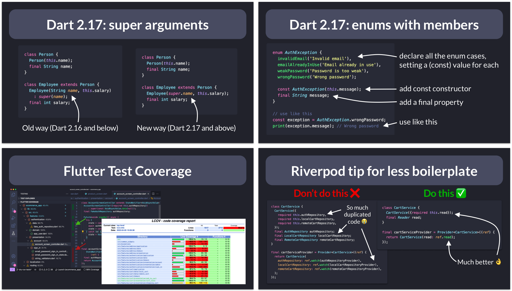

# Flutter Tips & Tricks

A collection of all the Flutter tips & tricks I share on [Twitter](https://twitter.com/biz84) and [LinkedIn](https://www.linkedin.com/in/andreabizzotto/recent-activity/all/). If you find this useful, give it a star! 🌟

## Preview

## Download the App

This repo now has a companion app! [Download it here](https://fluttertips.dev/) to get all my Flutter tips on your phone: 

## Full List

> I'm adding new tips regularly (newest at the top 👇).

| ID | View on GitHub (this repo)                                                                                                                                                        | Twitter Post   | LinkedIn Post | Link on [codewithandrea.com](https://codewithandrea.com/)                                                                            |
| -- |-----------------------------------------------------------------------------------------------------------------------------------------------------------------------------------| -------------- | ------------- | ------------------------------------------------------------------------------------------------------------------------------------ |
| 170 | [The build method: DOs and DON'Ts](tips/0170-build-method-do-dont/index.md) | [link](https://x.com/biz84/status/1806345326262890870) | [link](https://www.linkedin.com/posts/andreabizzotto_did-you-know-the-widget-build-method-can-activity-7212111530044125185-6UcN) | [link](https://codewithandrea.com/articles/side-effects-flutter/) |
| 169 | [Transparent Images With Opacity](tips/0169-transparent-images-with-opacity/index.md) | [link](https://x.com/biz84/status/1806611989961085412) | [link](https://www.linkedin.com/posts/andreabizzotto_take-2-if-you-need-to-show-a-semi-transparent-activity-7212378193616404481-zy4l) | |
| 168 | [Disposing fields to avoid memory leaks](tips/0168-dispose-to-avoid-memory-leaks/index.md) | [link](https://x.com/biz84/status/1805971627437428950) | [link](https://www.linkedin.com/posts/andreabizzotto_did-you-know-forgetting-to-dispose-an-animationcontroller-activity-7211737496328507393-Gmtu) | |
| 167 | [Find Unused Dart Files (VSCode Extension)](tips/0167-find-unused-dart-files/index.md) | [link](https://x.com/biz84/status/1805221861170499798) | [link](https://www.linkedin.com/posts/andreabizzotto_did-you-know-unused-assets-will-increase-activity-7210987699317452800-OkE_) | |
| 166 | [Conditional Imports for Web/Native APIs](tips/0166-conditional-imports/index.md) | [link](https://x.com/biz84/status/1803796875734090130) | [link](https://www.linkedin.com/posts/andreabizzotto_did-you-know-if-you-try-to-access-a-web-specific-activity-7209562745543741441-9qCN) | |
| 165 | [Use defaultTargetPlatform and kIsWeb](tips/0165-default-target-platform/index.md) | [link](https://x.com/biz84/status/1801161442118242783) | [link](https://www.linkedin.com/posts/andreabizzotto_did-you-know-if-your-code-checks-the-current-activity-7206927597866266625-eptz) | |
| 164 | [The UniversalPlatform Package](tips/0164-universal-platform-package/index.md) | [link](https://x.com/biz84/status/1800520573346566582) | [link](https://www.linkedin.com/posts/andreabizzotto_did-you-know-if-your-code-checks-the-current-activity-7206286803283161088-CJB3) |
| 163 | [Taking screenshots with the Flutter CLI](tips/0163-flutter-screenshot/index.md) | [link](https://x.com/biz84/status/1792839682688184433) | [link](https://www.linkedin.com/posts/andreabizzotto_did-you-know-apps-created-with-flutter-activity-7198606765519687681-V9Se) | |
| 162 | [Flutter Web App Initialization Logic with CSS Loader](tips/0162-flutter-web-app-initialization-logic/index.md) | [link](https://x.com/biz84/status/1792839682688184433) | [link](https://www.linkedin.com/posts/andreabizzotto_did-you-know-apps-created-with-flutter-activity-7198606765519687681-V9Se) | | 
| 161 | [Transform SVG assets at build time](tips/0161-vector-graphics-compiler/index.md) | [link](https://x.com/biz84/status/1791392190716952636) | [link](https://www.linkedin.com/posts/andreabizzotto_did-you-know-with-the-vector-graphics-compiler-activity-7197158879045054464-pp9p) | |
| 160 | [JsonCodable (Dart Macros experiment)](tips/0160-dart-macros-json-codable/index.md) | [link](https://twitter.com/biz84/status/1790764117579509824) | [link](https://www.linkedin.com/posts/andreabizzotto_did-you-know-as-of-dart-350-master-channel-activity-7196530105374961667-1t6q) | |
| 159 | [Useful Aliases for Flutter Development](tips/0159-useful-aliases-flutter-dev/index.md) | [link](https://x.com/biz84/status/1798695675770843583) | [link](https://www.linkedin.com/posts/andreabizzotto_commands-like-dart-run-buildrunner-build-activity-7204461547903991808-BLZQ/) | |
| 158 | [Hide Generated Dart Files in GitHub PRs](tips/0158-hide-generated-files-with-gitattributes/index.md) | [link](https://twitter.com/biz84/status/1787840083954950434) | [link](https://www.linkedin.com/posts/andreabizzotto_did-you-know-if-you-use-buildrunner-and-activity-7193605951357169666-igIf) | [link](https://codewithandrea.com/articles/dart-flutter-code-generation/) |
| 157 | [Force App Upgrade Gone Wrong 😭](tips/0157-force-upgrade-gone-wrong/index.md) | [link](https://twitter.com/biz84/status/1780506401086865438) | [link](https://www.linkedin.com/posts/andreabizzotto_i-messed-up-my-force-upgrade-logic-activity-7186272936855576576-gB42) | |
| 156 | [Debouncing in Flutter](tips/0156-debouncing-timer/index.md) | [link](https://twitter.com/biz84/status/1775445897775558934) | [link](https://www.linkedin.com/posts/andreabizzotto_did-you-know-in-addition-to-the-regular-activity-7181211620457467904-N9l-) | [link](https://codewithandrea.com/articles/flutter-riverpod-pagination/) |
| 155 | [Null-aware spread operator (...?)](tips/0155-null-aware-spread-operator/index.md) | [link](https://twitter.com/biz84/status/1775445897775558934) | [link](https://www.linkedin.com/posts/andreabizzotto_did-you-know-in-addition-to-the-regular-activity-7181211620457467904-N9l-) | | 
| 154 | [Loading UI with Shimmer effect](tips/0154-shimmer-effect/index.md) | [link](https://twitter.com/biz84/status/1772621866915508285) | [link](https://www.linkedin.com/posts/andreabizzotto_want-something-nicer-than-a-circularprogressindicator-activity-7178387635298521089-nvcc) | |
| 153 | [Zoom an image with InteractiveViewer](tips/0153-interactive-viewer/index.md) | [link](https://twitter.com/biz84/status/1771126164284735828) | [link](https://www.linkedin.com/posts/andreabizzotto_did-you-know-you-can-use-an-interactiveviewer-activity-7176892015689768960-sXJh) | |
| 152 | [Logging HTTP status codes with emojis](tips/0152-log-status-code-emoji/index.md) | [link](https://twitter.com/biz84/status/1768588707852902738) | [link](https://www.linkedin.com/posts/andreabizzotto_want-to-get-pretty-network-logs-that-look-activity-7174354531571355648-dpOr) | |
| 151 | [Scroll-to-index inside a ListView](tips/0151-scroll-to-index/index.md) | [link](https://twitter.com/biz84/status/1767916676098470071) | [link](https://www.linkedin.com/posts/andreabizzotto_ever-needed-to-open-a-new-page-with-a-listview-activity-7173682973123166208-Y1HT) | |
| 150 | [Preloading SVG assets in Flutter](tips/0150-preload-svgs/index.md) | [link](https://twitter.com/biz84/status/1767558469538758682) | [link](https://www.linkedin.com/posts/andreabizzotto_svgs-have-some-good-advantages-over-regular-activity-7173325191278747648-WySa) | |
| 149 | [Environment variables in Dart](tips/0149-environment-variables/index.md) | [link](https://twitter.com/biz84/status/1765699988137312445) | [link](https://www.linkedin.com/posts/andreabizzotto_did-you-know-as-an-alternative-to-dart-define-activity-7171466066173349888-1Ufd) | |
| 148 | [Determinate Circular Progress Indicator](tips/0148-determinate-circular-progress-indicator/index.md) | [link](https://twitter.com/biz84/status/1762836485517046142) | [link](https://www.linkedin.com/posts/andreabizzotto_did-you-know-circularprogressindicator-activity-7168602211390853120-xYW7) | |
| 147 | [How to bundle assets based on flavor](tips/0147-bundle-assets-based-on-flavor/index.md) | [link](https://twitter.com/biz84/status/1760677178902204495) | [link](https://www.linkedin.com/posts/andreabizzotto_did-you-know-if-you-have-assets-that-are-activity-7166443009998327808-ZGhn) | |
| 146 | [Extension methods vs types (Dart 3.3)](tips/0146-extension-types-dart3.3/index.md) | [link](https://twitter.com/biz84/status/1758507290921935252) | [link](https://www.linkedin.com/posts/andreabizzotto_dart-33-introduces-a-new-feature-called-activity-7164273207267545088-MyMN) | |
| 145 | [Write reusable widgets!](tips/0145-build-reusable-widgets/index.md) | [link](https://twitter.com/biz84/status/1755923275048247789) | [link](https://www.linkedin.com/posts/andreabizzotto_top-tip-for-flutter-developers-write-reusable-activity-7161689097948884992-nETk) | | 
| 144 | [Scheduling microtasks in Dart](tips/0144-scheduling-microtasks/index.md) | [link](https://twitter.com/biz84/status/1754884409856020716) | [link](https://www.linkedin.com/feed/update/urn:li:activity:7160650195246948354/) | |
| 143 | [We need to talk about FlutterFlow!](tips/0143-we-need-to-talk-about-flutterflow/index.md) | [link](https://twitter.com/biz84/status/1752695079675056147) | [link](https://www.linkedin.com/posts/andreabizzotto_we-need-to-talk-about-flutterflow-the-company-activity-7158460907814105089-5njg) | [link](https://codewithandrea.com/articles/flutterflow/) |
| 142 | [Launching your Flutter app with flavors](tips/0142-flutter-run-flavor/index.md) | [link](https://twitter.com/biz84/status/1750486116581417103) | [link](https://www.linkedin.com/posts/andreabizzotto_take-2-when-you-run-your-flutter-app-activity-7156252095753441280-18QM) | |
| 141 | [⚠️ debugPrint prints in release mode ⚠️](tips/0141-dont-use-debug-print/index.md) | [link](https://twitter.com/biz84/status/1747254624317546852) | [link](https://www.linkedin.com/posts/andreabizzotto_did-you-know-debugprint-prints-logs-in-activity-7153020484979236864--StA) | |
| 140 | [Toggle Inlay Hints in VSCode](tips/0140-vscode-toggle-inlay-hints/index.md) | [link](https://twitter.com/biz84/status/1745778839249203498) | [link](https://www.linkedin.com/posts/andreabizzotto_did-you-know-in-vscode-you-can-hit-ctrl-activity-7151544645926154241-8CGO) | |
| 139 | [GitHub Copilot Tips for Flutter Devs](tips/0139-github-copilot-tips-flutter-devs/index.md) | [link](https://twitter.com/biz84/status/1735680283767136686) | [link](https://www.linkedin.com/posts/andreabizzotto_did-you-know-github-copilot-was-recently-activity-7141455478047326208-VGpm) | [link](https://codewithandrea.com/articles/github-copilot-tips-for-flutter-devs/) |
| 138 | [Opening URLs with xcrun / adb](tips/0138-xcrun-adb-open-url/index.md) | [link](https://twitter.com/biz84/status/1732369744399835344) | [link](https://www.linkedin.com/feed/update/urn:li:share:7138135725387968512) | |
| 137 | [Combining Streams with RxDart](tips/0137-rxdart-combine-latest/index.md) | [link](https://twitter.com/biz84/status/1729882793373811198) | [link](https://www.linkedin.com/feed/update/urn:li:share:7135648846910517250) | [link](https://codewithandrea.com/videos/rx-dart-by-example-combine-latest/) |
| 136 | [Use `IntrinsicWidth`, not fixed width](tips/0136-intrinsic-width/index.md) | [link](https://twitter.com/biz84/status/1729520341125386420) | [link](https://www.linkedin.com/feed/update/urn:li:share:7135286226705625088) | |
| 135 | [Replace `Container` with nested widgets](tips/0135-replace-container-nested-widgets/index.md) | [link](https://twitter.com/biz84/status/1729114620512887056) | [link](https://www.linkedin.com/feed/update/urn:li:share:7134880528784089090) | |
| 134 | [Debug Paint Size (DevTools)](tips/0134-debug-paint-size/index.md) | [link](https://twitter.com/biz84/status/1727699486497976402) | [link](https://www.linkedin.com/feed/update/urn:li:share:7133465461333061633) | |
| 133 | [SelectionArea across multiple widgets](tips/0133-selection-area/index.md) | [link](https://twitter.com/biz84/status/1726983819415470249) | [link](https://www.linkedin.com/feed/update/urn:li:share:7132749772016242688) | | 
| 132 | [Highlight oversized images with the Flutter DevTools](tips/0132-highlight-oversized-images/index.md) | [link](https://twitter.com/biz84/status/1726614258467922082) | [link](https://www.linkedin.com/feed/update/urn:li:share:7132380314248605696) | |
| 131 | [Async Dependency Initialization with `requireValue` (Riverpod)](tips/0131-future-provider-require-value/index.md) | [link](https://twitter.com/biz84/status/1724443435346604214) | [link](https://www.linkedin.com/feed/update/urn:li:ugcPost:7130213580339064835) | [link](https://codewithandrea.com/articles/robust-app-initialization-riverpod/) |
| 130 | [8 Steps to Follow When Building Your Next Flutter App](tips/0130-steps-to-follow-next-flutter-app/index.md) | [link](https://twitter.com/biz84/status/1721912498863870440) | [link](https://www.linkedin.com/feed/update/urn:li:share:7127678274322731008/) | [link](https://codewithandrea.com/articles/steps-to-follow-your-next-flutter-app/) |
| 129 | [VSCode Debug Toolbar in Command Center](tips/0129-vscode-debug-toolbar-command-center/index.md) | [link](https://twitter.com/biz84/status/1720070673413054484) | [link](https://www.linkedin.com/feed/update/urn:li:share:7125836694724964352) | |
| 128 | [Error Handling during App Startup](tips/0128-error-handling-app-startup/index.md) | [link](https://twitter.com/biz84/status/1719741960586469824) | [link](https://www.linkedin.com/feed/update/urn:li:share:7125507767380893696) | [link](https://codewithandrea.com/articles/robust-app-initialization-riverpod/) |
| 127 | [Full-Text Search: Firestore Extensions](tips/0127-full-text-search/index.md) | [link](https://twitter.com/biz84/status/1714265768668398050) | [link](https://www.linkedin.com/feed/update/urn:li:share:7120031686058201088) | |
| 126 | [How to work with webhooks?](tips/0126-webhooks/index.md) | [link](https://twitter.com/biz84/status/1711743782398394863) | [link](https://www.linkedin.com/feed/update/urn:li:share:7117510337276338176) | [link](https://codewithandrea.com/articles/webhooks-flutter-backend/) |
| 125 | [Xcode 15 DT_TOOLCHAIN_DIR issue](tips/0125-xcode-15-cocoapods-issue/index.md) | [link](https://twitter.com/biz84/status/1709225405637382171) | [link](https://www.linkedin.com/feed/update/urn:li:ugcPost:7114994548317016065) | |
| 124 | [Payment options on mobile and web](tips/0124-payment-options-mobile-web/index.md) | [link](https://twitter.com/biz84/status/1707403535481016424) | [link](https://www.linkedin.com/feed/update/urn:li:share:7113168955682234369/) | |
| 123 | [Top reasons for using a realtime backend](tips/0123-user-realtime-backend/index.md) | [link](https://twitter.com/biz84/status/1707026963469062651) | [link](https://www.linkedin.com/posts/andreabizzotto_top-reasons-for-using-a-realtime-backend-activity-7112792982449213441-kWJA) | [link](https://codewithandrea.com/articles/realtime-updates-vs-one-time-reads-flutter/) |
| 122 | [First steps to tackle when starting a new mobile app](tips/0122-first-steps-new-app/index.md) | [link](https://twitter.com/biz84/status/1706730796243939717) | [link](https://www.linkedin.com/posts/andreabizzotto_someone-asked-me-what-should-be-the-first-activity-7112496543940648960-sYfn) | [link](https://codewithandrea.com/articles/steps-to-follow-your-next-flutter-app/) |
| 121 | [Fetching vs Mutating data with Riverpod](tips/0121-riverpod-fetch-vs-mutate-data/index.md) | [link](https://twitter.com/biz84/status/1704486985925099958) | [link](https://www.linkedin.com/posts/andreabizzotto_data-fetching-and-data-mutations-are-two-activity-7110256018126721024-w8LE) | [link](https://codewithandrea.com/articles/data-mutations-riverpod/) |
| 120 | [Flutter web: redirect to an external URL](tips/0120-set-html-window-url/index.md) | [link](https://twitter.com/biz84/status/1701977300131049540) | | |
| 119 | [VSCode Quick Fix: Create constructor for final fields, required named](tips/0119-constructor-required-named-vsassist/index.md) | [link](https://twitter.com/biz84/status/1699752300170895365) | |
| 118 | [How to Inspect Network Requests with the Flutter DevTools](tips/0118-network-view-devtools/index.md) | [link](https://twitter.com/biz84/status/1699055590495203688) | | |
| 117 | [Are global variables bad?](tips/0117-are-global-variables-bad/index.md) | [link](https://twitter.com/biz84/status/1697598442686554500) | | |
| 116 | [Measuring execution time in Dart](tips/0116-measure-time/index.md) | [link](https://twitter.com/biz84/status/1696517265985093781) | | |
| 115 | [Find the Invalid Switch Expression 🧐](tips/0115-switch-newline/index.md) | [link](https://twitter.com/biz84/status/1694675308371210339) | | |
| 114 | [6 steps to minimize your Firebase Bill](tips/0114-minimize-firebase-bill/index.md) | [link](https://twitter.com/biz84/status/1681324942363619328) | | |
| 113 | [Conditional JSON parsing in Dart 3](tips/0113-conditional-json-parsing/index.md) | [link](https://twitter.com/biz84/status/1679472787495215106) | | |
| 112 | [Switch Matrix in Dart 3](tips/0112-switch-matrix/index.md) | [link](https://twitter.com/biz84/status/1679067058909110273) | | |
| 111 | [Destructuring Lists in Dart](tips/0111-destructure-lists-dart/index.md) | [link](https://twitter.com/biz84/status/1678720885472088064) | | |
| 110 | [Getting a `Future` from a `FutureProvider` with Riverpod](tips/0110-riverpod-watch-future-provider/index.md) | [link](https://twitter.com/biz84/status/1673702960046514176) | | |
| 109 | [Record Equality in Dart 3](tips/0109-records-equality/index.md) | [link](https://twitter.com/biz84/status/1673360231579959297) | | |
| 108 | [MediaQuery as InheritedModel](tips/0108-media-query-inherited-model/index.md) | [link](https://twitter.com/biz84/status/1671085759858606081) | | |
| 107 | [Happy Birthday with records in Dart 3](tips/0107-happy-birthday-records-dart-3/index.md) | [link](https://twitter.com/biz84/status/1669670842282721280) | | |
| 106 | [Return without `async`/`await`](tips/0106-return-no-await/index.md) | [link](https://twitter.com/biz84/status/1666456993048002562) | | |
| 105 | [Creating an empty Flutter project](tips/0105-flutter-create-empty/index.md) | [link](https://twitter.com/biz84/status/1663204152032231425) | | |
| 104 | [[core/duplicate-app] A Firebase App named "[DEFAULT]" already exists](tips/0104-firebase-duplicate-app/index.md) | [link](https://twitter.com/biz84/status/1654444312170512385) | | |
| 103 | [Firebase Auth flow in 5 minutes](tips/0103-simple-auth-firebase-ui/index.md) | [link](https://twitter.com/biz84/status/1653384017092263945) | | |
| 102 | [Storing API keys in a JSON file](tips/0102-dart-define-from-file/index.md) | [link](https://twitter.com/biz84/status/1653276293318729737) | | [link](https://codewithandrea.com/articles/flutter-api-keys-dart-define-env-files/) |
| 101 | [Backend-agnostic Flutter apps](tips/0101-backend-agnostic/index.md) | [link](https://twitter.com/biz84/status/1653050251262009355) | | [link](https://codewithandrea.com/articles/abstraction-repository-pattern-flutter/) |
| 100 | [Firestore Security Rules Playground](tips/0100-security-rules-playground/index.md) | [link](https://twitter.com/biz84/status/1651212776113618944) | | |
| 99 | [Firestore OR queries 🔥](tips/0099-firestore-or-query/index.md) | [link](https://twitter.com/biz84/status/1650493598465421315) | | |
| 98 | [Pagination with FirestoreListView](tips/0098-firestore-list-view/index.md) | [link](https://twitter.com/biz84/status/1638904695627583492) | | [link](https://codewithandrea.com/articles/firestore-pagination-list-view/) |
| 97 | [Riverpod Notifier with build arguments](tips/0097-riverpod-notifier-build-argument/index.md) | [link](https://twitter.com/biz84/status/1638188503476457474) | | |
| 96 | [Cloud Firestore - Cache Size](tips/0096-cloud-firestore-cache-size/index.md) | [link](https://twitter.com/biz84/status/1633800807492534272) | | |
| 95 | [StreamProvider with Riverpod Generator](tips/0095-stream-provider-generator/index.md) | [link](https://twitter.com/biz84/status/1633438421422055424) | | [link](https://codewithandrea.com/articles/flutter-riverpod-generator/) |
| 94 | [Fix missing `ProviderScope` error with Riverpod Lint](tips/0094-add-provider-scope/index.md) | [link](https://twitter.com/biz84/status/1633090622033625088) | | [link](https://codewithandrea.com/articles/flutter-riverpod-lint/) |
| 93 | [Add a part file with Riverpod Snippets](tips/0093-riverpod-part/index.md) | [link](https://twitter.com/biz84/status/1632740671164407811) | | |
| 92 | [Firebase Billing and Cost Calculator](tips/0092-firebase-billling/index.md) | [link](https://twitter.com/biz84/status/1620753669183479813) | | | 
| 91 | [Got linter issues? Use `dart fix --apply`](tips/0091-dart-fix-apply/index.md) | [link](https://twitter.com/biz84/status/1618216903209586690) | | [link](https://codewithandrea.com/tips/dart-fix-apply/) | 
| 90 | [Using `context.mounted` in Flutter 3.7](tips/0090-context-mounted/index.md) | [link](https://twitter.com/biz84/status/1618176831764430848) | | [link](https://codewithandrea.com/tips/flutter-3.7-using-context-mounted) |
| 89 | [Using `serverTimestamp()` in Firestore](tips/0089-server-timestamp/index.md) | [link](https://twitter.com/biz84/status/1615261153462030336) | | |
| 88 | [Get a single item from a list](tips/0088-list-single/index.md) | [link](https://twitter.com/biz84/status/1611332511342231553) | | |
| 87 | [The Accessibility Tools package](tips/0087-accessibility-tools/index.md) | [link](https://twitter.com/biz84/status/1606302122378657796) | | |
| 86 | [Dart code samples in the Firebase docs](tips/0086-firebase-docs-dart-samples/index.md) | [link](https://twitter.com/biz84/status/1602555005243985920) | | |
| 85 | [Use ChatGPT to do custom styling in Flutter](tips/0085-chatgpt-styling/index.md) | [link](https://twitter.com/biz84/status/1599695368459018240) | | |
| 84 | [Using the query builder UI in Cloud Firestore](tips/0084-firestore-query-builder/index.md) | [link](https://twitter.com/biz84/status/1598710090617561088) | | |
| 83 | [Update packages with the Version Lens VSCode extension](tips/0083-version-lens-vscode/index.md) | [link](https://twitter.com/biz84/status/1593220448682389506) | | [link](https://codewithandrea.com/articles/vscode-shortcuts-extensions-settings-flutter-development/) |
| 82 | [Cloud Firestore collection count](tips/0082-cloud-firestore-collection-count/index.md) | [link](https://twitter.com/biz84/status/1592433238915497984) | | |
| 81 | [How to use the new Riverpod Generator package](tips/0081-future-provider-riverpod-generator/index.md) | [link](https://twitter.com/biz84/status/1590344470087671809) | | [link](https://codewithandrea.com/articles/flutter-riverpod-generator/) |
| 80 | [How to use Future.wait() in Dart](tips/0080-future.wait/index.md) | [link](https://twitter.com/biz84/status/1587334631707353091) | | |
| 79 | [String multiplication in Dart](tips/0079-string-multiplication/index.md) | [link](https://twitter.com/biz84/status/1587071641649020929) | | |
| 78 | [How to nest generated files in VSCode](tips/0078-file-nesting-vscode/index.md) | [link](https://twitter.com/biz84/status/1584527886891245568) | | |
| 77 | [Using AnimatedContainer to animate Container properties](tips/0077-animatedcontainer/index.md) | [link](https://twitter.com/biz84/status/1584420460288126976) | | |
| 76 | [Enable sticky scroll in VSCode](tips/0076-sticky-scroll-vscode/index.md) | [link](https://twitter.com/biz84/status/1583083667626242049) | | |
| 75 | [Using `build_runner` in watch mode](tips/0075-build-runner-watch/index.md) | [link](https://twitter.com/biz84/status/1582759551912198144) | | |
| 74 | [Functions as arguments (with tear-off)](tips/0074-pass-functions-as-arguments/index.md) | [link](https://twitter.com/biz84/status/1580940047003844611) | | |
| 73 | [How to Define Type Aliases in Dart](tips/0073-enhance-readability-with-typdef/index.md) | [link](https://twitter.com/biz84/status/1579426576978087936) | | |
| 72 | [Use Type Annotations for Safer Code](tips/0072-use-type-annotations-for-safer-code/index.md) | [link](https://twitter.com/biz84/status/1577928394762846208) | | |
| 71 | [Prefer `const` over `final` over `var`](tips/0071-const-vs-final-vs-var/index.md) | [link](https://twitter.com/biz84/status/1577285912253308928) | | |
| 70 | [Flutter app localization in 5 min](tips/0070-localizations/index.md) | [link](https://twitter.com/biz84/status/1575401492567261184) | | [link](https://codewithandrea.com/articles/flutter-localization-build-context-extension/) |
| 69 | [Use `SizedBox.shrink()` to return an empty box](tips/0069-sizedbox-shrink/index.md) | [link](https://twitter.com/biz84/status/1572962423702786050) | | |
| 68 | [`--enable-asserts` flag in Dart / Flutter](tips/0068-enable-asserts-flag/index.md) | [link](https://twitter.com/biz84/status/1572227339060117505) | | |
| 67 | [REST Client extension for VSCode](tips/0067-rest-client-vscode/index.md) | [link](https://twitter.com/biz84/status/1569690846051635205) | | [link](https://codewithandrea.com/articles/vscode-shortcuts-extensions-settings-flutter-development/) |
| 66 | [The HtmlUnescape package](tips/0066-html-unescape/index.md) | [link](https://twitter.com/biz84/status/1567889998220779520) | | |
| 65 | [How `kIsWeb` works in Flutter](tips/0065-kIsWeb/index.md) | [link](https://twitter.com/biz84/status/1567512783448588289) | | |
| 64 | [When to use each Riverpod provider?](tips/0064-all-riverpod-providers/index.md) | [link](https://twitter.com/biz84/status/1555598020644933633) | | |
| 63 | [Explicit error types with Either](tips/0063-either-type-fpdart/index.md) | [link](https://twitter.com/biz84/status/1554518642343256067) | | [link](https://codewithandrea.com/articles/functional-error-handling-either-fpdart/) |
| 62 | [Exception handling: try/catch vs Result](tips/0062-try-catch-result-type/index.md) | [link](https://twitter.com/biz84/status/1552337771158818817) | | [link](https://codewithandrea.com/articles/flutter-exception-handling-try-catch-result-type/) |
| 61 | [Errors vs Exceptions in Flutter](tips/0061-flutter-errors-vs-exceptions/index.md) | [link](https://twitter.com/biz84/status/1551443128925790210) | | |
| 60 | [Do not use BuildContexts across async gaps (and what to do instead)](tips/0060-build-context-async-gaps/index.md) | [link](https://twitter.com/biz84/status/1547224363568619522) | | |
| 59 | [Flutter Riverpod: How to Register a Listener during App Startup](tips/0059-register-listener-riverpod/index.md)                                                                  | [link](https://twitter.com/biz84/status/1544365241739378690) | | [link](https://codewithandrea.com/articles/riverpod-initialize-listener-app-startup/)                                                                                   |
| 58 | [Using test tags in Flutter](tips/0058-using-test-tags/index.md)                                                                                                                  | [link](https://twitter.com/biz84/status/1543957714254053377) | | [link](https://codewithandrea.com/tips/unit-widget-test-tags-flutter/) |
| 57 | [Singletons in Flutter: Drawbacks](tips/0057-singletons-flutter/index.md)                                                                                                         | [link](https://twitter.com/biz84/status/1539287086729244673) | | [link](https://codewithandrea.com/articles/flutter-singletons/) |
| 56 | [Riverpod: Async init with Provider Overrides](tips/0056-async-init-provider-overrides/index.md)                                                                                  | [link](https://twitter.com/biz84/status/1537796968503705601) | | |
| 55 | [How to run multiple test variants](tips/0055-run-multiple-test-variants/index.md)                                                                                                | [link](https://twitter.com/biz84/status/1537117778817204225) | | [link](https://codewithandrea.com/tips/run-multiple-test-variants/) |
| 54 | [Riverpod tip for less boilerplate (Passing Ref)](tips/0054-riverpod-tip-less-boilerplate/index.md)                                                                               | [link](https://twitter.com/biz84/status/1534773316145356801) | | |
| 53 | [How to Create DartPad Examples from GitHub Gists](tips/0053-how-to-create-dartpad-examples-from-github-gists/index.md)                                                           | [link](https://twitter.com/biz84/status/1533682331386527745) | | [link](https://codewithandrea.com/tips/create-dartpad-from-github-gist/)                              |
| 52 | [How to Add a Custom Test Timeout in Flutter](tips/0052-custom-test-timeout/index.md)                                                                                             | [link](https://twitter.com/biz84/status/1528747329804812289) | | [link](https://codewithandrea.com/tips/custom-test-timeout-flutter/)                                  |
| 51 | [Golden Image Testing with Robot Testing](tips/0051-golden-image-testing-with-robot-testing/index.md)                                                                             | [link](https://twitter.com/biz84/status/1526572320202047488) | | |
| 50 | [Dart 2.17: Enhanced Enums with Members](tips/0050-dart-2-17-enhanced-enums-with-members/index.md)                                                                                | [link](https://twitter.com/biz84/status/1523919468283453440) | | [link](https://codewithandrea.com/tips/enums-with-members-dart-2.17)                                  |
| 49 | [Dart 2.17: Super Initializers](tips/0049-dart-2-17-super-initializers/index.md)                                                                                                  | [link](https://twitter.com/biz84/status/1522931548152074240) | | [link](https://codewithandrea.com/tips/dart-2.17-super-initializers/)                                 |
| 48 | [Testing functions that throw](tips/0048-testing-functions-that-throw/index.md)                                                                                                   | [link](https://twitter.com/biz84/status/1521732405123497987) | | [link](https://codewithandrea.com/tips/flutter-test-expect-tear-off/) |
| 47 | [Why write automated tests?](tips/0047-why-write-automated-tests/index.md)                                                                                                        | [link](https://twitter.com/biz84/status/1521732405123497987) | | |
| 46 | [Riverpod: difference between `ref.watch`, `ref.read`, `ref.listen`](tips/0046-riverpod-difference-between-ref-watch-ref-read-ref-listen/index.md)                                | [link](https://twitter.com/biz84/status/1518503651211362305) | | |
| 45 | [The `Map.update()` method](tips/0045-the-map-update-method/index.md)                                                                                                             | [link](https://twitter.com/biz84/status/1516659126083985408) | | [link](https://codewithandrea.com/tips/dart-map-update-method/)                                       |
| 44 | [`AsyncValue.guard()` vs `try`/`catch`](tips/0044-async-value-guard-vs-try-catch/index.md)                                                                                        | [link](https://twitter.com/biz84/status/1516299097594028035) | | [link](https://codewithandrea.com/tips/async-value-guard-try-catch/)                                  |
| 43 | [How to write a reactive in-memory store with RxDart](tips/0043-how-to-write-a-reactive-in-memory-store-with-rxdart/index.md)                                                     | [link](https://twitter.com/biz84/status/1511370391259914240) | | |
| 42 | [How to Generate and Analyze a Flutter Test Coverage Report in VSCode](tips/0042-how-to-generate-and-analyze-a-flutter-test-coverage-report-in-vscode/index.md)                   | [link](https://twitter.com/biz84/status/1510980344434016258) | | [link](https://codewithandrea.com/articles/flutter-test-coverage/)                                    |
| 41 | [Using Fake Repositories for Testing](tips/0041-using-fake-repositories-for-testing/index.md)                                                                                     | [link](https://twitter.com/biz84/status/1509127400491298816) | | |
| 40 | [Anatomy of a Riverpod Provider](tips/0040-anatomy-of-a-riverpod-provider/index.md)                                                                                               | [link](https://twitter.com/biz84/status/1507394180896677892) | | |
| 39 | [Flutter Project Structure: Feature-first or Layer-first?](tips/0039-flutter-project-structure-feature-first-or-layer-first/index.md)                                             | [link](https://twitter.com/biz84/status/1506285698558660609) | | [link](https://codewithandrea.com/articles/flutter-project-structure/)                                |
| 38 | [Popular architectures for Flutter development](tips/0038-popular-architectures-for-flutter-development/index.md)                                                                 | [link](https://twitter.com/biz84/status/1504137683697905669) | | [link](https://codewithandrea.com/articles/comparison-flutter-app-architectures/)           |
| 37 | [Rules to follow for good app architecture](tips/0037-rules-to-follow-for-good-app-architecture/index.md)                                                                         | [link](https://twitter.com/biz84/status/1503387745275850761) | | |
| 36 | [GoRouter: `go` vs `push`](tips/0036-gorouter-go-vs-push/index.md)                                                                                                                | [link](https://twitter.com/biz84/status/1501603042982080520) | | [link](https://codewithandrea.com/articles/flutter-navigation-gorouter-go-vs-push/)                   |
| 35 | [`AsyncValue` vs `FutureBuilder` & `StreamBuilder`](tips/0035-asyncvalue-vs-futurebuilder-streambuilder/index.md)                                                                 | [link](https://twitter.com/biz84/status/1500871781262966796) | | [link](https://codewithandrea.com/articles/flutter-use-async-value-not-future-stream-builder/)        |
| 34 | [How to use `WidgetsBindingObserver`](tips/0034-how-to-use-widgetsbindingobserver/index.md)                                                                                       | [link](https://twitter.com/biz84/status/1498679218846285824) | | |
| 33 | [VSCode extensions to speed-up your Flutter workflow](tips/0033-vscode-extensions-to-speed-up-your-flutter-workflow/index.md)                                                     | [link](https://twitter.com/biz84/status/1496416091110883332) | | [link](https://codewithandrea.com/articles/vscode-shortcuts-extensions-settings-flutter-development/) |
| 32 | [Flutter tip: use composition aggressively](tips/0032-flutter-tip-use-composition-aggressively/index.md)                                                                          | [link](https://twitter.com/biz84/status/1495795551627005955) | | |
| 31 | [How to use the Flutter Widget Inspector](tips/0031-how-to-use-the-flutter-widget-inspector/index.md)                                                                             | [link](https://twitter.com/biz84/status/1494610003352866817) | | |
| 30 | [VSCode launch configurations](tips/0030-vscode-launch-configurations/index.md)                                                                                                   | [link](https://twitter.com/biz84/status/1493266073226993672) | | |
| 29 | [Domain-Driven Exception Handling](tips/0029-domain-driven-exception-handling/index.md)                                                                                           | [link](https://twitter.com/biz84/status/1491744835035967495) | | |
| 28 | [DDD: The Domain Model](tips/0028-ddd-the-domain-model/index.md)                                                                                                                  | [link](https://twitter.com/biz84/status/1491381498641063938) | | |
| 27 | [Better Comments Extension for VSCode](tips/0027-better-comments-extension-for-vscode/index.md)                                                                                   | [link](https://twitter.com/biz84/status/1489620510887587841) | | |
| 26 | [Running tests with GitHub actions](tips/0026-running-tests-with-github-actions/index.md)                                                                                         | [link](https://twitter.com/biz84/status/1488578982656290820) | | |
| 25 | [How to run Flutter Integration Tests at Hyper Speed](tips/0025-how-to-run-flutter-integration-tests-at-hyper-speed/index.md)                                                     | [link](https://twitter.com/biz84/status/1488529134431186946) | | |
| 24 | [Simplified Flutter App Localization](tips/0024-simplified-flutter-app-localization/index.md)                                                                                     | [link](https://twitter.com/biz84/status/1486349439086256139) | | [link](https://codewithandrea.com/articles/flutter-localization-build-context-extension/)             |
| 23 | [The Gap Widget](tips/0023-the-gap-widget/index.md)                                                                                                                               | [link](https://twitter.com/biz84/status/1485284738487226381) | | |
| 22 | [App Development workflow in 6 steps](tips/0022-app-development-workflow-in-six-steps/index.md)                                                                                   | [link](https://twitter.com/biz84/status/1484554041170571264) | | |
| 21 | [Repositories as abstract classes (program to interfaces, not implementations)](tips/0021-repositories-as-abstract-classes/index.md)                                              | [link](https://twitter.com/biz84/status/1479432874235514881) | | [link](https://codewithandrea.com/articles/flutter-repository-pattern/)                               |
| 20 | [How to configure multiple Firebase environments with FlutterFire CLI](tips/0020-how-to-configure-multiple-firebase-environments-with-flutterfire-cli/index.md)                   | [link](https://twitter.com/biz84/status/1471418104274165767) | | |
| 19 | [How to use Robot Testing to write more readable widget tests](tips/0019-how-to-use-robot-testing-to-write-more-readable-widget-tests/index.md)                                   | [link](https://twitter.com/biz84/status/1466053266454818826) | | |
| 18 | [How to create a Flutter GridView with content-sized items](tips/0018-how-to-create-a-flutter-gridview-with-content-sized-items/index.md)                                         | [link](https://twitter.com/biz84/status/1463459311208775686) | | [link](https://codewithandrea.com/articles/flutter-layout-grid-content-sized-items/)                  |
| 17 | [6 common sources of errors in Flutter apps](tips/0017-six-common-sources-of-errors-in-flutter-apps/index.md)                                                                     | [link](https://twitter.com/biz84/status/1455950598071803911) | | |
| 16 | [Easily handle loading and error states](tips/0016-easily-handle-loading-and-error-states/index.md)                                                                               | [link](https://twitter.com/biz84/status/1448946157909053469) | | |
| 15 | [`AsyncValueWidget`: a reusable Flutter widget to work with `AsyncValue` (using Riverpod)](tips/0015-asyncvaluewidget-a-reusable-flutter-widget-to-work-with-asyncvalue/index.md) | [link](https://twitter.com/biz84/status/1447949847361998849) | | [link](https://codewithandrea.com/articles/async-value-widget-riverpod/) |
| 14 | [How to navigate programmatically between tabs in Flutter](tips/0014-how-to-navigate-programmatically-between-tabs-in-flutter/index.md)                                           | [link](https://twitter.com/biz84/status/1447859250852663301) | | |
| 13 | [Responsive Flutter layout with SizedBox & Center](tips/0013-responsive-flutter-card-layout-with-sizedbox-center/index.md)                                               | [link](https://twitter.com/biz84/status/1445400059894542337) | | |
| 12 | [How to Validate a `TextField` in Flutter](tips/0012-how-to-validate-a-textfield-in-flutter/index.md)                                                                             | [link](https://twitter.com/biz84/status/1443521715800354816) | | [link](https://codewithandrea.com/articles/flutter-text-field-form-validation/)                       |
| 11 | [How to Style an `ElevatedButton` in Flutter](tips/0011-how-to-style-an-elevatedbutton-in-flutter/index.md)                                                                       | [link](https://twitter.com/biz84/status/1439910121975558145) | | [link](https://codewithandrea.com/tips/elevated-button-style-flutter/)                                |
| 10 | [How to Generate Fake data with the Faker package](tips/0010-how-to-generate-fake-data-with-the-faker-package/index.md)                                                           | [link](https://twitter.com/biz84/status/1438096427306168324) | | [link](https://codewithandrea.com/articles/chat-messaging-ui-flutter/) |
| 9 | [Chat UI with message bubbles (revisited)](tips/0009-chat-ui-with-message-bubbles-revisited/index.md)                                                                              | [link](https://twitter.com/biz84/status/1437692261672919041) | | [link](https://codewithandrea.com/articles/chat-messaging-ui-flutter/) |
| 8 | [Chat UI with message bubbles](tips/0008-chat-ui-with-message-bubbles/index.md)                                                                                                    | [link](https://twitter.com/biz84/status/1437409386423521282) | | [link](https://codewithandrea.com/articles/chat-messaging-ui-flutter/)                                |
| 7 | [How to set the border radius on a Flutter widget](tips/0007-how-to-set-the-border-radius-on-a-flutter-container/index.md)                                                      | [link](https://twitter.com/biz84/status/1437111434656329730) | | [link](https://codewithandrea.com/tips/rounded-border-widget-flutter/) |
| 6 | [Flutter Fix all command](tips/0006-flutter-fix-all-command/index.md)                                                                                                              | [link](https://twitter.com/biz84/status/1436734716271644681) | | |
| 5 | [Use the DevTools to identify Jank and Shader compilation issues](tips/0005-use-the-devtools-to-identify-jank-and-shader-compilation-issues/index.md)                              | [link](https://twitter.com/biz84/status/1436356730380816388) | | |
| 4 | [Flutter Lints package](tips/0004-flutter-lints-package/index.md)                                                                                                                  | [link](https://twitter.com/biz84/status/1436011664747503616) | | |
| 3 | [Accept payments with the Stripe SDK](tips/0003-accept-payments-with-the-stripe-sdk/index.md)                                                                                      | [link](https://twitter.com/biz84/status/1435932664821919751) | | |
| 2 | [Flutter create --sample](tips/0002-flutter-create-sample/index.md)                                                                                                                | [link](https://twitter.com/biz84/status/1433812404463448064) | | |
| 1 | [Flutter reusable Split View on mobile, desktop and web](tips/0001-flutter-reusable-split-view-on-mobile-desktop-and-web/index.md)                                                 | [link](https://twitter.com/biz84/status/1417510791146770432) | | [link](https://codewithandrea.com/articles/flutter-responsive-layouts-split-view-drawer-navigation/)  |

## Spread the word!

If these tips have helped you, make sure to star this repo 🌟 and [share this tweet](https://twitter.com/biz84/status/1546868449963540480)! 🙏 

This way others can benefit too and everyone can learn! 👍

## How to Contribute

If you find any typos, errors, broken links, or other mistakes, feel free to open a PR.

If you have more Flutter tip ideas, please send me a DM [on Twitter](https://twitter.com/biz84).

Thank you for all your input!

### [LICENSE: MIT](LICENSE.md)