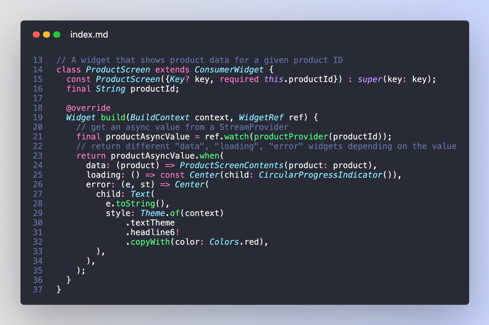

Compared to the built-in `FutureBuilder` and `StreamBuilder` Flutter widgets, working with `AsyncValue` in Riverpod is a breeze:



All this magic is possible because the `when` method gives us a convenient **pattern matching** API, and we can use it to map our data to the UI. 

But there's more. 🧵

```dart
// A screen that shows product data for a given product ID
class ProductScreen extends ConsumerWidget {
  const ProductScreen({Key? key, required this.productId}) : super(key: key);
  final String productId;

  @override
  Widget build(BuildContext context, WidgetRef ref) {
    // get an async value from a StreamProvider
    final productAsyncValue = ref.watch(productProvider(productId));
    // return different "data", "loading", "error" widgets depending on the value
    return productAsyncValue.when(
      data: (product) => ProductScreenContents(product: product),
      loading: () => const Center(child: CircularProgressIndicator()),
      error: (e, st) => Center(
        child: Text(
          e.toString(),
          style: Theme.of(context)
              .textTheme
              .headline6!
              .copyWith(color: Colors.red),
        ),
      ),
    );
  }
}
```

---

As you build your apps, you're likely to have different "data" widgets for different async APIs:

But the loading and error UI are often the same.

And it would be quite repetitive to copy-paste them every time you need a new "async" widget.


---

A better option is to define an `AsyncValueWidget` that takes care of the **loading** and **error** states, and let us customise the UI for the **data** state.

This is easy to implement:


---

With this in place, we can rewrite our `ProductScreen` like this.

Much cleaner.


---

What about slivers? 

The `AsyncValueWidget` class works well for regular widgets. But sometimes you have complex view hierarchies that use slivers.

And if you're not careful, you may end up with errors like this:


---

Well, let's get this sorted by creating an AsyncValueSliverWidget:


---

Wanna use this code in your projects?

Then check out all the extra details from this new article on my site:

https://codewithandrea.com/articles/async-value-widget-riverpod/

---

Did you enjoy this thread?

There's a lot more where this came from: @biz84

Happy coding!


