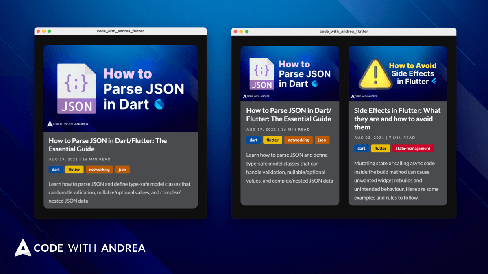

Have you ever tried to build a GridView with custom items, but you've been unable to size them correctly as the width changes?

In such cases, bottom overflows are very common.

Let's see how to fix this: 🧵

IMAGE Twitter card

---

We could try to implement the desired layout with a GridView, and set the *crossAxisCount*, *mainAxisSpacing*, *crossAxisSpacing*, and *childAspectRatio* as needed:

----

But this can only work for a given window width.

If we resize the window, the content inside the items will become taller or shorter.

What we need is *content-sized* items.

And GridView won't work here because it has a *fixed* aspect ratio that applies to all children.

------

What we need is a layout algorithm that can work out *how tall each item should be as the width changes*.

This algorithm should calculate the *height of the tallest item on each row*, and apply that *to all items in the row*.

This means that the size of any given item on the grid *depends on the size of other items in the grid*.

----

Luckily, this wonderful package is perfect for our use case.

It is based on the CSS Grid Layout spec, and is optimized for complex user interface design.

https://pub.dev/packages/flutter_layout_grid

--------

Once installed, we can use it to define *content-sized* items by using *auto*:

-------

That's it! We now have a *responsive* grid layout with *content-sized* items.

And this only takes a few lines of code thanks to flutter_layout_grid!

--------

Want more Flutter tips like this?

Then just follow me: @biz84

I'll share a complete article with more details soon. 👇

