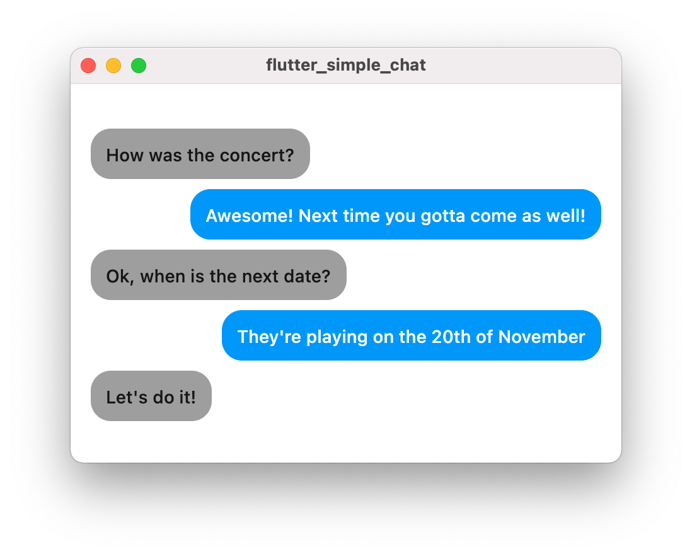
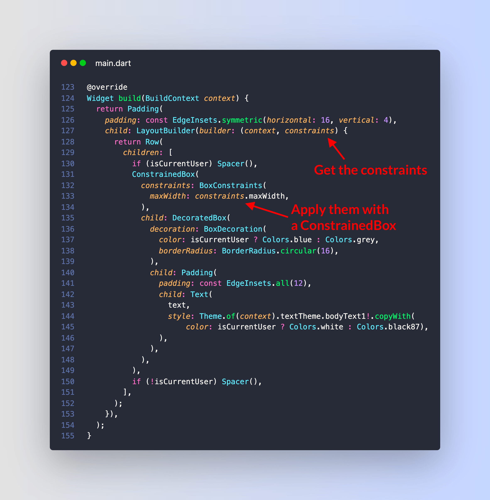
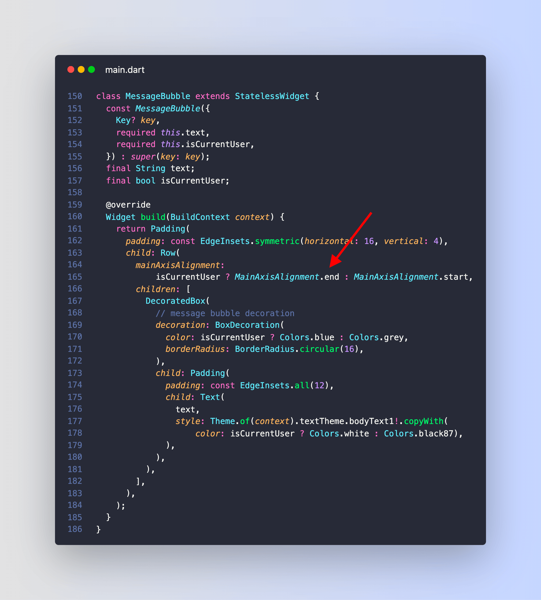
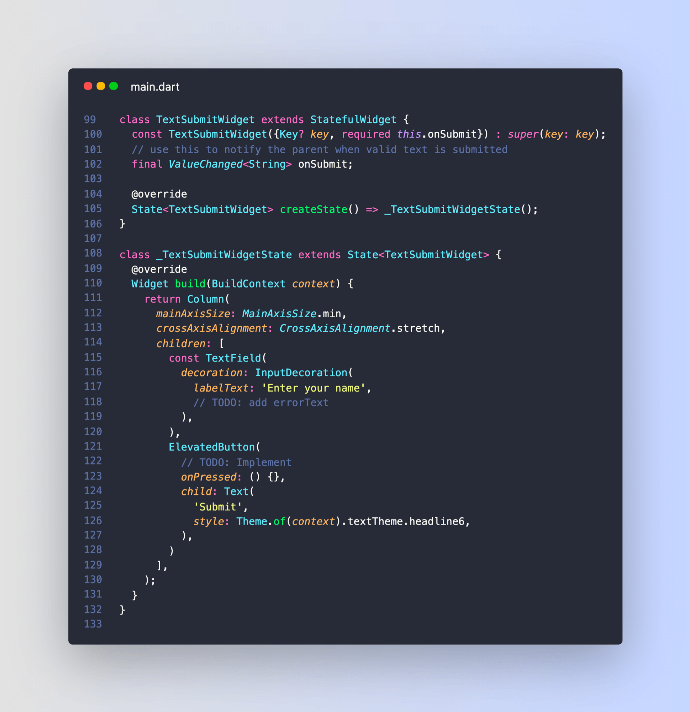
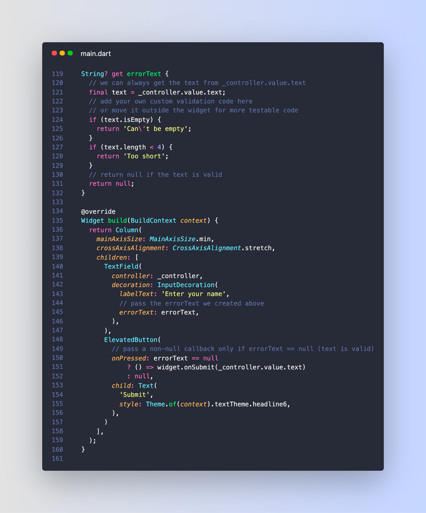
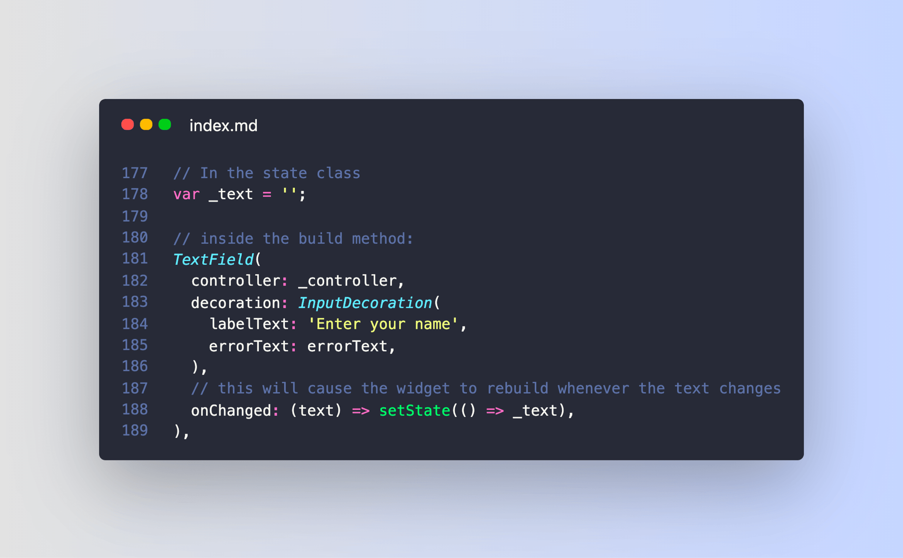
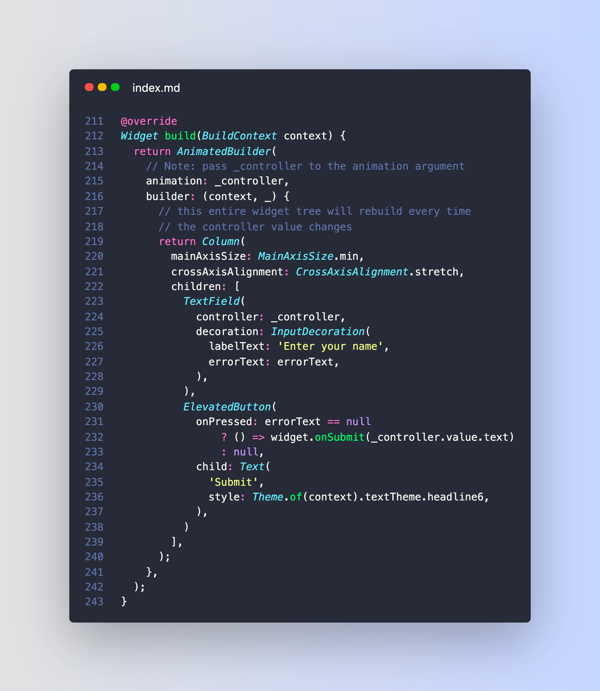
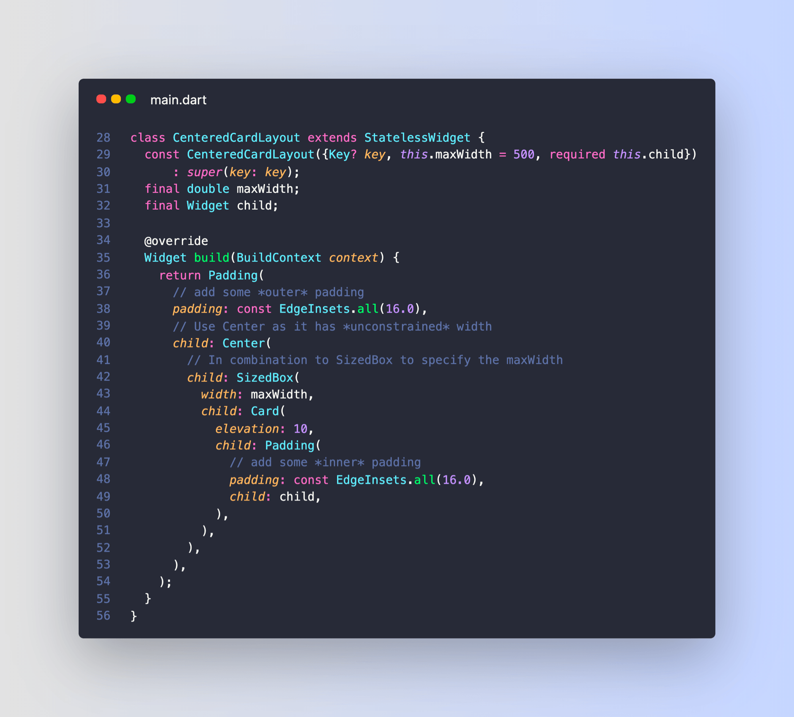

## 1. Split View

- [Link to Tweet](https://twitter.com/biz84/status/1417510791146770432)

#FlutterDev Wanna create a reusable split-view widget that works on mobile, desktop and web?

You can do this in 30 lines of code, without any 3rd party packages: 👇

(spoiler alert: responsive layout tutorial incoming)


Alt: Split view widget on desktop & web + Drawer navigation on mobile

```dart

class SplitView extends StatelessWidget {
  SplitView({required this.menuBuilder,required this.contentBuilder,
      this.breakpoint = 600, this.menuWidth = 240});
  final WidgetBuilder menuBuilder;
  final WidgetBuilder contentBuilder;
  final double breakpoint;
  final double menuWidth;

  @override
  Widget build(BuildContext context) {
    final screenWidth = MediaQuery.of(context).size.width;
    if (screenWidth >= breakpoint) {
      // wide screen: menu on the left, content on the right
      return Row(
        children: [
          SizedBox(
            width: menuWidth,
            child: menuBuilder(context),
          ),
          Container(width: 0.5, color: Colors.black),
          Expanded(child: contentBuilder(context)),
        ],
      );
    } else {
      // narrow screen: show content, menu inside drawer
      return Scaffold(
        body: contentBuilder(context),
        drawer: Drawer(
          child: menuBuilder(context),
        ),
      );
    }
  }
}
```

## 2. Flutter create --sample

Did you know?

You can use `flutter create --sample` to test many of the widgets in the Flutter documentation.


## 3. Stripe

https://twitter.com/biz84/status/1435932664821919751

Did you know?

You can accept payments in your Flutter apps with the Stripe SDK.

Support various payment methods including wallets (Apple, Google Pay).

https://pub.dev/packages/flutter_stripe

<!-- video -->

## 4. flutter_lints

https://twitter.com/biz84/status/1436011664747503616

Have you added linting to your Flutter apps yet?

That's the simplest way to follow good coding practices.

And with the flutter_lints package, this is easier than ever:

https://pub.dev/packages/flutter_lints

## 5. Performance page DevTools

https://twitter.com/biz84/status/1436356730380816388

Having some fun with the new performance page in the Flutter DevTools.

Makes it easier to identify Jank and Shader Compilation issues.

(note: this needs to be run in profile mode on a real device)

## 6. Fix all on save

https://twitter.com/biz84/status/1436734716271644681

The Flutter "Fix All" command is great! 

But you know what's even better?

Fix All on Save. 🚀

Just add "source.fixAll" to "editor.codeActionsOnSave" on your VSCode settings and you're good to go!

<!-- video: 006 -->

## 7. Container border radius

https://twitter.com/biz84/status/1437111434656329730

I've been a Flutter dev for 3 years and I still need to Google "Flutter Container border radius" sometimes. 😅

Let's put it to rest! This is the easiest way to get a rounded rectangle with a given radius:

## 8. Dart Completers (never sent)

## 9. Flutter Simple chat (LayoutBuilder)

https://twitter.com/biz84/status/1437409386423521282

Building a chat UI with message bubbles like this should be easy right?

Not so fast! 🧵



---

This layout can be built with a ListView that contains some message bubbles.

Each bubble is a Row that holds a DecoratedBox (with a child Text) and a Spacer (or viceversa).

The text expands horizontally on one line and the bubble adjusts accordingly.


---

Here's how the message bubble looks in code:


---

But if the screen is narrow and the message bubble doesn't fit within the available width, the text doesn't wrap over multiple lines and we get an error:

A RenderFlex overflowed by 31 pixels on the right.


---

The debugger will suggest applying a flex factor (e.g. using an Expanded widget). But that doesn't quite work.

As we can see with the Widget Inspector, the real problem is that the Text widget (and the parent DecoratedBox) have an *unconstrained width*:


How to fix this?

---

Well, we can use a ConstrainedBox to specify the maximum width of the DecoratedBox.

And that maximum width can be obtained with a LayoutBuilder widget.

Here's the code:



---

And here's the working app with the fixed layout (note how the text now wraps over multiple lines):


----

TL;DR:

- Text widgets will only wrap over multiple lines if they have a **constrained** width
- but this doesn't happen by default when they're placed inside a Row
- ConstrainedBox comes to the rescue by providing a maximum width
- that maximum width can be obtained from a LayoutBuilder widget

----

## 10. Message bubbles (updated)

https://twitter.com/biz84/status/1437692261672919041

Remember this thread about how to create a chat with message bubbles?

Well, I found a simpler and more performant solution. 

Let's get back to basics. 🧵

-----

What we want to do is to *align* our message bubble to the left or right as needed.

We *could* accomplish this using a Row with MainAxisAlignment.start or MainAxisAlignment.end.



---

But that leads to an unconstrained width issue and breaks our layout in certain cases.

This *could* be fixed with LayoutBuilder + ConstrainedBox. But there's a better way.


---

What if we could *align* the child widget *without* using a Row?

Well, turns out a simple *Align* widget does the trick:


---

And with this change, the text inside each message bubble will wrap over multiple lines if needed.


---

Albert Einstein said it best:

"Everything should be made as simple as possible, but not simpler."

Turns out, this is great advice for Flutter app development. 

Happy coding!

## 11. Faker
https://twitter.com/biz84/status/1438096427306168324

Want to quickly generate some fake data to use when building Flutter UIs?

Use the Faker package: https://pub.dev/packages/faker

Supports addresses, names, food, dates, sports... you name it!


## 12. Elevated Button

https://twitter.com/biz84/status/1439910121975558145

## 13. Flutter text field validation

https://twitter.com/biz84/status/1443521715800354816

How do you validate a TextField *as the user types* in Flutter?

Let's figure it out. 🧵

(hint: we'll use an AnimatedBuilder)

GIF

---

Let's start with a StatefulWidget that contains a TextField and an ElevatedButton.

This just shows the UI but doesn't do any validation.



---

Next, let's create a TextEditingController, dispose it as needed, and pass it to the TextField.


---

To validate the text, we can add:

- an errorText getter variable
- pass it to the TextField
- use it to enable/disable our button with some conditional logic



---

But if we try this now, both the TextField error hint and the button UI don't update as the text changes.

Why? 🧐

---

We forgot to tell Flutter to rebuild our widget when the text changes!

This *could* be fixed by setting a local state variable with a call to setState() in the TextField onChanged callback.



---

But we don't even need a local state variable in the first place because TextEditingController already contains the text value.

So how can we rebuild the widget when the text value changes?

----

We can wrap our widgets with an AnimatedBuilder and pass our TextEditingController to the animation argument:



---

This works because AnimatedBuilder takes an animation argument of type Listenable.

And TextEditingController extends ValueNotifier, which extends ChangeNotifier, which implements Listenable.

This means that we can pass instances of any of these classes to AnimatedBuilder.

And we can now validate our text on the fly:


--------


I have just written an article that covers all these details and includes all the source code.

Feel free to use this as reference for your projects.

And if you liked this, follow me for more Flutter tips: @biz84.

Happy coding!

// article link

```dart
class TextEditingController extends ValueNotifier<TextEditingValue> { ... }
class ValueNotifier<T> extends ChangeNotifier implements ValueListenable<T> { ... }
class ChangeNotifier implements Listenable { ... }
```

## 014 Centered card layout

How do you create a Flutter card layout that grows horizontally up to a given width, then remains fixed at that width just like in this example?

---

This can be done by composing Center and SizedBox widgets like so:



---

Why does this work?

Well, it's all about *tight* vs *loose* constraints:

- Center has loose constraints
- SizedBox has tight constraints

Combine them together for profit.

This excellent article by @mhadaily explains all the details:

https://blog.logrocket.com/best-practices-laying-out-flutter-app/


## 015


## Tweet ideas

- SliverPadding
- camera / image picker from the [Flutter 2.5 announcement](https://medium.com/flutter/whats-new-in-flutter-2-5-6f080c3f3dc)


## Profiling on iOS device: permissions

https://flutter.dev/docs/development/add-to-app/ios/project-setup#local-network-privacy-permissions

