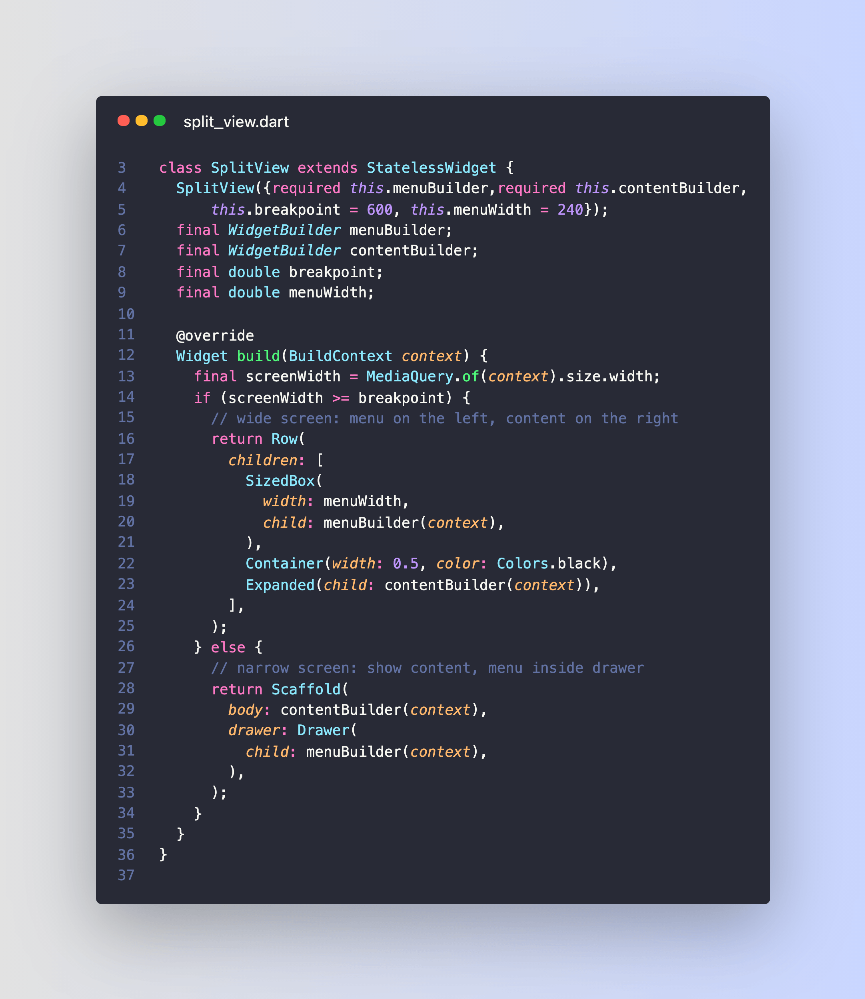

# Flutter reusable Split View on mobile, desktop and web

Wanna create a reusable split-view widget that works on mobile, desktop and web?

You can do this in 30 lines of code, without any 3rd party packages: 👇

> Complete article: [Responsive layouts in Flutter: Split View and Drawer Navigation](https://codewithandrea.com/articles/flutter-responsive-layouts-split-view-drawer-navigation/)

---

### Found this useful? Show some love and share the [original tweet](https://twitter.com/biz84/status/1417510791146770432) 🙏

---

| Previous | Next |
| -------- | ---- |
|          | [Flutter create --sample](../0002-flutter-create-sample/index.md) |