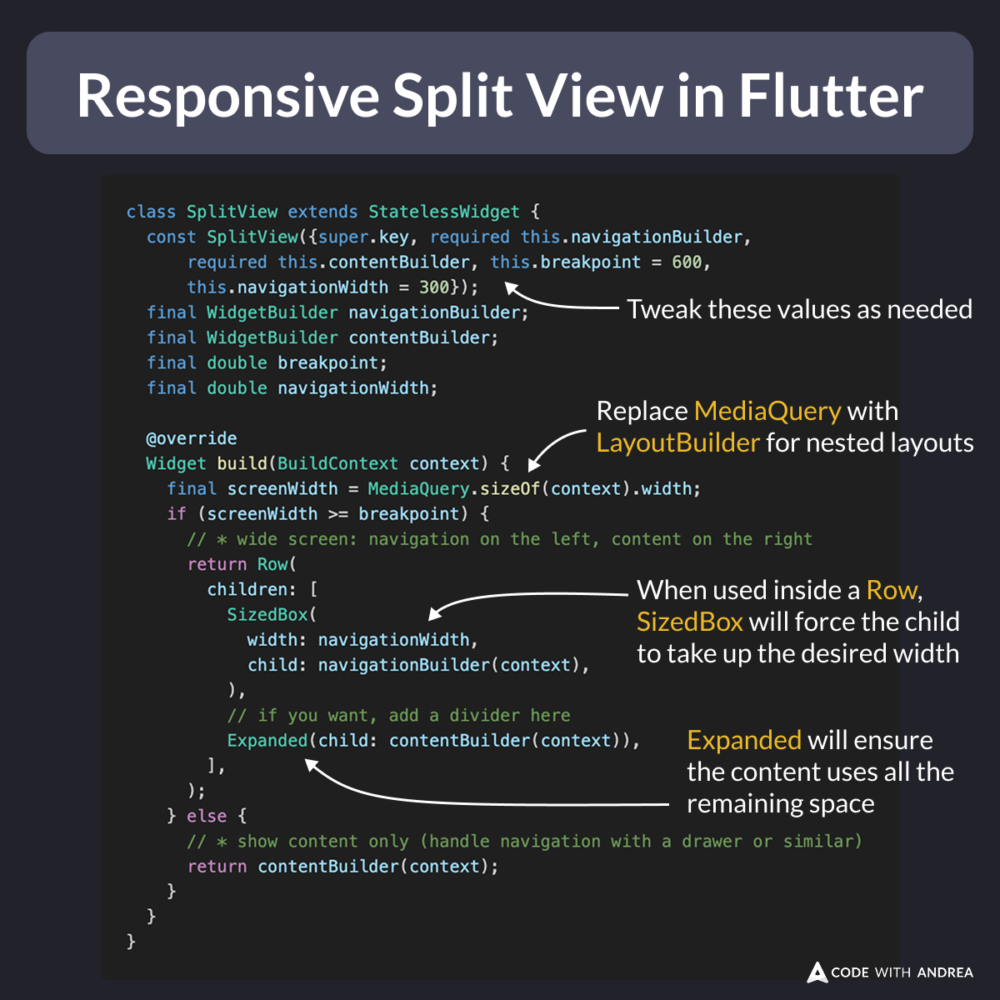

# Responsive Split View in Flutter

Did you know?

In Flutter, you can easily create a responsive split-view widget that works on mobile, desktop and web.

You can do this in 30 lines of code, without any 3rd party packages: 👇

<!--
class SplitView extends StatelessWidget {
  const SplitView({super.key, required this.navigationBuilder,
      required this.contentBuilder, this.breakpoint = 600,
      this.navigationWidth = 300});
  final WidgetBuilder navigationBuilder;
  final WidgetBuilder contentBuilder;
  final double breakpoint;
  final double navigationWidth;

  @override
  Widget build(BuildContext context) {
    final screenWidth = MediaQuery.sizeOf(context).width;
    if (screenWidth >= breakpoint) {
      // * wide screen: navigation on the left, content on the right
      return Row(
        children: [
          SizedBox(
            width: navigationWidth,
            child: navigationBuilder(context),
          ),
          // if you want, add a divider here
          Expanded(child: contentBuilder(context)),
        ],
      );
    } else {
      // * show content only (handle navigation with a drawer or similar)
      return contentBuilder(context);
    }
  }
}
-->

---

For a more complete tutorial, read this article (slightly outdated, but the main principles still apply):

- [Responsive layouts in Flutter: Split View and Drawer Navigation](https://codewithandrea.com/articles/flutter-responsive-layouts-split-view-drawer-navigation/)

---

| Previous | Next |
| -------- | ---- |
|          | [Flutter create --sample](../0002-flutter-create-sample/index.md) |

<!-- TWITTER|https://x.com/biz84/status/1888985406047158782 -->
<!-- LINKEDIN|https://www.linkedin.com/posts/andreabizzotto_did-you-know-in-flutter-you-can-easily-activity-7294751218587897859-j67T -->
<!-- BLUESKY|https://bsky.app/profile/codewithandrea.com/post/3lhtkbyqr2c2f -->
<!-- CWA|https://codewithandrea.com/articles/flutter-responsive-layouts-split-view-drawer-navigation/ -->
