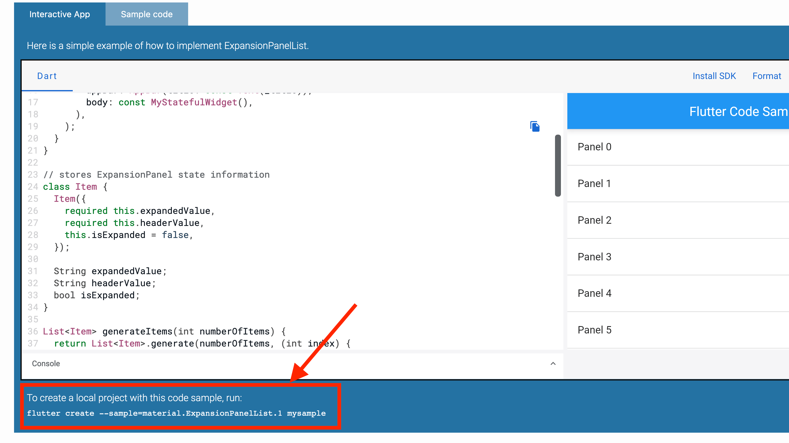

# Flutter create --sample

Did you know?

You can use `flutter create --sample` to test many of the widgets in the Flutter documentation.

---

### Found this useful? Show some love and share the [original tweet](https://twitter.com/biz84/status/1433812404463448064) 🙏

---

| Previous | Next |
| -------- | ---- |
| [Flutter reusable Split View on mobile, desktop and web](../0001-flutter-reusable-split-view-on-mobile-desktop-and-web/index.md) | [Accept payments with the Stripe SDK](../0003-accept-payments-with-the-stripe-sdk/index.md) |

<!-- TODO:UPDATE -->
<!-- TWITTER|https://twitter.com/biz84/status/1433812404463448064 -->
