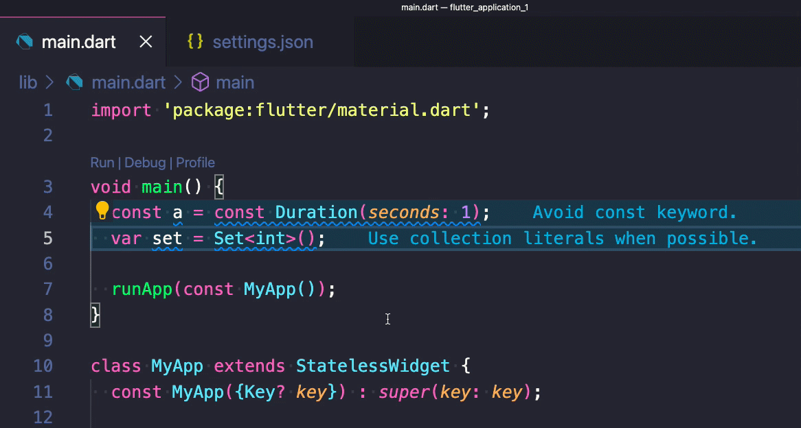

# Flutter Fix all command

The Flutter "Fix All" command is great!

But you know what's even better?

Fix All on Save. 🚀

Just add "source.fixAll" to "editor.codeActionsOnSave" on your VSCode settings and you're good to go!

---

### Found this useful? Show some love and share the [original tweet](https://twitter.com/biz84/status/1436734716271644681) 🙏