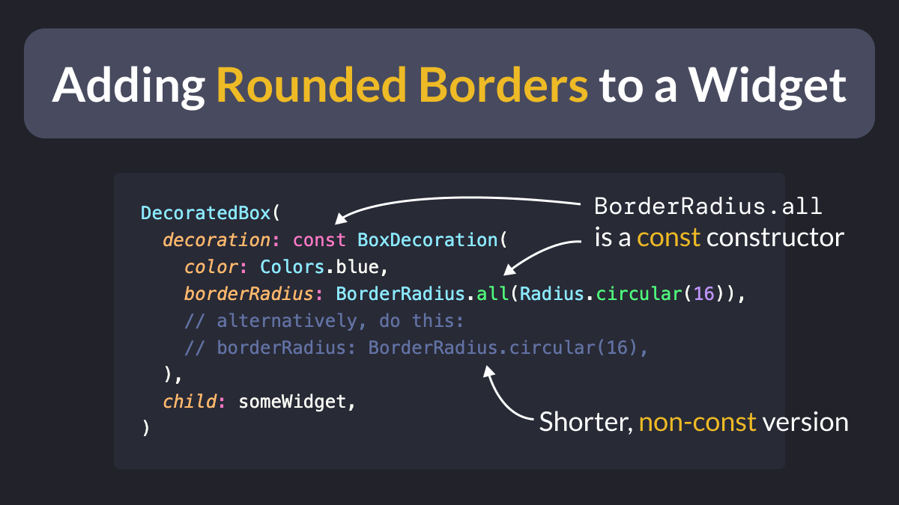

# How to set the border radius on a Flutter widget

I've been a Flutter dev for many years and I still need to Google "Flutter border radius" sometimes. 😅

Let's put it to rest! This is the easiest way to get a rounded rectangle with a given radius:

<!--
DecoratedBox(
  decoration: const BoxDecoration(
    color: Colors.blue,
    borderRadius: BorderRadius.all(Radius.circular(16)),
    // alternatively, do this:
    // borderRadius: BorderRadius.circular(16),
  ),
  child: someWidget,
)
-->

A couple things to note:

- `Container` also has a `decoration` argument, but using `DecoratedBox` is more lightweight.
- the above also works with `BorderRadius.circular(16)`, however `BorderRadius.all()` is a `const` constructor and therefore more optimal.

---

### Also published on codewithandrea.com 👇

- [How to add Rounded Borders to a Widget in Flutter](https://codewithandrea.com/tips/rounded-border-widget-flutter/)

---

### Found this useful? Show some love and share the [original tweet](https://twitter.com/biz84/status/1437111434656329730) 🙏

---

| Previous | Next |
| -------- | ---- |
| [Flutter Fix all command](../0006-flutter-fix-all-command/index.md) | [Chat UI with message bubbles](../0008-chat-ui-with-message-bubbles/index.md) |

<!-- TODO:UPDATE -->
<!-- TWITTER|https://twitter.com/biz84/status/1437111434656329730 -->