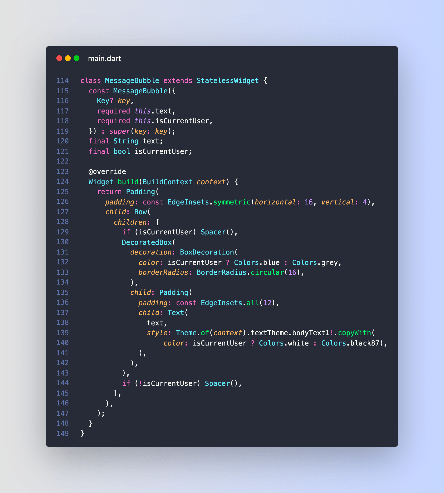
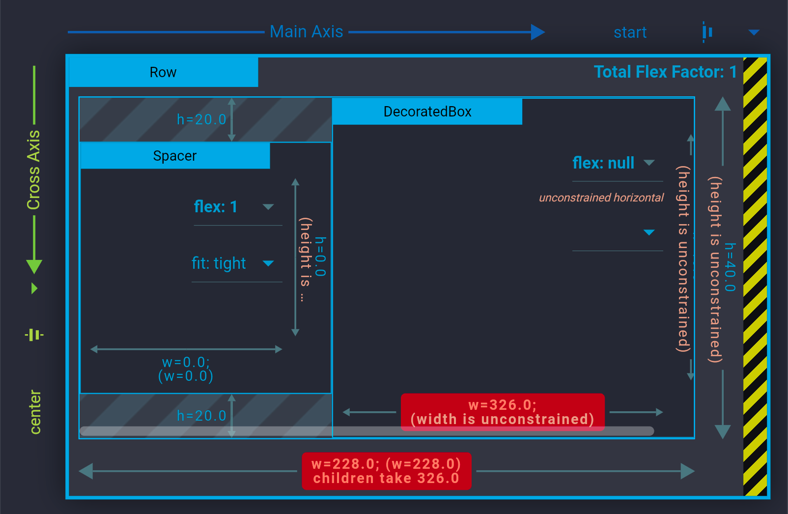

# Chat UI with message bubbles

Building a chat UI with message bubbles like this should be easy right?

Not so fast! 🧵

---

This layout can be built with a ListView that contains some message bubbles.

Each bubble is a Row that holds a DecoratedBox (with a child Text) and a Spacer (or viceversa).

The text expands horizontally on one line and the bubble adjusts accordingly.

---

Here's how the message bubble looks in code:

---

But if the screen is narrow and the message bubble doesn't fit within the available width, the text doesn't wrap over multiple lines and we get an error:

A RenderFlex overflowed by 31 pixels on the right.

---

The debugger will suggest applying a flex factor (e.g. using an Expanded widget). But that doesn't quite work.

As we can see with the Widget Inspector, the real problem is that the Text widget (and the parent DecoratedBox) have an *unconstrained width*:

How to fix this?

---

Well, we can use a ConstrainedBox to specify the maximum width of the DecoratedBox.

And that maximum width can be obtained with a LayoutBuilder widget.

Here's the code:

---

And here's the working app with the fixed layout (note how the text now wraps over multiple lines):

----

TL;DR:

- Text widgets will only wrap over multiple lines if they have a **constrained** width
- but this doesn't happen by default when they're placed inside a Row
- ConstrainedBox comes to the rescue by providing a maximum width
- that maximum width can be obtained from a LayoutBuilder widget

---

> Complete article: [How to build a Chat Messaging UI in Flutter](https://codewithandrea.com/articles/chat-messaging-ui-flutter/)

---

### Found this useful? Show some love and share the [original tweet](https://twitter.com/biz84/status/1437409386423521282) 🙏

---

| Previous | Next |
| -------- | ---- |
| [How to set the border radius on a Flutter container](../0007-how-to-set-the-border-radius-on-a-flutter-container/index.md) | [Chat UI with message bubbles (revisited)](../0009-chat-ui-with-message-bubbles-revisited/index.md) |

<!-- TODO:REPLACE -->
<!-- TWITTER|https://twitter.com/biz84/status/1437409386423521282 -->
<!-- CWA|https://codewithandrea.com/articles/chat-messaging-ui-flutter/ -->
