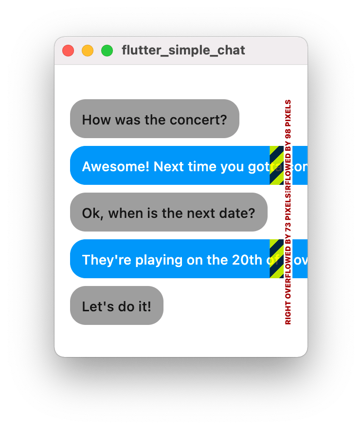
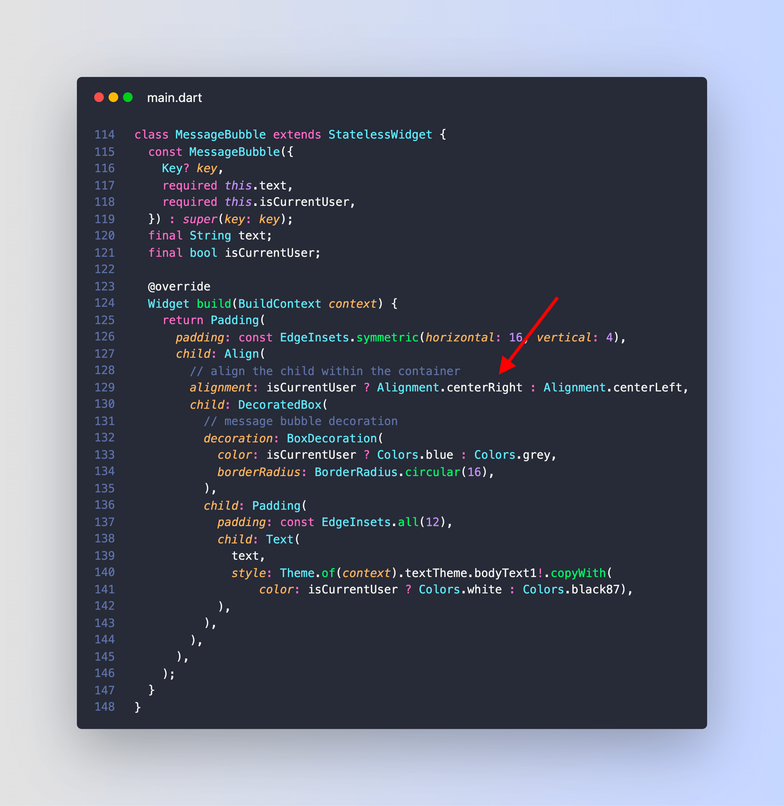

# Chat UI with message bubbles (revisited)

Remember this thread about how to create a chat with message bubbles?

- [Chat UI with message bubbles (Twitter thread)](https://twitter.com/biz84/status/1437409386423521282)

Well, I found a simpler and more performant solution.

Let's get back to basics. 🧵

-----

What we want to do is to **align** our message bubble to the left or right as needed.

We **could** accomplish this using a Row with MainAxisAlignment.start or MainAxisAlignment.end.

---

But that leads to an unconstrained width issue and breaks our layout in certain cases.

This **could** be fixed with `LayoutBuilder` + `ConstrainedBox`. But there's a better way.

---

What if we could **align** the child widget **without** using a `Row`?

Well, turns out a simple `Align` widget does the trick:

---

And with this change, the text inside each message bubble will wrap over multiple lines if needed.

---

Albert Einstein said it best:

> "Everything should be made as simple as possible, but not simpler."

Turns out, this is great advice for Flutter app development.

Happy coding!

---

### Found this useful? Show some love and share the [original tweet](https://twitter.com/biz84/status/1437692261672919041) 🙏

---

| Previous | Next |
| -------- | ---- |
| [Chat UI with message bubbles](../0008-chat-ui-with-message-bubbles/index.md) | [How to Generate Fake data with the Faker package](../0010-how-to-generate-fake-data-with-the-faker-package/index.md) |