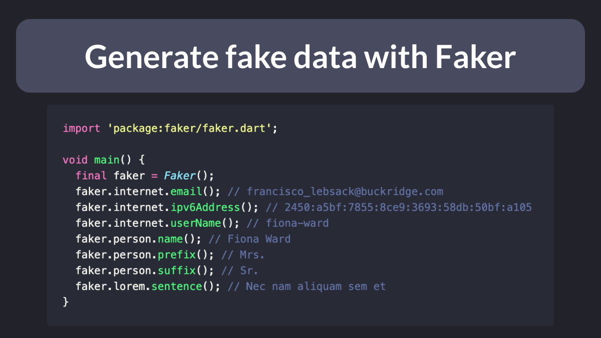

# How to Generate Fake data with the Faker package

Want to quickly generate some fake data to use when building Flutter UIs?

Use the Faker package:

- [https://pub.dev/packages/faker](https://pub.dev/packages/faker)

Supports addresses, names, food, dates, sports... you name it!

<!--
import 'package:faker/faker.dart';

void main() {
  final faker = Faker();
  faker.internet.email(); // francisco_lebsack@buckridge.com
  faker.internet.ipv6Address(); // 2450:a5bf:7855:8ce9:3693:58db:50bf:a105
  faker.internet.userName(); // fiona-ward
  faker.person.name(); // Fiona Ward
  faker.person.prefix(); // Mrs.
  faker.person.suffix(); // Sr.
  faker.lorem.sentence(); // Nec nam aliquam sem et
}
-->

---

### Found this useful? Show some love and share the [original tweet](https://twitter.com/biz84/status/1438096427306168324) 🙏

---

| Previous | Next |
| -------- | ---- |
| [Chat UI with message bubbles (revisited)](../0009-chat-ui-with-message-bubbles-revisited/index.md) | [How to Style an `ElevatedButton` in Flutter](../0011-how-to-style-an-elevatedbutton-in-flutter/index.md) |

<!-- TODO:UPDATE -->
<!-- TWITTER|https://twitter.com/biz84/status/1438096427306168324 -->