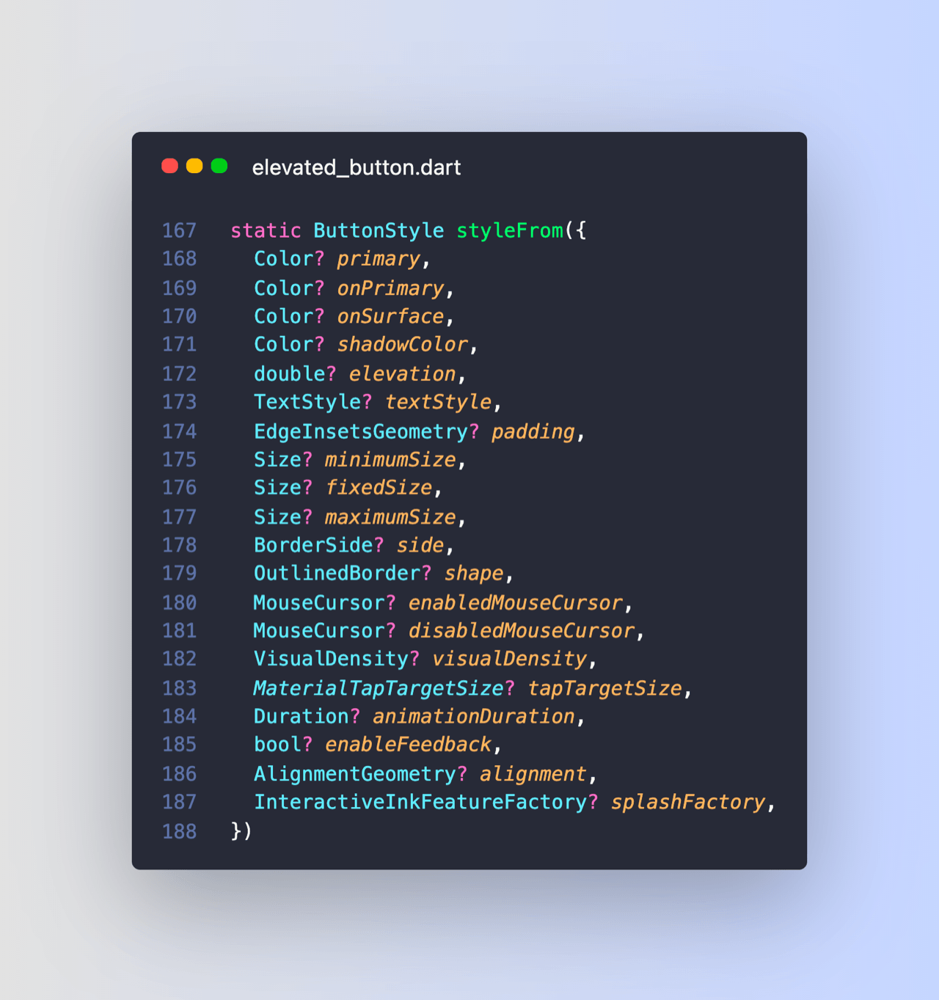

# How to Style an ElevatedButton in Flutter

So how do you style an ElevatedButton in Flutter?

Glad you asked. This is the simplest way:

---

Of course, ButtonStyle has many properties.

As usual, the documentation is your friend:

---

Want a consistent style across all ElevatedButtons in your app?

Then set ThemeData.elevatedButtonTheme in your MaterialApp and you're good to go:

---

### Found this useful? Show some love and share the [original tweet](https://twitter.com/biz84/status/1439910121975558145) 🙏

### Also published on codewithandrea.com 👇

- [How to style an ElevatedButton in Flutter](https://codewithandrea.com/tips/elevated-button-style-flutter/)

---

| Previous | Next |
| -------- | ---- |
| [How to Generate Fake data with the Faker package](../0010-how-to-generate-fake-data-with-the-faker-package/index.md) | [How to Validate a `TextField` in Flutter](../0012-how-to-validate-a-textfield-in-flutter/index.md) |