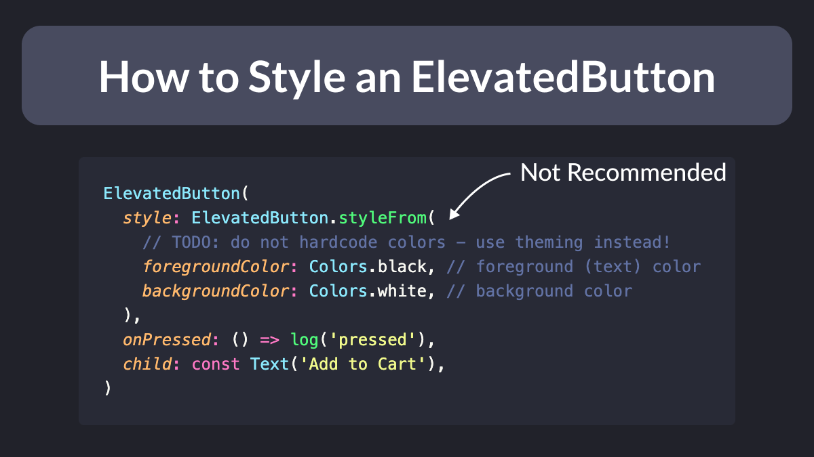
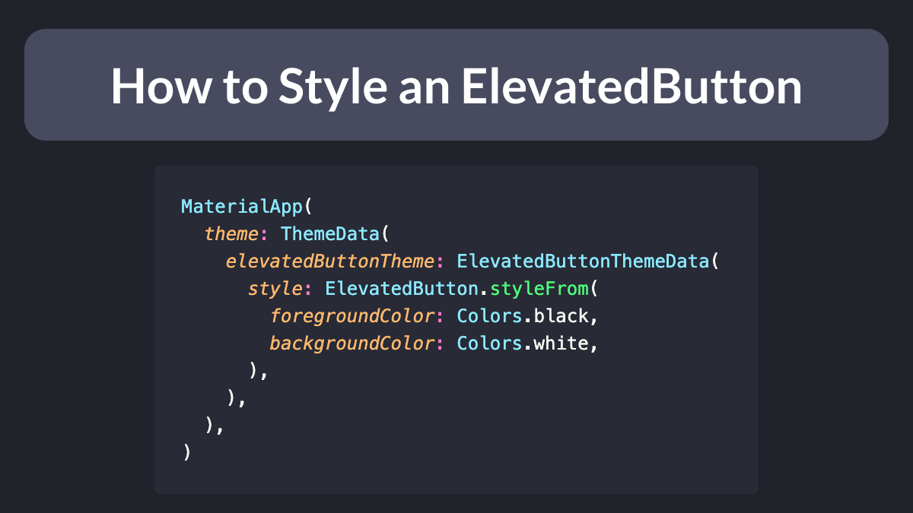

# How to Style an ElevatedButton in Flutter

How do you style an `ElevatedButton` in Flutter?

Glad you asked. This is the simplest way:



---

Want a consistent style across all `ElevatedButtons` in your app?

Then set `ThemeData.elevatedButtonTheme` in your `MaterialApp` and you're good to go:



---

Of course, `ButtonStyle` has many properties:

```dart
static ButtonStyle styleFrom({
  Color? foregroundColor,
  Color? backgroundColor,
  Color? disabledForegroundColor,
  Color? disabledBackgroundColor,
  Color? shadowColor,
  Color? surfaceTintColor,
  double? elevation,
  TextStyle? textStyle,
  EdgeInsetsGeometry? padding,
  Size? minimumSize,
  Size? fixedSize,
  Size? maximumSize,
  BorderSide? side,
  OutlinedBorder? shape,
  MouseCursor? enabledMouseCursor,
  MouseCursor? disabledMouseCursor,
  VisualDensity? visualDensity,
  MaterialTapTargetSize? tapTargetSize,
  Duration? animationDuration,
  bool? enableFeedback,
  AlignmentGeometry? alignment,
  InteractiveInkFeatureFactory? splashFactory,
})
```

As usual, the [documentation](https://api.flutter.dev/flutter/material/ElevatedButton/styleFrom.html) is your friend.

> Complete article: [How to style an ElevatedButton in Flutter](https://codewithandrea.com/tips/elevated-button-style-flutter/)

---

### Found this useful? Show some love and share the [original tweet](https://twitter.com/biz84/status/1439910121975558145) 🙏

---

| Previous | Next |
| -------- | ---- |
| [How to Generate Fake data with the Faker package](../0010-how-to-generate-fake-data-with-the-faker-package/index.md) | [How to Validate a `TextField` in Flutter](../0012-how-to-validate-a-textfield-in-flutter/index.md) |

<!-- TODO:UPDATE -->
<!-- TWITTER|https://twitter.com/biz84/status/1439910121975558145 -->