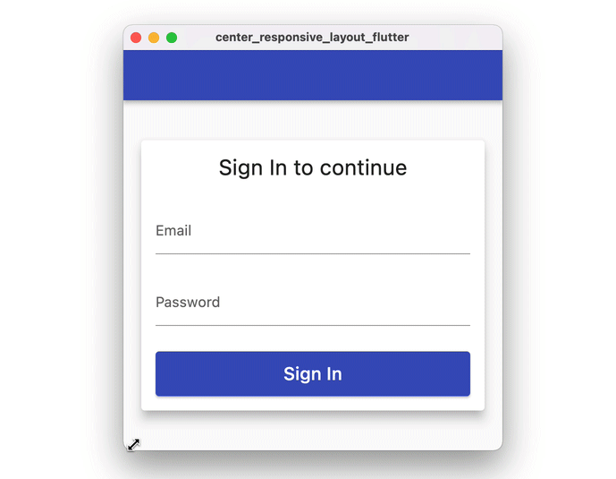
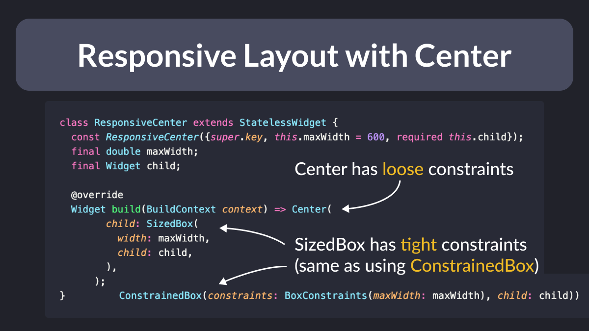
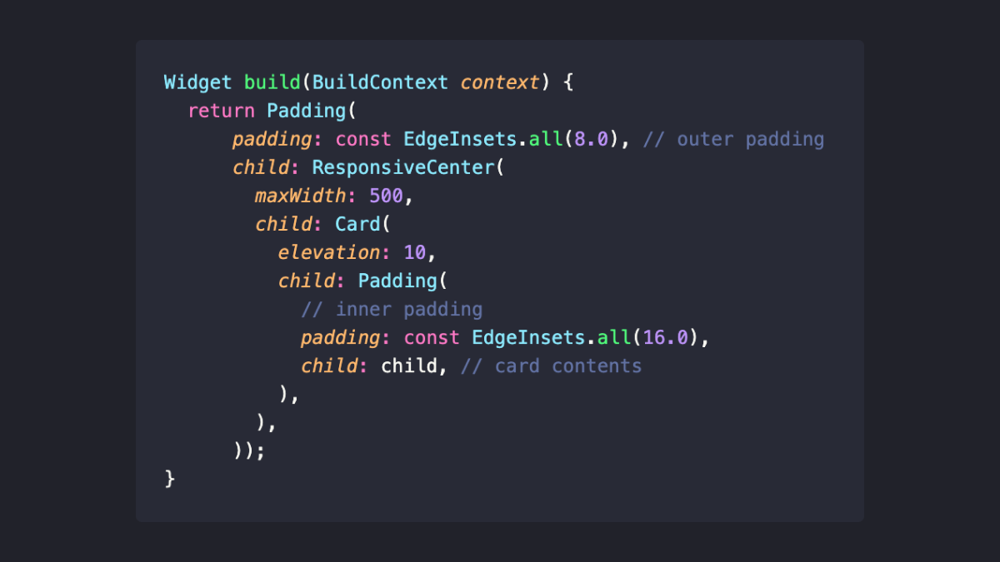

# Responsive Flutter layout with SizedBox & Center

How do you create a Flutter card layout that grows horizontally up to a given width, then remains fixed at that width just like in this example?

---

This can be done by composing `Center` and `SizedBox` widgets like so:

<!--
class ResponsiveCenter extends StatelessWidget {
  const ResponsiveCenter({super.key, this.maxWidth = 600, required this.child});
  final double maxWidth;
  final Widget child;

  @override
  Widget build(BuildContext context) => Center(
        // can use ConstrainedBox as an alternative to SizedBox
        child: SizedBox(
          width: maxWidth,
          child: child,
        ),
      );
}
-->

---

Then, to recreate the card layout from above, you can use this code:

<!--
class CenteredCardLayout extends StatelessWidget {
  const CenteredCardLayout({super.key, required this.child});
  final Widget child;

  @override
  Widget build(BuildContext context) {
    return Padding(
        padding: const EdgeInsets.all(8.0), // outer padding
        child: ResponsiveCenter(
          maxWidth: 500,
          child: Card(
            elevation: 10,
            child: Padding(
              padding: const EdgeInsets.all(16.0), // inner padding
              child: child, // card contents
            ),
          ),
        ));
  }
}
-->

---

### Tight and Loose Constraints

Why does this work?

Well, it's all about **tight** vs **loose** constraints:

- `Center` has loose constraints
- `SizedBox` has tight constraints

Combine them together for fun and profit.

### Going Further with ResponsiveCenterScrollable

The `ResponsiveCenter` widget works well for simple use cases **without** scrollable content.

But if you want to use the same technique with scrollable widgets (such as a `ListView`), you'll need to do some extra work.

To make life easier, I created a `ResponsiveCenterScrollable` widget that you can use in your projects.

Here's a full Dartpad example showing how it works:

- [ResponsiveCenterScrollable demo with Dartpad](https://dartpad.dev/?id=6294ffeaef0ea8f5dfdfce1909f80422)

---

### Found this useful? Show some love and share the [original tweet](https://twitter.com/biz84/status/1445400059894542337) 🙏

---

| Previous | Next |
| -------- | ---- |
| [How to Validate a `TextField` in Flutter](../0012-how-to-validate-a-textfield-in-flutter/index.md) | [How to navigate programmatically between tabs in Flutter](../0014-how-to-navigate-programmatically-between-tabs-in-flutter/index.md) |

<!-- TODO:UPDATE -->