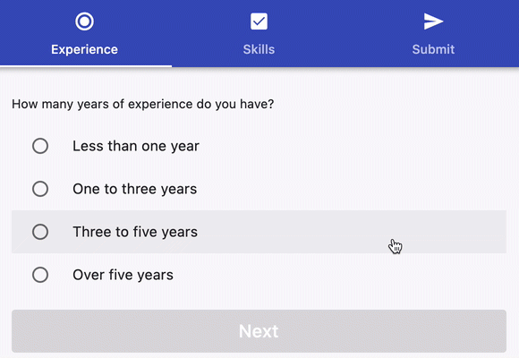
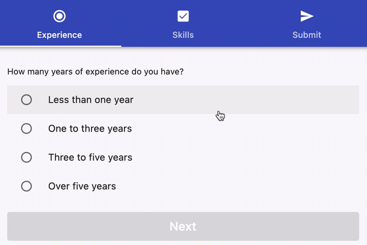

# How to navigate programmatically between tabs in Flutter

How do you navigate programmatically between tabs like this in Flutter?

Let's figure it out. 🧵

----

First of all, we need:

- a `TabBar` with three tabs
- a `TabController` to control the selected tab

----

Then, let's add a `TabBarView` to contain all the views (pages).

Our custom views have an `onNext` callback that we can use to change the index of the `TabController` (and update the page).

----

This works, but by default we can still navigate through tabs by tapping on them.

If we want to lead the user through the pages in order, this is not ideal:

---

To address this, we can create a `ReadOnlyTabBar` that uses `IgnorePointer` to ignore all interactions with the tabs.

Then we can wrap the `TabBar` with this new widget:

---

We should also make sure that we can't switch between tabs with interactive drag gestures.

`NeverScrollableScrollPhysics()` helps with that:

---

And that's it! We now have leveraged `TabController`, `TabBar`, and `TabBarView` to create a multi-step user journey.

For bonus points, we can show a dialog and reset the `TabController` index to 0 when we press OK:

----

You can find the full source code for this example on DartPad:

https://dartpad.dev/?null_safety=true&id=aabd31bb2b9a4b16d822759fce8b5010

Want more Flutter tips like this? Then follow me: [@biz84](https://twitter.com/biz84)

Happy coding!

---

### Found this useful? Show some love and share the [original tweet](https://twitter.com/biz84/status/1447859250852663301) 🙏

### Also published on codewithandrea.com 👇

- [Flutter TabBar Tutorial: How to Navigate Programmatically Between Tabs](https://codewithandrea.com/articles/flutter-tab-bar-navigation/)

---

| Previous | Next |
| -------- | ---- |
| [Responsive Flutter card layout with `SizedBox` & `Center`](../0013-responsive-flutter-card-layout-with-sizedbox-center/index.md) | [`AsyncValueWidget`: a reusable Flutter widget to work with `AsyncValue` (using Riverpod)](../0015-asyncvaluewidget-a-reusable-flutter-widget-to-work-with-asyncvalue/index.md) |

<!-- TODO:UPDATE -->