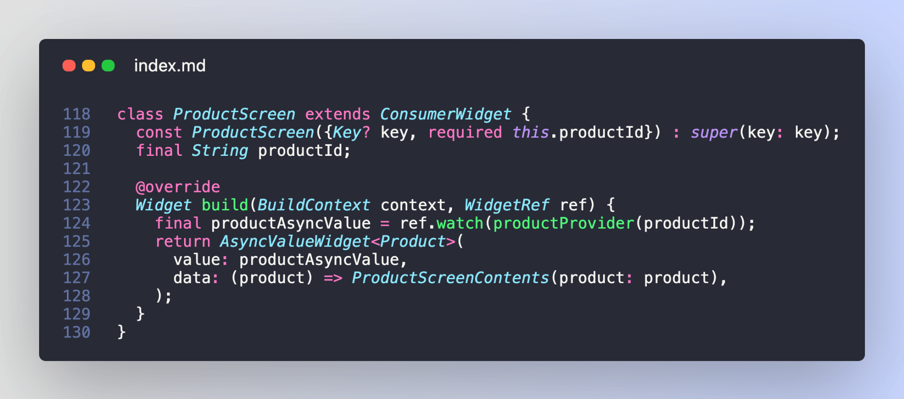
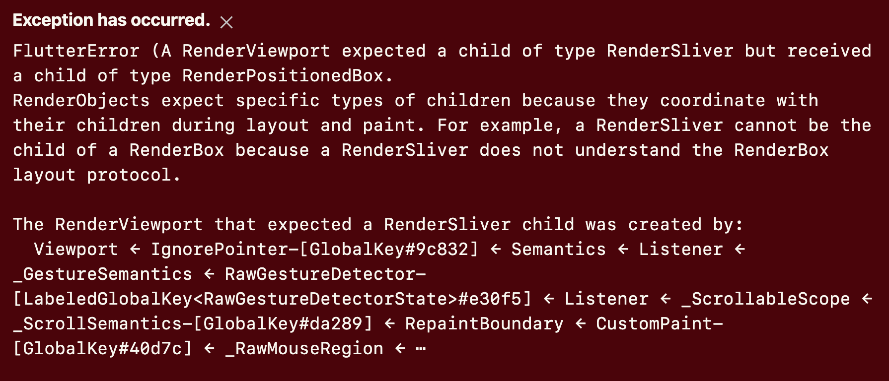

# AsyncValueWidget: a reusable Flutter widget to work with AsyncValue (using Riverpod)

Compared to the built-in `FutureBuilder` and `StreamBuilder` Flutter widgets, working with `AsyncValue` in Riverpod is a breeze:

All this magic is possible because the `when` method gives us a convenient **pattern matching** API, and we can use it to map our data to the UI. 

But there's more. 🧵

---

As you build your apps, you're likely to have different "data" widgets for different async APIs:

But the loading and error UI are often the same.

And it would be quite repetitive to copy-paste them every time you need a new "async" widget.

---

A better option is to define an `AsyncValueWidget` that takes care of the **loading** and **error** states, and let us customise the UI for the **data** state.

This is easy to implement:

---

With this in place, we can rewrite our `ProductScreen` like this.

Much cleaner.

---

What about slivers? 

The `AsyncValueWidget` class works well for regular widgets. But sometimes you have complex view hierarchies that use slivers.

And if you're not careful, you may end up with errors like this:

---

Well, let's get this sorted by creating an AsyncValueSliverWidget:

---

Wanna use this code in your projects?

Then check out all the extra details from this new article on my site:

https://codewithandrea.com/articles/async-value-widget-riverpod/

---

Did you enjoy this thread?

There's a lot more where this came from: [@biz84](https://twitter.com/biz84)

Happy coding!

### Found this useful? Show some love and share the [original tweet](https://twitter.com/biz84/status/1447949847361998849) 🙏

### Also published on codewithandrea.com 👇

- [AsyncValueWidget: a reusable Flutter widget to work with AsyncValue (using Riverpod)](https://codewithandrea.com/articles/async-value-widget-riverpod/)

