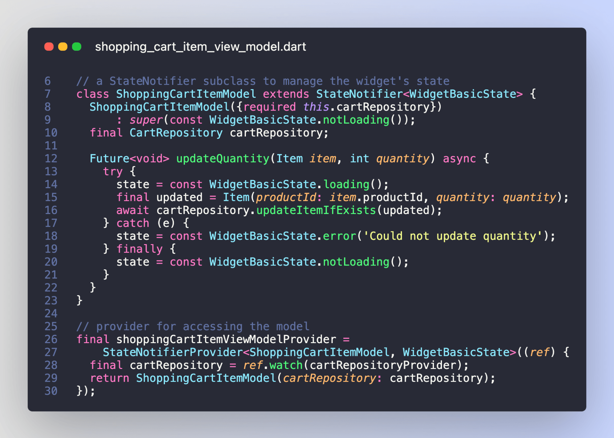

# Easily handle loading and error states

> Note: This thread is outdated. Please see this article for an updated version: [How to handle loading and error states with StateNotifier & AsyncValue in Flutter](https://codewithandrea.com/articles/loading-error-states-state-notifier-async-value/)

Want to easily handle loading and error states in your widgets?

Here's an utility class I created with Freezed:

How does this work? 🧵

---

As this uses Freezed, you need to run:

`flutter pub run build_runner build --delete-conflicting-outputs`

Then you can use it like this inside a `StateNotifier` subclass that will represent your widget's state:

---

Finally, in the widget build method you can setup a listener that will show a SnackBar whenever an error state is observed.

---

All the code above works if you use Riverpod and Freezed in your app, so make sure they are installed.

I've got more tips like this coming along. So follow me for more: [@biz84](https://twitter.com/biz84).

---

### Found this useful? Show some love and share the [original tweet](https://twitter.com/biz84/status/1448946157909053469) 🙏