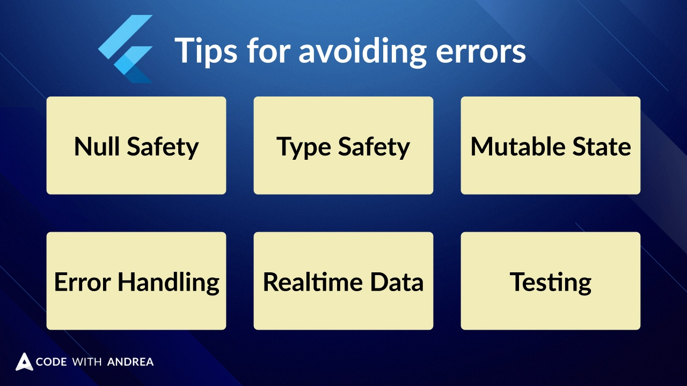

# 6 common sources of errors in Flutter apps

I can think of 6 very common sources of errors in Flutter apps.

With a bit of planning and attention, each one can be solved.

Let's take a look. 🧵

---

1. Improper use of null values and Null Safety features.

Solution: variables should be non-nullable by default unless there's a good reason not to.

And make sure you also use all the null-aware operators (?, !, ?., !., ??) correctly.

---

2. Using maps and lists of *dynamic* values rather than *type-safe* model classes.

Packages like Freezed and the Data Class extension help with this. Use them.

https://pub.dev/packages/freezed

---

3. Using mutable state for things that should be immutable.

Many state management packages prefer immutable data for good reason (don't fight them)

---

4. Not catching errors or handling them in the wrong place.

Solution: plan (and design for) error handling in relation to your application layers (e.g. widgets, state, repositories, services)

Also install (and properly use) an error reporting tools to catch errors in the wild.

---

5. Not making widgets *reactive* when they read data from *realtime* data sources.

This can cause widgets to show old data or not update when they should. 

So think about each individual source of realtime data (streams, state notifiers) and design your widgets accordingly.

---

6. Lack of tests (unit, widget, integration etc.).

This *will* cause bugs and regressions and will bite you hard as your codebase grows.

Solution: strategically write tests for new features. When you find a bug, write a failing test and fix it.

If that's your thing, do TDD.

---

The good news is that with a *repeatable* and well defined development process, all these issues can be solved, *consistently*.

Want me to create more content about these topics?

Then like the first tweet in this thread.

---

And for more Flutter tips and threads like this, just follow me: [@biz84](https://twitter.com/biz84)

Happy coding!

### Found this useful? Show some love and share the [original tweet](https://twitter.com/biz84/status/1455950598071803911) 🙏