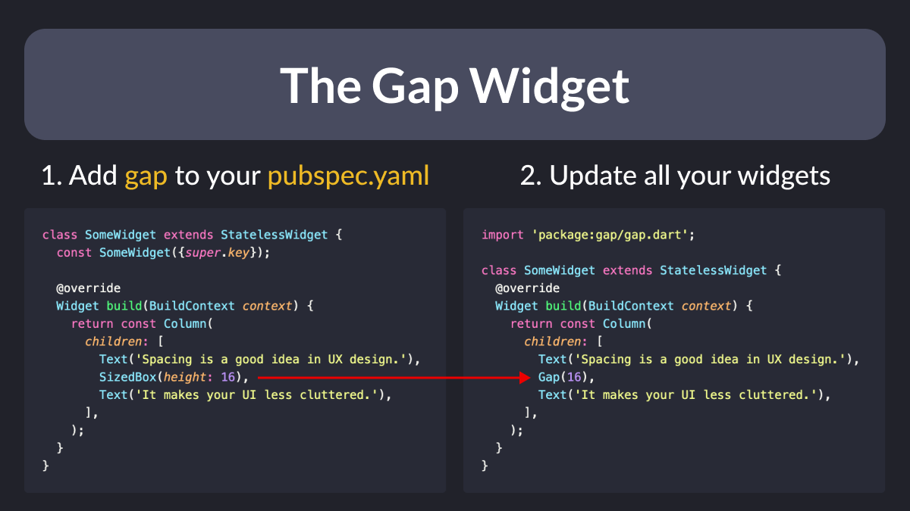

# The Gap Widget

Did you know?

You can easily add gaps inside Flex widgets such as Columns and Rows or scrolling views.

Just install the [gap](https://pub.dev/packages/gap) package, and replace all those pesky SizedBoxes!



<!--
import 'package:gap/gap.dart';

class SomeWidget extends StatelessWidget {
  const SomeWidget({super.key});

  @override
  Widget build(BuildContext context) {
    return const Column(
      children: [
        Text('Spacing is a good idea in UX design.'),
        Gap(16),
        Text('It makes your UI less cluttered.'),
      ],
    );
  }
}

-->

---

## When to Choose Gap vs SizedBox

Note that `Gap(x)` is a valid substitute for **both** `SizedBox(width: x)` and `SizedBox(height: x)`, because it works **along** the main axis of the parent widget, and its syntax is shorter.

But of course, it's a 3rd-party package that adds an extra dependency to your project.

If you feel it's not justified, don't use it. Again, `SizedBox` is **just fine**.

## Constant Gap Widgets with SizedBox

In my apps, I prefer to declare a bunch of constant sizes and widgets:

```dart
/// Constant sizes to be used in the app (paddings, gaps, rounded corners etc.)
class Sizes {
  static const p4 = 4.0;
  static const p8 = 8.0;
  static const p12 = 12.0;
  static const p16 = 16.0;
  static const p20 = 20.0;
  static const p24 = 24.0;
  static const p32 = 32.0;
  static const p40 = 40.0;
  static const p48 = 48.0;
  static const p64 = 64.0;
}

/// Constant gap widths
const gapW4 = SizedBox(width: Sizes.p4);
const gapW8 = SizedBox(width: Sizes.p8);
const gapW12 = SizedBox(width: Sizes.p12);
const gapW16 = SizedBox(width: Sizes.p16);
const gapW20 = SizedBox(width: Sizes.p20);
const gapW24 = SizedBox(width: Sizes.p24);
const gapW32 = SizedBox(width: Sizes.p32);
const gapW40 = SizedBox(width: Sizes.p40);
const gapW48 = SizedBox(width: Sizes.p48);
const gapW64 = SizedBox(width: Sizes.p64);

/// Constant gap heights
const gapH4 = SizedBox(height: Sizes.p4);
const gapH8 = SizedBox(height: Sizes.p8);
const gapH12 = SizedBox(height: Sizes.p12);
const gapH16 = SizedBox(height: Sizes.p16);
const gapH20 = SizedBox(height: Sizes.p20);
const gapH24 = SizedBox(height: Sizes.p24);
const gapH32 = SizedBox(height: Sizes.p32);
const gapH40 = SizedBox(height: Sizes.p40);
const gapH48 = SizedBox(height: Sizes.p48);
const gapH64 = SizedBox(height: Sizes.p64);
```

Then, in my widgets, I can use them like this:

```dart
class SomeWidget extends StatelessWidget {
  const SomeWidget({super.key});

  @override
  Widget build(BuildContext context) {
    return const Column(
      children: [
        Text('Spacing is a good idea in UX design.'),
        gapH16,
        Text('It makes your UI less cluttered.'),
        gapH16,
        Text('So be generous with spacing in your apps.');
      ],
    );
  }
}
```

---

### Found this useful? Show some love and share the [original tweet](https://twitter.com/biz84/status/1485284738487226381) 🙏

---

| Previous | Next |
| -------- | ---- |
| [App Development workflow in 6 steps](../0022-app-development-workflow-in-six-steps/index.md) | [Simplified Flutter App Localization](../0024-simplified-flutter-app-localization/index.md) |