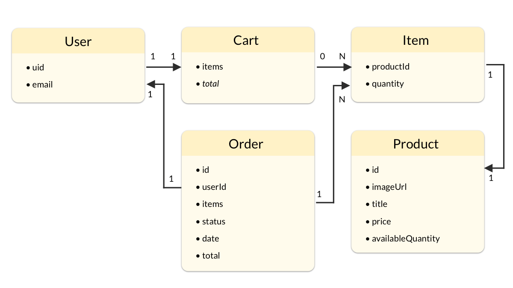
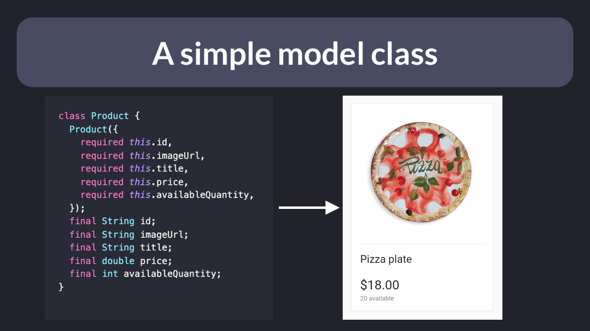

## DDD: The Domain Model

Domain-Driven Design helps us write complex software.

At the heart of it lies the **domain model**, which is a conceptual model that incorporates both behavior and data.

Sounds complicated?

Let's explain with an example. 🧵

---

Suppose we want to build an eCommerce app.

To better understand this domain, we need to figure out:

- the entities we care about and their relationships
- the behaviour (or business logic) for manipulating them

The end result may look like this:

---

In Dart, we can represent each entity as a simple model class.

As we define this, it helps to think about all the properties that we need to show in the UI:

---

In some cases we need both a model class and the logic for manipulating it.

For example, here's how we may define a shopping cart class along with some methods for mutating its items:

---

Note how the Cart class and MutableCart extension don't have dependencies to any objects that live outside the domain layer.

This makes them very easy to test:

---

Eric Evans has written an ENTIRE book about Domain-Driven Design, and it's well worth a read if you want to expand your skills as an application developer.

But here's a short summary that may help you take the first steps in this complex field:

---

Did you find this useful or have feedback to share? Let me know in the comments. 👇

And for more Flutter (and app development) tips, just follow me: [@biz84](https://twitter.com/biz84)

Happy coding!

---

### Found this useful? Show some love and share the [original tweet](https://twitter.com/biz84/status/1491381498641063938) 🙏