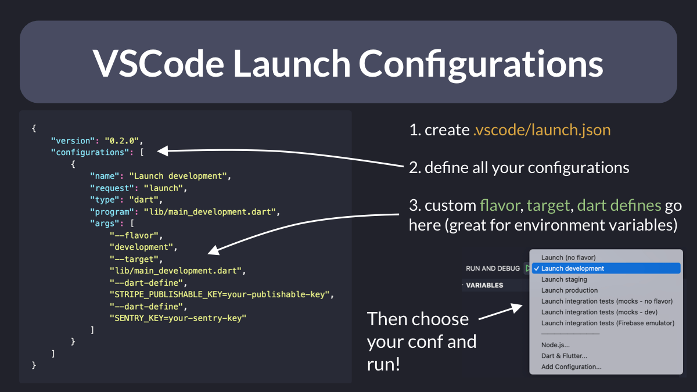
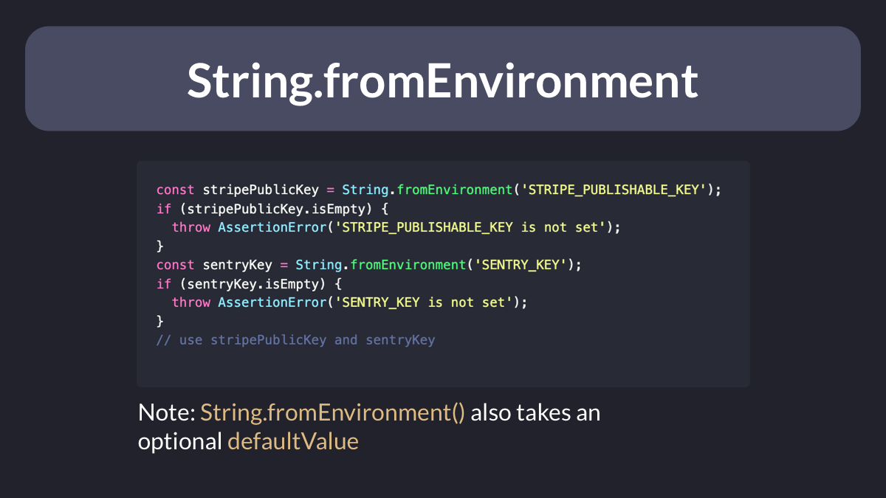

# VSCode launch configurations

Want to quickly switch between multiple flavors/targets/environments in your Flutter apps?

Just add a `.vscode/launch.json` file with custom arguments for each configuration.

This lets you set environment variables as key=value pairs using --dart-define:

---

Then, in your Flutter code, you can read all the environment variables using String.fromEnvironment():

---

### Found this useful? Show some love and share the [original tweet](https://twitter.com/biz84/status/1493266073226993672) 🙏