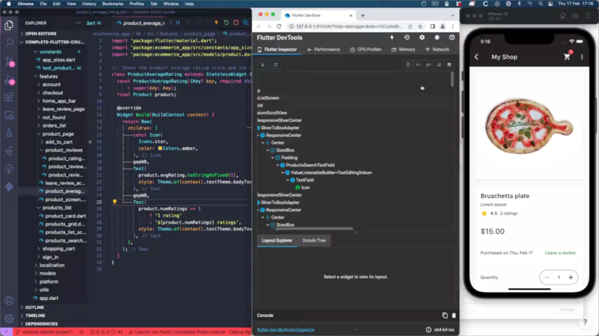

# How to use the Flutter Widget Inspector

Need to quickly become familiar with a new codebase?

The Widget Inspector is a great tool for that!

It lets you select widgets on your running app, and see:

- where they live in the widget tree
- where they are declared in your code

keeping everything in sync. 👌

)

---

### Found this useful? Show some love and share the [original tweet](https://twitter.com/biz84/status/1494610003352866817) 🙏