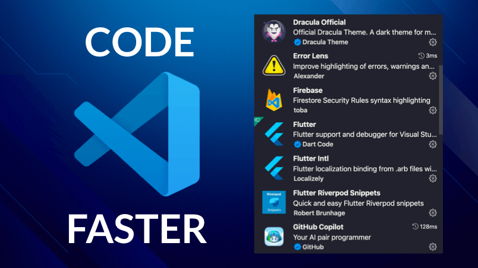
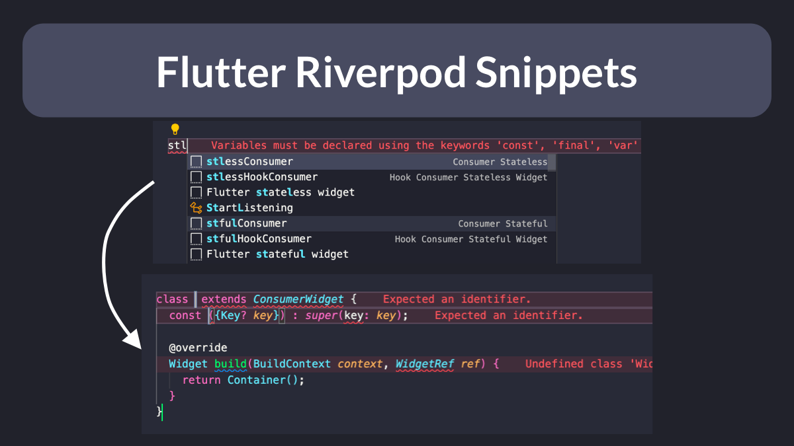
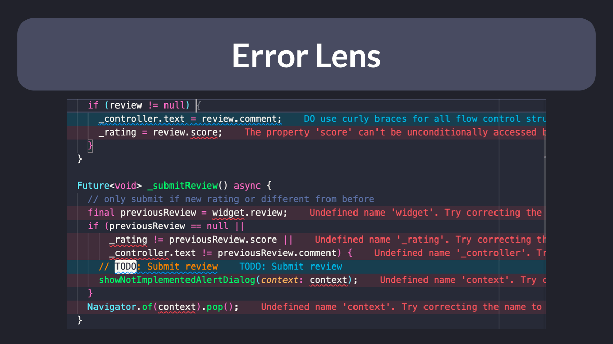

# VSCode extensions to speed-up your Flutter workflow

What are some VSCode extensions you can use to speed-up your Flutter workflow?

Here's a thread with my favourites! 🧵

---

When creating model classes, you'll often needs methods such as:

 - copyWith()
 - toString()
 - toJson()
 - fromJson()
 - toMap()
 - fromMap()
 - == operator
 - hashCode

Use the Dart data class generator to create them all in one go!

Link: https://marketplace.visualstudio.com/items?itemName=BendixMa.dart-data-class-generator

---

If you use Riverpod, you'll quickly get tired of typing out all your providers and consumers by hand.

The Flutter Riverpod Snippets extension makes this a lot easier!

Link: https://marketplace.visualstudio.com/items?itemName=robert-brunhage.flutter-riverpod-snippets

---

Do you want to know if you make mistakes as you type?

The Error Lens extension improves the highlighting of errors, warnings, and other language diagnostics, and I find it immensely helpful.

Link: https://marketplace.visualstudio.com/items?itemName=usernamehw.errorlens

---

Better Comments helps you improve your code comments by highlighting alerts, notes, TODOs, and more.

Link: https://marketplace.visualstudio.com/items?itemName=aaron-bond.better-comments

---

The Advanced New File extension lets you create files anywhere in your workspace, using your keyboard only.

(and we all know that every time we touch the mouse a cute animal suffers, right?)

Link: https://marketplace.visualstudio.com/items?itemName=patbenatar.advanced-new-file

---

Unless you've been living under a rock, you'll know about GitHub Copilot.

It's an AI pair programmer which suggests line completions and entire function bodies as you type.

(it even helps me write documentation and marketing copy! 🤯)

Link: https://marketplace.visualstudio.com/items?itemName=GitHub.copilot

---

Of course, you're free to choose whichever theme you like best.

Though this Official Dracula theme is my favorite.

Link: https://marketplace.visualstudio.com/items?itemName=dracula-theme.theme-dracula

---

There are many other useful VSCode extensions.

But these are the ones I use all the time. 👌

And for more Flutter tips, just follow me: [@biz84](https://twitter.com/biz84)

Happy coding!

### Found this useful? Show some love and share the [original tweet](https://twitter.com/biz84/status/1496416091110883332) 🙏

### Also published on codewithandrea.com 👇

- [VSCode Shortcuts, Extensions & Settings for Flutter Development](https://codewithandrea.com/articles/vscode-shortcuts-extensions-settings-flutter-development/)

---

| Previous | Next |
| -------- | ---- |
| [Flutter tip: use composition aggressively](../0032-flutter-tip-use-composition-aggressively/index.md) | [How to use `WidgetsBindingObserver`](../0034-how-to-use-widgetsbindingobserver/index.md) |