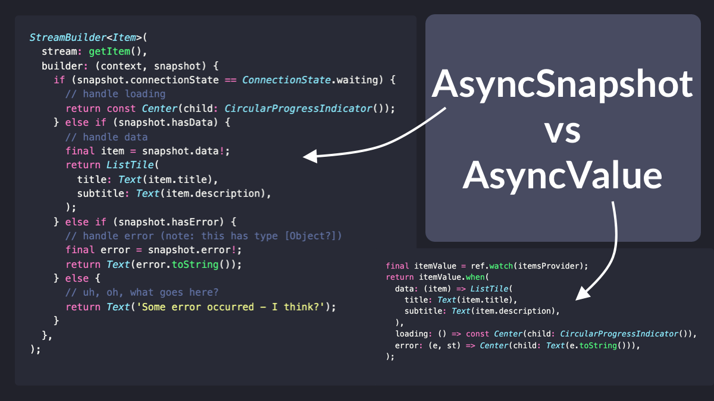
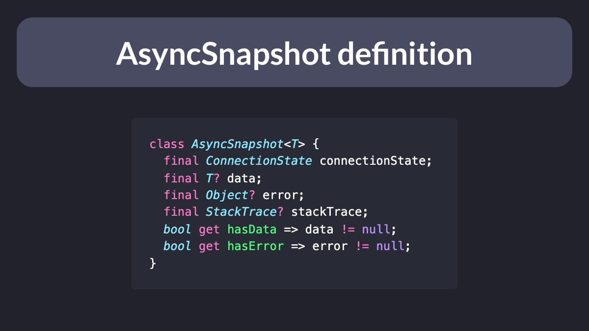

# AsyncValue vs FutureBuilder & StreamBuilder

If you've been using Flutter for some time, you'll know that FutureBuilder & StreamBuilder help you deal with asynchronous data in your UI.

But working with AsyncSnapshot is quite tricky, and the AsyncValue class from the Riverpod package makes life much easier.

A thread. 🧵

---

Let's take a peek at the definition of AsyncSnapshot.

This is a class that defines four properties:

- connectionState
- data
- error
- stackTrace

These properties are all *independent* from each other.

---

But what we really want are three *mutually exclusive* states:

- data
- loading
- error

And that's exactly what AsyncValue gives us, by defining them with some factory constructors:

---

On top of that, we also get an AsyncValueX extension with a "when" method that we can use to map all possible states to our UI.

This technique is called *pattern matching*, and means that we don't need to rely on if/else clauses like we do when working with AsyncSnapshot.

---

Time to put things together.

You can create a StreamProvider that returns any method or function that returns a stream with a matching type.

Then you can declare a ConsumerWidget and *watch* the provider, ensuring that the widget will rebuild whenever there's a new value.

---

That's all. You can now say bye-bye to all your StreamBuilders and FutureBuilders, and use StreamProvider & FutureProvider with AsyncValue instead.

An article with more details will be coming soon.

---

And I'll cover state management with Riverpod in great detail in my upcoming course.

If you're interested, you can sign up to secure a big pre-sale discount:

- [The Complete Flutter Course Bundle](https://codewithandrea.com/courses/complete-flutter-bundle/)

And for more Flutter tips, just follow me: [@biz84](https://twitter.com/biz84)

Happy coding!

### Found this useful? Show some love and share the [original tweet](https://twitter.com/biz84/status/1500871781262966796) 🙏

### Also published on codewithandrea.com 👇

- [AsyncValue vs FutureBuilder & StreamBuilder](https://codewithandrea.com/articles/flutter-use-async-value-not-future-stream-builder/)