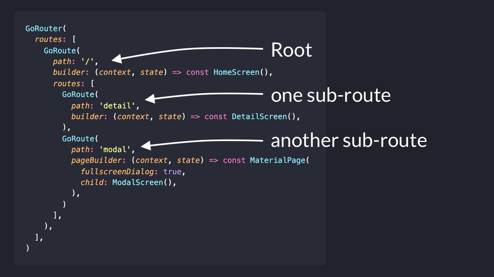
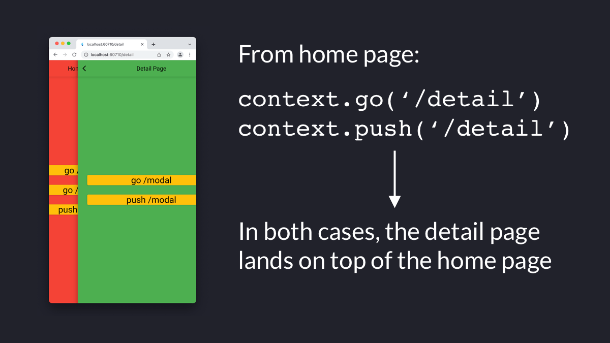
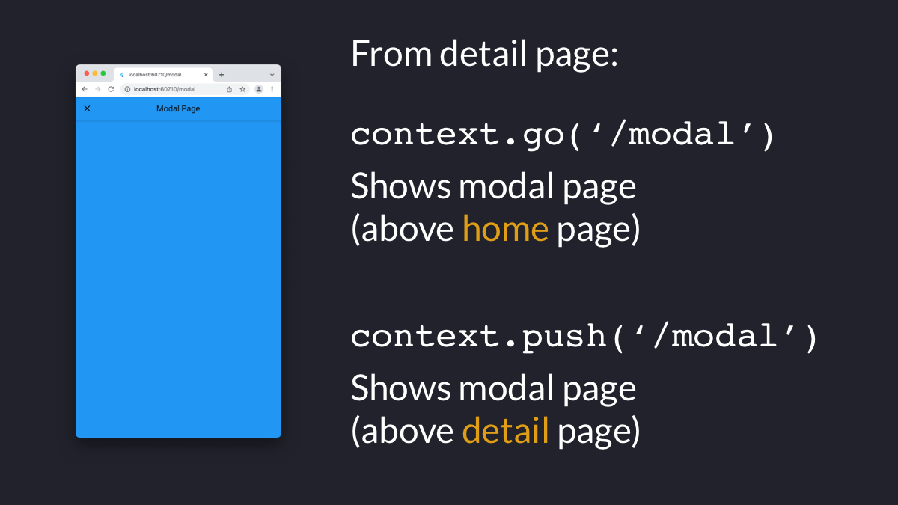

# GoRouter: go vs push

When using GoRouter for declarative navigation, you'll often have to choose between:

- GOING to a route
- PUSHING a route

What is the difference between the two?

A thread. 🧵

---

To start off, let's consider a simple route hierarchy made of one top route with two sub-routes.

---

Let's also define 3 pages for our routes:

---

Now, suppose that we're in the HomeScreen.

From here, we can either call `context.go('/detail')` or `context.push('/detail')`, and end up with the same result.

That is, in both cases we'll have two routes in the navigation stack (home → detail).

---

From the detail page, we can now call `context.go('/modal')` or `context.push('/modal')`.

This time the result is different:

- If we use "go", we end up with the modal page on top of the **home** page
- If we use "push", we end up with the modal page on top of the **detail** page

---

That's because "go" jumps to the target route (/modal) by **discarding** the previous route (/detail), since /modal is *not* a sub-route of /detail.

Meanwhile, "push" always adds the target route on top of the existing one, preserving the navigation stack.

---

This means that once we dismiss the modal page, we navigate back to:

- the home page, if we used "go"
- the detail page, if we used "push"

Here's a short video showing this behavior:

---

The bottom line?

Think of `go` as a way to **jump** to a new route. This will modify the underlying navigation stack if the new route is not a sub-route of the old one.

On the other hand, `push` will always push the destination route on top of the existing navigation stack.

---

For more info about GoRouter, make sure to check the official documentation (it's excellent):

https://gorouter.dev/

---

I'll cover GoRouter extensively in my upcoming Flutter course, along with many other important topics.

If this is of interest, you can sign up today to secure a big discount when the course goes live. 👇

- [The Complete Flutter Course Bundle](https://codewithandrea.com/courses/complete-flutter-bundle/)

Happy coding!

---

### Found this useful? Show some love and share the [original tweet](https://twitter.com/biz84/status/1501603042982080520) 🙏

### Also published on codewithandrea.com 👇

- [GoRouter: go vs push](https://codewithandrea.com/articles/flutter-navigation-gorouter-go-vs-push/)