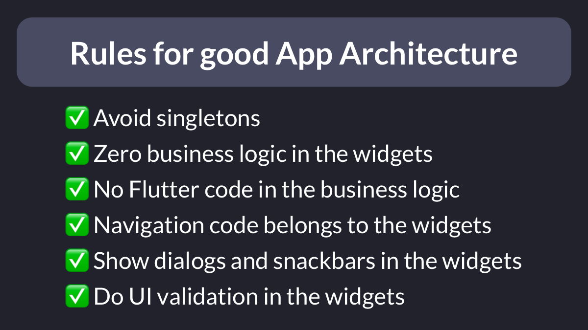

# Rules to follow for good app architecture

What are some rules to follow for good app architecture in Flutter?

Thread. 🧵

---

### RULE: Avoid singletons

If you want your code to be testable, there are various alternatives to singletons:

- constructor arguments (doesn't scale well with deep widget hierarchies)
- `InheritedWidget` or Provider
- Service locators (e.g. get_it)

---

### RULE: Zero (or very little) business logic in the widgets.

Widgets should be as dumb as possible and only be used to map the state to the UI.

Small exceptions: sometimes I include some simple currency, date, or number formatting code in my widgets if it makes life easier.

---

### RULE: No Flutter code (including BuildContext) in the business logic.

Your view models/blocs/controllers are used to update the widget state in response to events.

By ensuring that these classes don't have any UI code in them, they can be easily unit tested.

---

### RULE: Navigation code belongs to the widgets

If you try to put your navigation code in the business logic, you'll have a hard time because you need a BuildContext to do so.

Solution:
- emit a new widget state
- listen to the state in the widget and perform the navigation there

---

### RULE: Show dialogs and snackbars in the widgets

Same as above. When we need to show an alert dialog because something went wrong, this is what we should do:

- emit a new error state
- listen to the state in the widget and use the context to show the alert dialog

---

### RULE: Do UI validation in the widgets*

`FormState` and `TextEditingController` depend on the widget lifecycle, so they shouldn't go in the view models/blocs etc.

Keep them in your widgets and offload everything else to the business logic.

---

Following these simple rules will force you to structure your code properly and make it much easier to test.

---

### Found this useful? Show some love and share the [original tweet](https://twitter.com/biz84/status/1503387745275850761) 🙏

---

| Previous | Next |
| -------- | ---- |
| [GoRouter: `go` vs `push`](../0036-gorouter-go-vs-push/index.md) | [Popular architectures for Flutter development](../0038-popular-architectures-for-flutter-development/index.md) |