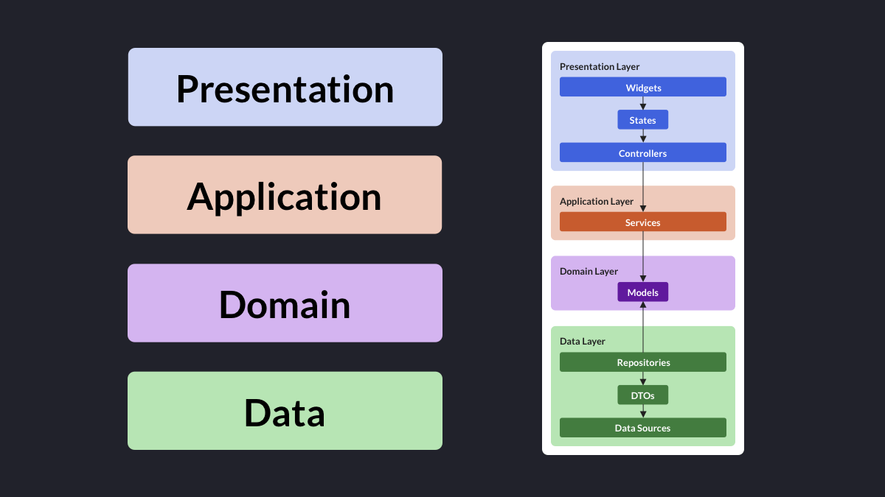
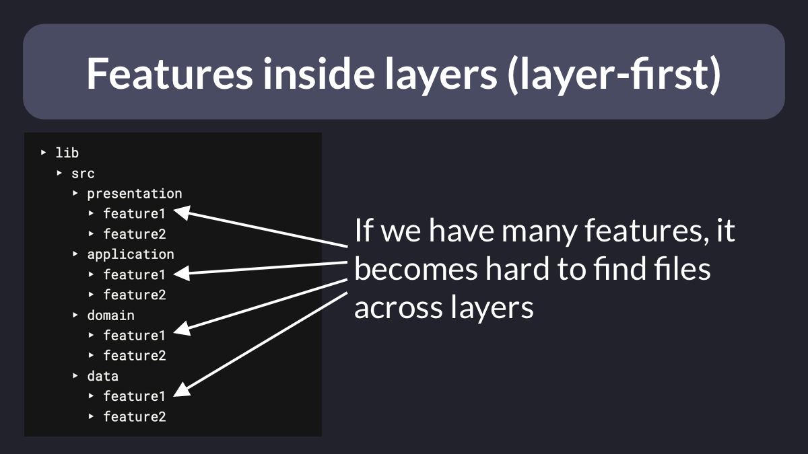
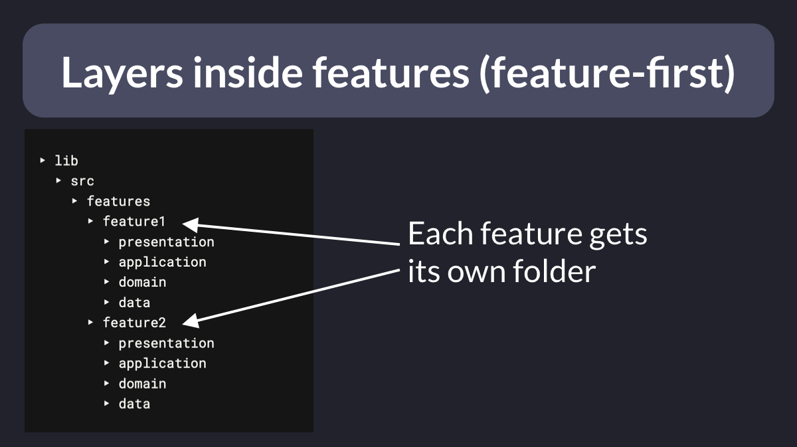
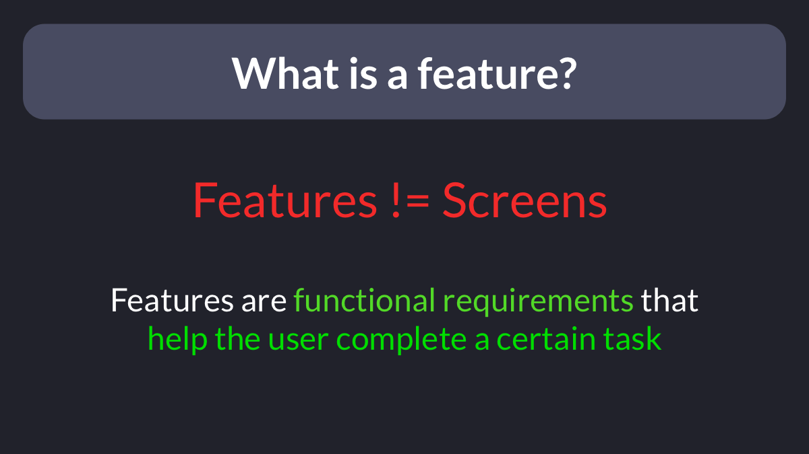
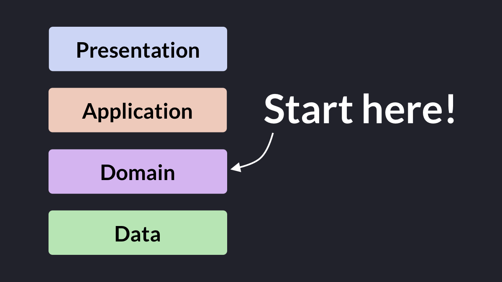

# Flutter Project Structure: Feature-first or Layer-first?

What's the best project structure for medium/large Flutter apps?

Most likely, there's no "right" answer that works for all projects.

So let's explore two popular approaches known as "feature-first" and "layer-first" and learn about their differences.

Thread. 🧵

---

First of all, it's best to consider project structure in relation to app architecture.

For reference, let's consider this high-level architecture made of four layers:

‣ presentation
‣ application (optional)
‣ domain
‣ data

---

If your app is complex enough, we'll have multiple features.

And each feature can be represented by a group of classes that belong to the four layers.

In this context, we have two choices in regards to project structure:

- layers inside features
- features inside layers

---

So what should we choose?

The "features inside layers" approach (layer-first) doesn't work great for big projects with many features.

For any given feature, files that belong to different layers are far away from each other and we have to constantly "jump" across layers.

---

But with the "layers inside features" approach (feature-first), things are a lot better.

For a given feature, all the files we need are found inside the same top-level folder.

And we still get a good separation between layers.

---

In practice, things are not always easy.

At the beginning of a project, you may not have a good understanding of the domain model.

And that makes it hard to clearly identify the various features and structure the project accordingy.

---

At that stage, you may be tempted to create one folder for each screen of your app.

But that's a mistake, because features are **not** screens.

Rather, think of features as **functional requirements** that help the user complete a certain task.

---

In practice, I found that studying the domain model leads to a much better understanding of the whole system.

This helps us identify the features we need, so that we can "build the right thing" later on.

---

With this approach, you'll be better equipped to figure out which widgets, controllers, services, and repositores belong to each feature.

And you'll be able to better organize your project as a result.

---

Of course, large projects have some additional requirements (infrastructure, performance, organizational structure).

Those projects are often split into completely independent modules (packages) that are owned by different teams.

---

But it's a great idea to apply domain-driven design from the start.

That way, we'll end up with clear boundaries between the different layers and components of our app, making dependencies more easy to manage later on.

---

This completes my overview of project structure in Flutter. 🏁

I'll publish a separate article that will cover this topic more in depth. ✅

What project structure have you used in your apps? Let me know in the comments. 👇

For more tips like this, just follow me: [@biz84](https://twitter.com/biz84)

---

And if you want to learn how to build a full-stack eCommerce app following these principles, check out my new course:

- [The Complete Flutter Course Bundle](https://codewithandrea.com/courses/complete-flutter-bundle/)

Happy coding!

---

### Found this useful? Show some love and share the [original tweet](https://twitter.com/biz84/status/1506285698558660609) 🙏

### Also published on codewithandrea.com 👇

- [Flutter Project Structure: Feature-first or Layer-first?](https://codewithandrea.com/articles/flutter-project-structure/)

---

| Previous | Next |
| -------- | ---- |
| [Popular architectures for Flutter development](../0038-popular-architectures-for-flutter-development/index.md) | [Anatomy of a Riverpod Provider](../0040-anatomy-of-a-riverpod-provider/index.md) |