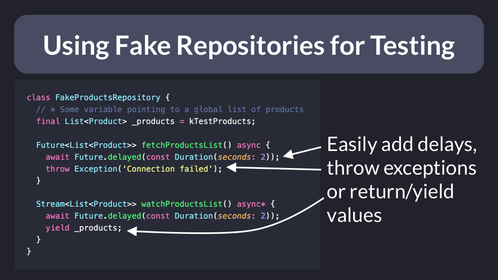

# Using Fake Repositories for Testing

In Dart, we can easily create mocks with packages like [mockito](https://pub.dev/packages/mockito) or [mocktail](https://pub.dev/packages/mocktail).

But sometimes it's quite handy to create fakes that can be configured in many different ways (and even store some state).

I often do this to test loading and error states in the UI. 👇

---

### Found this useful? Show some love and share the [original tweet](https://twitter.com/biz84/status/1509127400491298816) 🙏