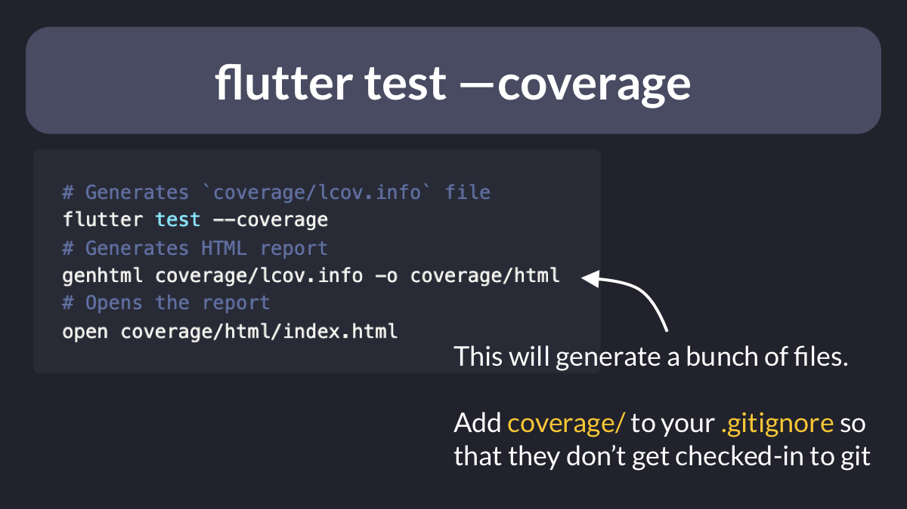
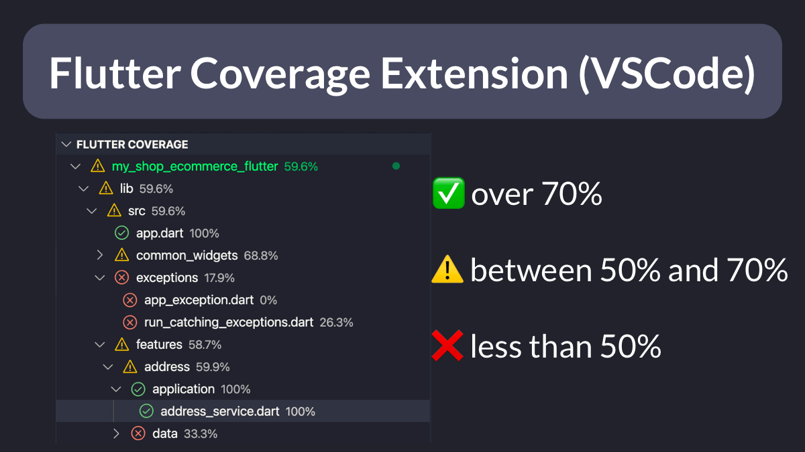
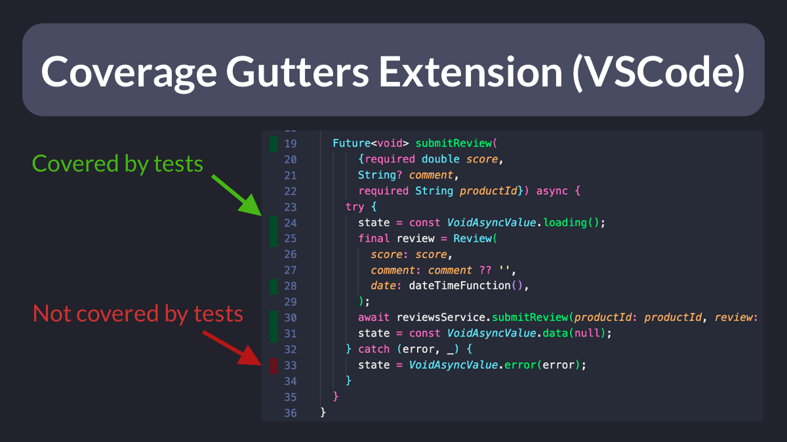

# How to Generate and Analyze a Flutter Test Coverage Report in VSCode

How do you generate (and make the most of) test coverage in Flutter?

This is very easy to do.

And there are VSCode extensions that help you integrate coverage data with your testing workflow.

Thread. 🧵

---

First of all, you need a Flutter project with tests. I'm sure you write them, right? 😉

Then, you can run these three commands to generate the LCOV data and open a report on your browser.

Tip: make sure the "coverage" folder is added to ".gitignore".

---

The LCOV report shows you which parts of your project have been covered by tests.

Notes:
- this is an indication of coverage only (and doesn't tell you if the tests are passing or not)
- coverage data won't be generated for variable declarations, class definitions etc.

---

But it's not practical to check coverage on the browser as you write your tests.

Instead, you can install the Flutter Coverage extension to get coverage info for each folder and file on the testing sidebar.

Link: https://marketplace.visualstudio.com/items?itemName=Flutterando.flutter-coverage

---

But there's more.

You can install the Flutter Gutters extension to enable a "watch mode" that shows line-by-line coverage in your files.

Link: https://marketplace.visualstudio.com/items?itemName=ryanluker.vscode-coverage-gutters

---

What I really like about these extensions is that they make writing tests fun! 🥰

The more tests you write, the more green your report will look like. ✅

Of course, code coverage **alone** is not a silver bullet.

---

Writing tests takes time (though not nearly as much as testing the entire app manually, over and over 😱).

So we should choose a testing strategy that makes sense.

Many options are available: unit, widget, integration, E2E, golden image tests.

Combine them for max ROI. 👍

----

I have covered automated testing in great depth in my new Flutter course:

---

The course is now available here:

- [The Complete Flutter Course Bundle](https://codewithandrea.com/courses/complete-flutter-bundle/)

Happy coding!

---

### Found this useful? Show some love and share the [original tweet](https://twitter.com/biz84/status/1510980344434016258) 🙏

### Also published on codewithandrea.com 👇

- [How to Generate and Analyze a Flutter Test Coverage Report in VSCode](https://codewithandrea.com/articles/flutter-test-coverage/)

---

| Previous | Next |
| -------- | ---- |
| [Using Fake Repositories for Testing](../0041-using-fake-repositories-for-testing/index.md) | [How to write a reactive in-memory store with RxDart](../0043-how-to-write-a-reactive-in-memory-store-with-rxdart/index.md) |