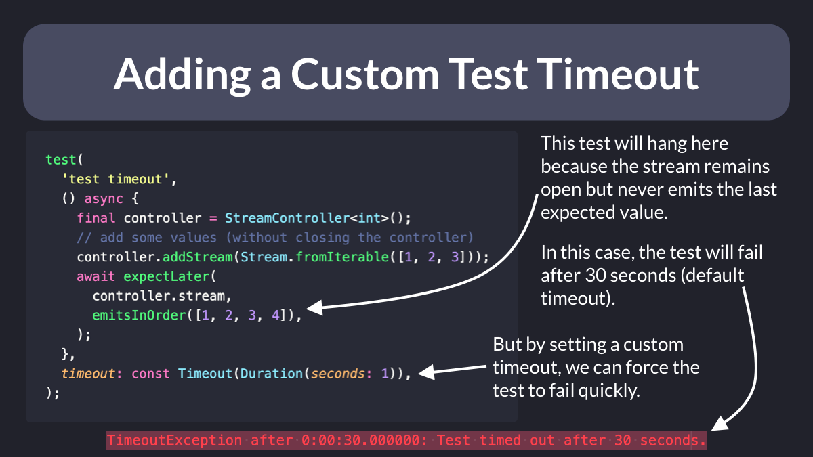

# Adding a Custom Test timeout

Did you know?

When writing tests in Flutter, you can add a custom timeout argument.

This is very useful for tests that can potentially hang (when waiting on an asynchronous stream matcher). 👇

If you have many tests running on CI, this can save you a lot of time and money! 💰

---

You know what else is cool?

Custom timeouts can be configured per-file, per-test, or per-group, just like this. 👇

---

### Also published on codewithandrea.com 👇

- [How to Add a Custom Test Timeout in Flutter](https://codewithandrea.com/tips/custom-test-timeout-flutter/)