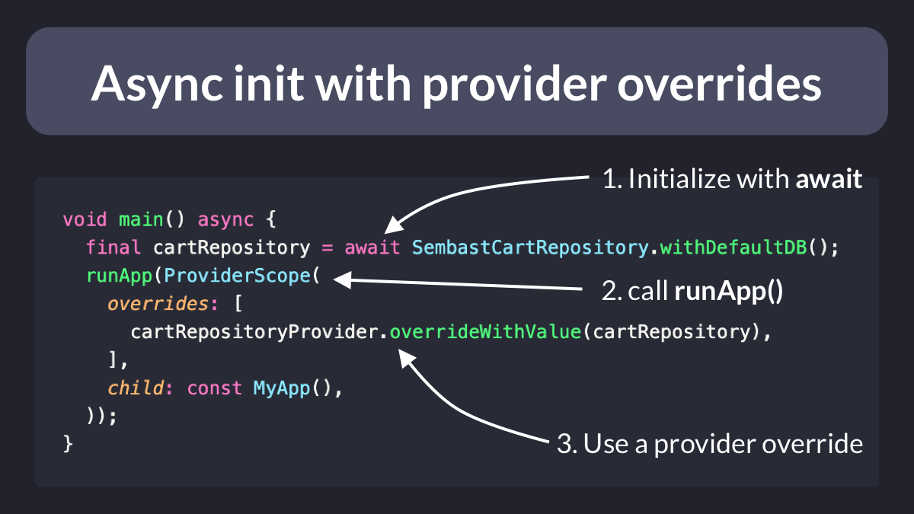
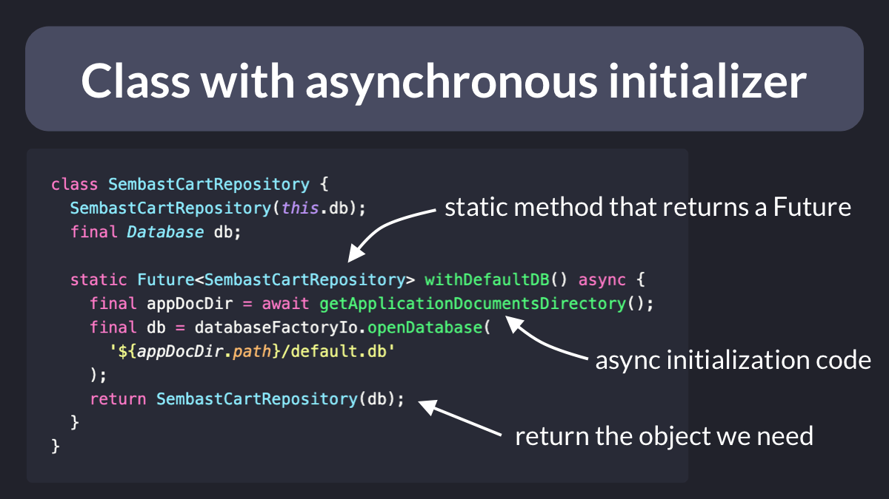

# Async init with Provider Overrides

How do you create and initialize an object *asynchronously*, but access it *synchronously* in the rest of the app?

If you use Riverpod, this can be accomplished with a provider override as shown here. 👇

Here's a thread with a complete example. 🧵

---

In this example, we have a class that takes a Database argument.

But the database can only be created after *awaiting* for some initialization code.

So we can put all the async init code inside a static method that returns a Future. 👇

---

Then, we can create a provider for our class.

It may be tempting to use a FutureProvider and just return `SembastCartRepository.withDefaultDB()`.

But that would force us to deal with AsyncValue every time we read the provider.

So we just throw an UnimplementedError instead.

---

As a result, we can initialize the object we need using `await` inside the main method.

And we can *override* the provider with the initialized object when we call runApp().

---

Then, we can read or watch the provider and get the underlying object when needed.

And this will return the provider that we have overridden in the main method.

---

This technique works well when initializing dependencies such as repositories or data sources.

In turn, those repositories can have their own methods to fetch data using a Future.

And when fetching *data*, it makes sense to use FutureProvider (as it can be reloaded/refreshed).

---

Hope you found this useful.

For more Flutter tips like this, just follow me: [@biz84](https://twitter.com/biz84)

Happy coding!

### Found this useful? Show some love and share the [original tweet](https://twitter.com/biz84/status/1537796968503705601) 🙏

### [Source code](main.dart)

