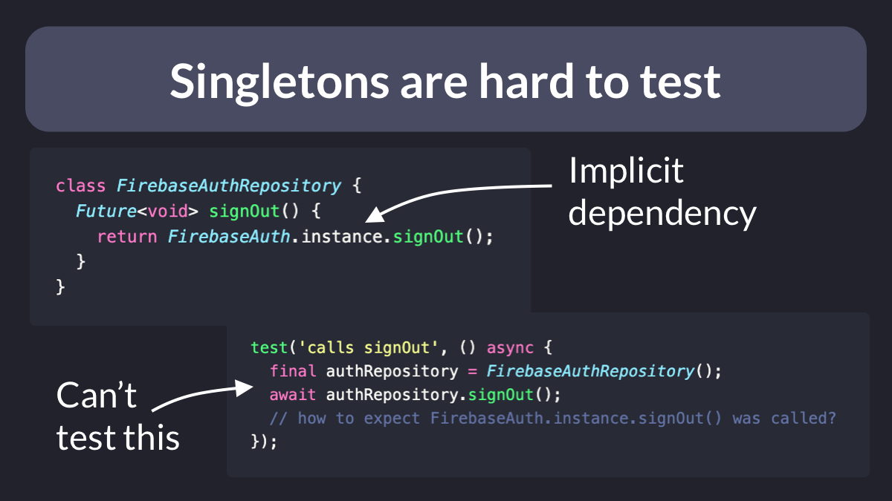
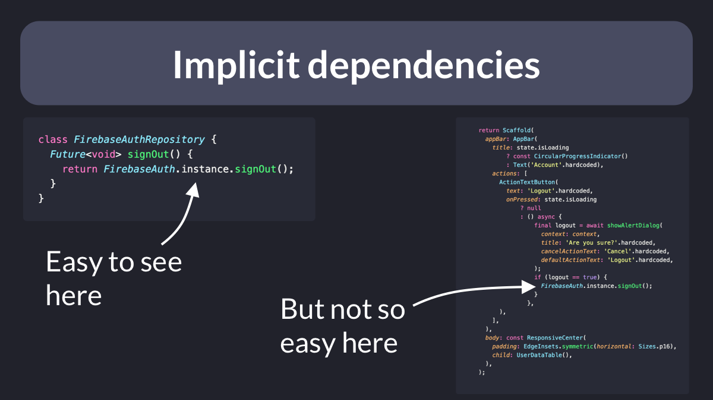
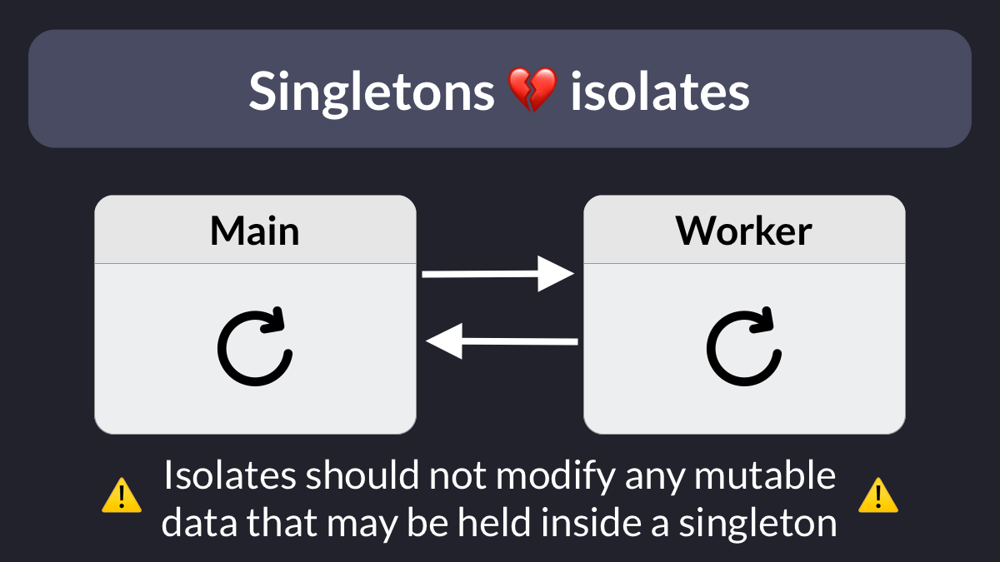
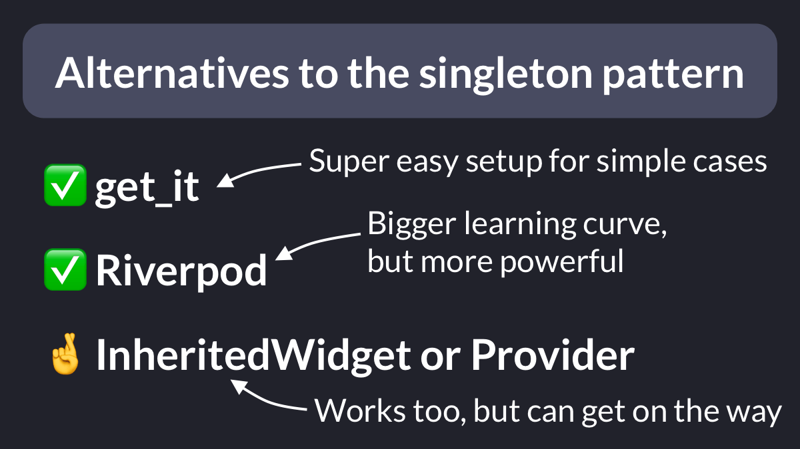

# Singletons in Flutter

Should you use singletons in Dart/Flutter?

While they are "easy" to use, there are some drawbacks and potential pitfalls regarding:

- Testing
- Implicit dependencies
- Immediate vs lazy initialization
- Instance lifecycle
- Thread safety

Let's cover them in this thread. 🧵

---

When used directly, singletons are hard to test.

That's because they become implicit dependencies that can't be mocked inside our tests.

---

Instead, we can pass each dependency **explicitly**.

As a result, we can easily:

- mock the dependency
- stub its methods
- verify that they are called

---

Once more: singletons make our dependencies **implicit**.

They are easy to spot if our classes are small.

But much harder to find on large classes.

Instead, when we make dependencies **explicit** by declaring them as properties, they are always easy to find.

---

In some cases, object initialization can take a long time and should be deferred until needed.

This can be hard to do correctly if you roll out your own singletons.

Packages such as get_it make the task easier by allowing you to create a **lazy** singleton.

----

One issue with regular singletons is that they control their own lifecycle, making it complex to dispose them when they are no longer needed.

Instead, we can use Riverpod, which gives us many different options to control the lifecycle of the state of a provider.

---

And if we work with isolates, we also need to be careful.

Isolates should not modify any mutable data that may be held inside a singleton, unless some synchronization system is in place.

---

So what are some good alternatives to writing your own singletons?

- get_it makes it easy to register and use your own singletons. Works great for simple use cases
- Riverpod is a more powerful solution, with a bigger learning curve
- Provider works too, but can get on the way

---

Time for a wrap up!

Creating your own singletons is often more trouble than it's worth, and there are better alternatives.

---

### Found this useful? Show some love and share the [original tweet](https://twitter.com/biz84/status/1539287086729244673) 🙏

### Also published on codewithandrea.com 👇

- [Singletons in Flutter: How to Avoid Them and What to do Instead](https://codewithandrea.com/articles/flutter-singletons/)

---

| Previous | Next |
| -------- | ---- |
| [Riverpod: Async init with Provider Overrides](../0056-async-init-provider-overrides/index.md) | [Using test tags in Flutter](../0058-using-test-tags/index.md) |
