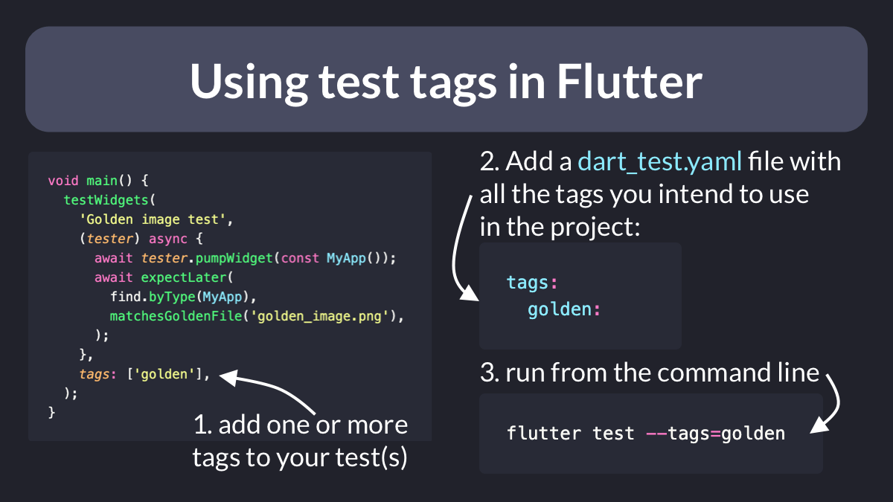

# Using test tags in Flutter

Ever wanted to filter tests so you only run the ones you need to?

This can be easily done using test tags.

Super useful when you have dozens/hundreds of tests and you want to target specific ones from the command line. 👇

---

Tags are quite flexible and you can use them to tag:

- an entire test suite (with the `@Tags` annotation)
- a test group or an individual test (with the `tags` argument, as shown above)

More info on the test package documentation:

- [Tagging Tests](https://pub.dev/packages/test#tagging-tests)

---

### Also published on codewithandrea.com 👇

- [How to Use Tags in Your Unit and Widget Tests](https://codewithandrea.com/tips/unit-widget-test-tags-flutter/)

---

### Found this useful? Show some love and share the [original tweet](https://twitter.com/biz84/status/1543957714254053377) 🙏

---

| Previous | Next |
| -------- | ---- |
| [Singletons in Flutter: Drawbacks](../0057-singletons-flutter/index.md) | [Flutter Riverpod: How to Register a Listener during App Startup](../0059-register-listener-riverpod/index.md) |
