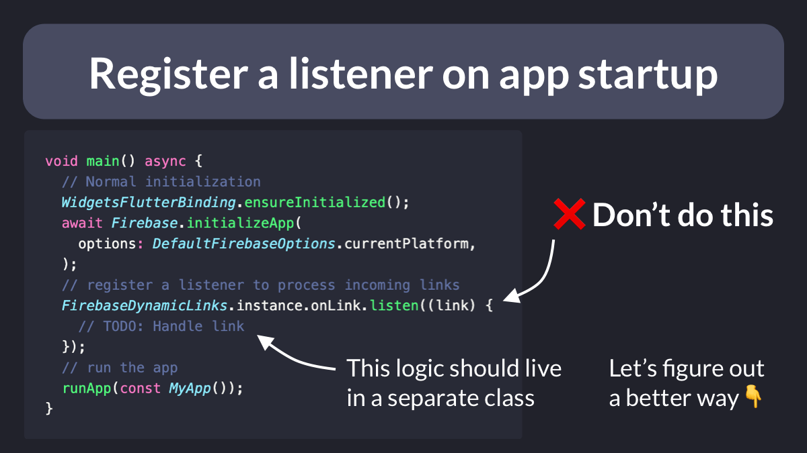
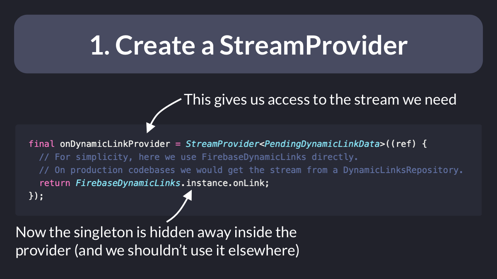
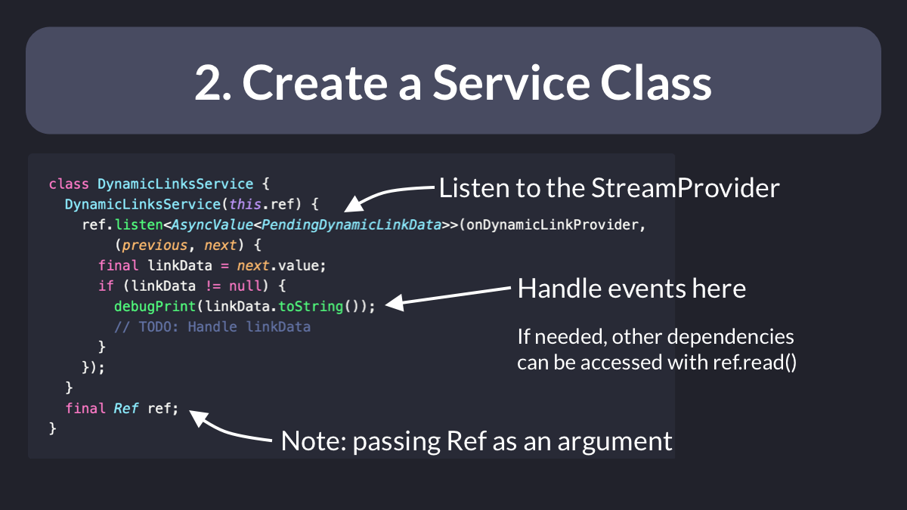
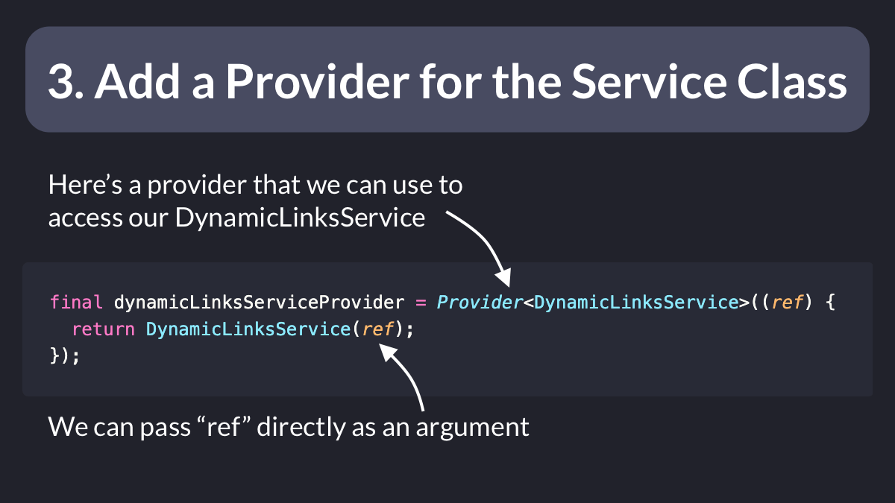
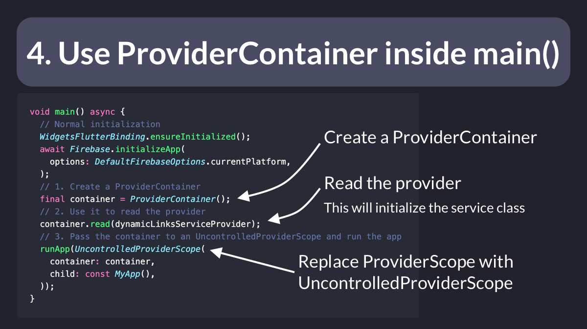
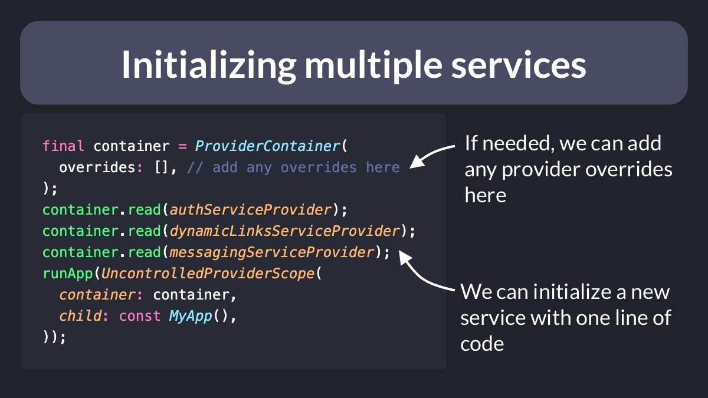

# Flutter Riverpod: How to Register a Listener during App Startup

How do you register a listener as soon as your Flutter app starts?

It's tempting to add the listener callback inside the main method directly.

But that's not a good idea.

Let's figure out a better approach using Riverpod, while keeping our app startup logic neat and tidy. 🧵

---

First of all, let's create a StreamProvider that we can use to access the input stream. 👇

This way we can hide away the singleton and get:

- better separation of concerns
- more testable code

---

Next, we can create a separate service class that:

- registers a listener (via `ref.listen`)
- handles all incoming stream events inside a callback

Note that since we have a Ref object, we can access other dependencies if needed. 👇

---

We also need to create a provider for our new service class.

This is easy as we just need to pass `ref` as a constructor argument. 👇

But doing this alone won't create the `DynamicLinksService` until we access/read it somewhere! ⚠️

---

To address this, we can get back to the main method and:

- Create a `ProviderContainer`
- Use it to read our service class provider
- Replace `ProviderScope` with `UncontrolledProviderScope`

---

And voila!  🏁

Our call to `container.read()` will ensure that our service class is initialized, and the listener is registered as soon as the app starts.

This approach is scalable too, as we can register/initialize new services with one line of code. 👇

---

That's it! You now have another valuable tool for your developer black belt! 🥋

Want more?

My complete Flutter course covers this more in depth, along with many other advanced topics. 👇

- [The Complete Flutter Course Bundle](https://codewithandrea.com/courses/complete-flutter-bundle/)

---

### Found this useful? Show some love and share the [original tweet](https://twitter.com/biz84/status/1544365241739378690) 🙏

### Also published on codewithandrea.com 👇

- [Flutter Riverpod: How to Register a Listener during App Startup](https://codewithandrea.com/articles/riverpod-initialize-listener-app-startup/)

### [Source code](main.dart)

---

| Previous | Next |
| -------- | ---- |
| [Using test tags in Flutter](../0058-using-test-tags/index.md) |  |
