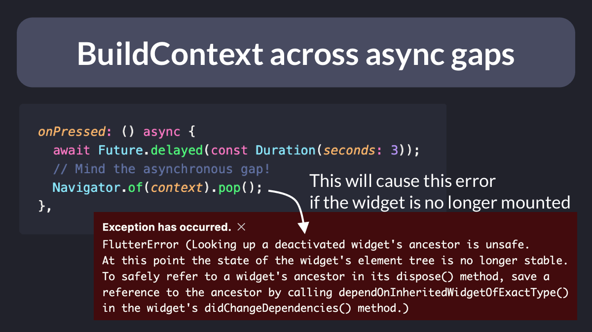
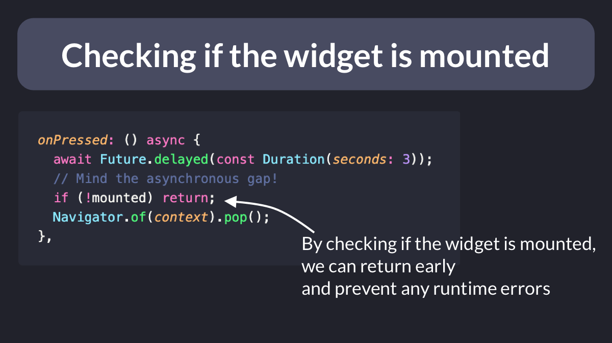
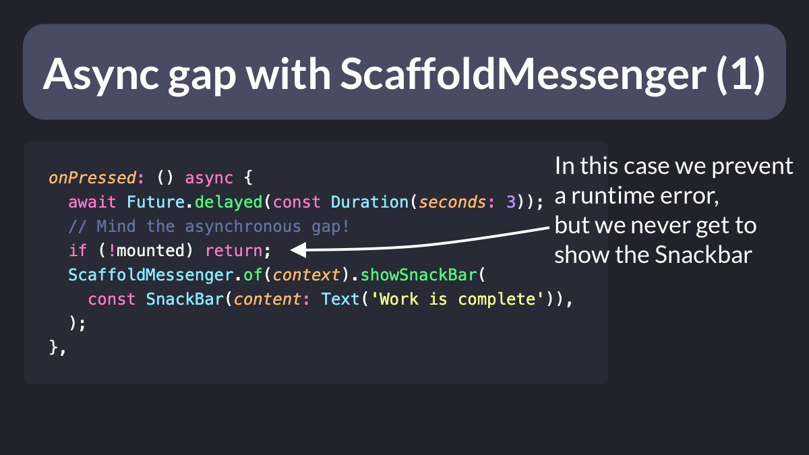
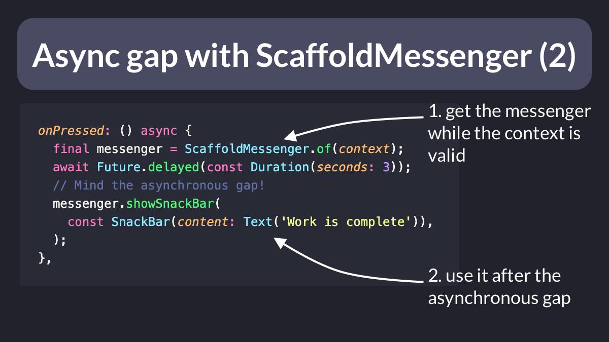
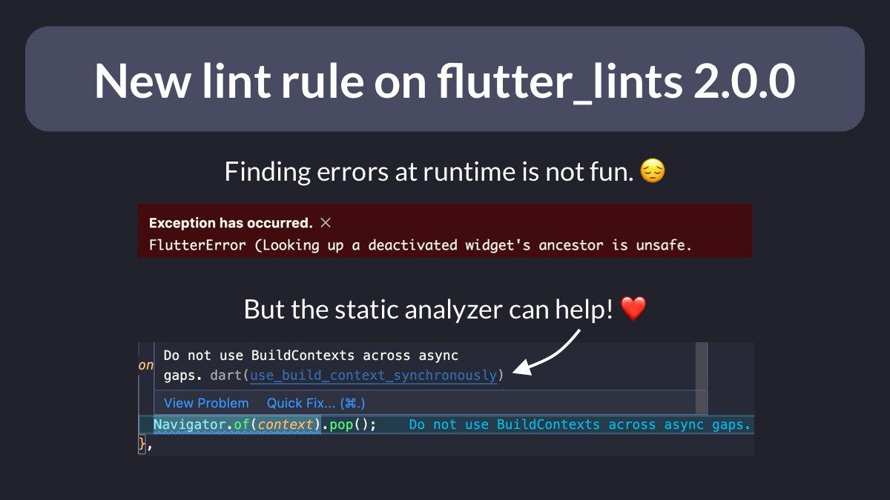

# Do not use BuildContexts across async gaps (and what to do instead)

Have you ever come across this error when using a `BuildContext` after awaiting for some work to complete?

This is a common mistake that can lead to unexpected behavior.

So let's learn what causes it and how to fix it (thread). 🧵

---

In Flutter, the `BuildContext` identifies the element that corresponds to our widget in the element tree.

At any point (and especially after an asynchronous operation), our widget may be no longer **mounted**.

---

For example, consider what happens when:

- we tap on the button that triggers the `onPressed` callback
- we immediately navigate away using the back button
- when the Future completes, we try to use `Navigator.of(context)`

This leads to the big scary error that we see here. 👇

---

This happens because our context is **stale** and no longer points to a valid element by the time the `Future` completes.

To work around this, we need to check that the widget is **mounted** before attempting to use the context:

----

Here's another example where we try to show a `SnackBar` after an asynchronous operation completes.

In this case, checking if the widget is mounted will prevent an error.

But it also means that the user won't see the `SnackBar`.

So how can we ensure the `SnackBar` is presented?

----

In this case, we should get the resource we need (`ScaffoldMessenger`) **before** the asynchronous gap.

And this makes it safe to use it **after** the asynchronous gap. 👇

---

Note that if you use `flutter_lints` 2.0.0 or above, the analyzer will warn you if you use a `BuildContext` across an asynchronous gap.

This makes it a lot easier to spot places where you need to fix your code **before** running your app, rather than bumping into errors at runtime.

---

For more info about using BuildContext synchronously, check out this excellent video by the Flutter team:

- [Synchronous BuildContexts | Decoding Flutter](https://youtu.be/bzWaMpD1LHY)

---

### Found this useful? Show some love and share the [original tweet](https://twitter.com/biz84/status/1547224363568619522) 🙏

---

| Previous | Next |
| -------- | ---- |
| [Flutter Riverpod: How to Register a Listener during App Startup](../0059-register-listener-riverpod/index.md) | [Errors vs Exceptions in Flutter](../0061-flutter-errors-vs-exceptions/index.md) |