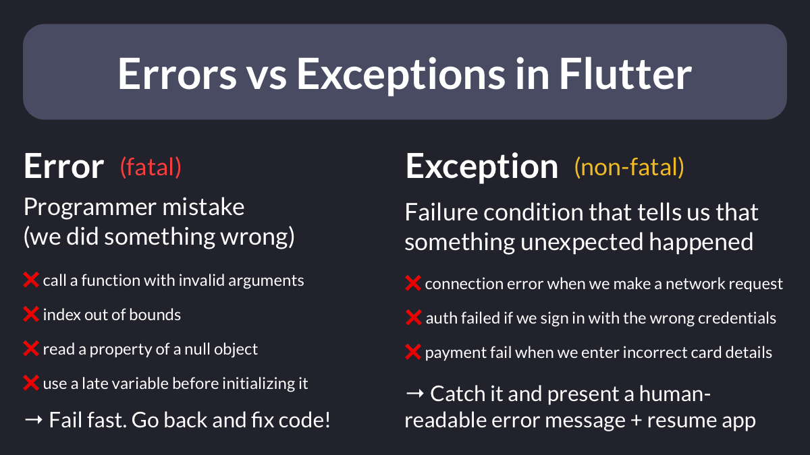
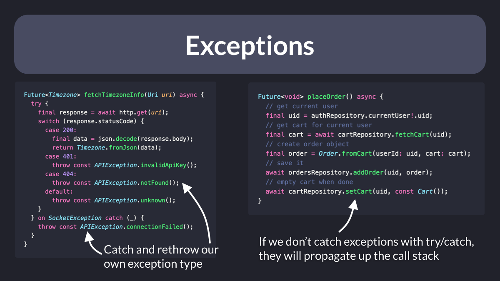

# Errors vs Exceptions in Flutter

What's the difference between errors and exceptions in Flutter?

→ Errors are programmer mistakes. They are fatal and we should not try to recover from them
→ Exceptions are failure conditions that are out of our control. We should handle them and recover gracefully

Thread 🧵

---

Errors are fatal and when they happen the program *cannot* recover normally.

→ we want to discover (and fix) them as early as possible in the development process
→ we should track them in production using a crash reporting solution, so that we can measure impact and severity

---

The most common errors we may encounter are:

- `AssertionError`
- `TypeError`
- `ArgumentError`
- `RangeError`
- `UnimplementedError`
- `StateError`

and many others.

They all *extend* the base Error class, and the full list of errors can be found here:

- [Error class | Flutter docs](https://api.flutter.dev/flutter/dart-core/Error-class.html)

---

Exceptions are not fatal and we should always handle them gracefully.

We can choose to map them to our own exception type inside a try/catch block.

Or we can let them propagate on the call stack (until something else catches them).

---

How to recover when an exception happens?

Eventually, we want to catch them somewhere and show a user-friendly error message.

One common way to do this is to emit an error state that the widget can listen to.

I've covered this before:

- [How to handle loading and error states with StateNotifier & AsyncValue in Flutter](https://codewithandrea.com/articles/loading-error-states-state-notifier-async-value/)

---

Some common exceptions you may encounter are:

- `FormatException`
- `IOException`
- `PlatformException`
- `TimeoutException`

They all *implement* the base Exception class (you may create your own if you want), and the full list can be found here:

- [Exception class | Flutter docs](https://api.flutter.dev/flutter/dart-core/Exception-class.html)

---

That's it for now. I've covered error & exception handling more in detail in some of my other tips.

And if you want to go more in depth, my Flutter Foundations course covers the most important topics. 👇

- [Flutter Foundations course](https://codewithandrea.com/courses/flutter-foundations/)

---

### Found this useful? Show some love and share the [original tweet](https://twitter.com/biz84/status/1551443128925790210) 🙏

---

| Previous | Next |
| -------- | ---- |
| [Do not use BuildContexts across async gaps (and what to do instead)](../0060-build-context-async-gaps/index.md) | [Exception handling: try/catch vs Result](../0062-try-catch-result-type/index.md) |
