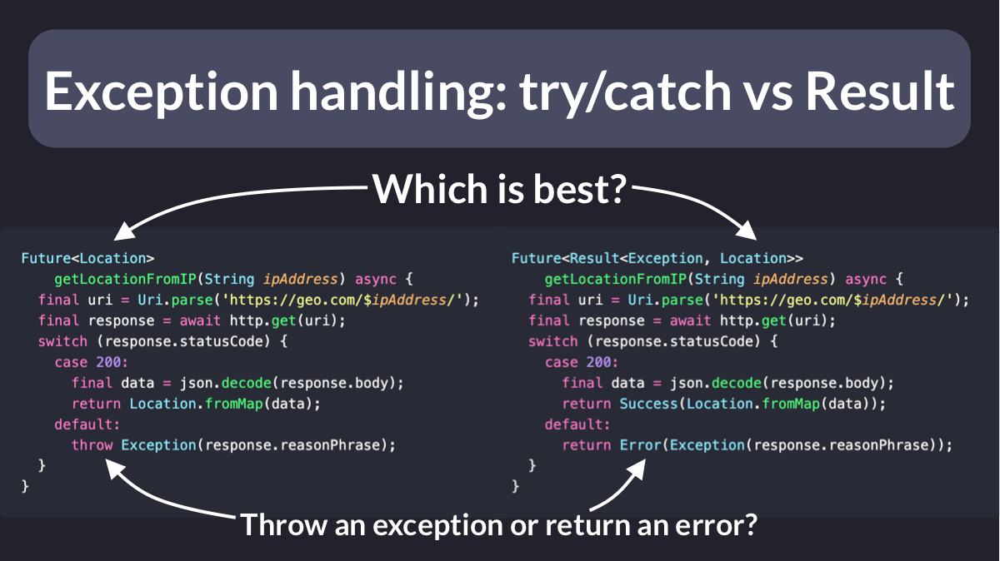
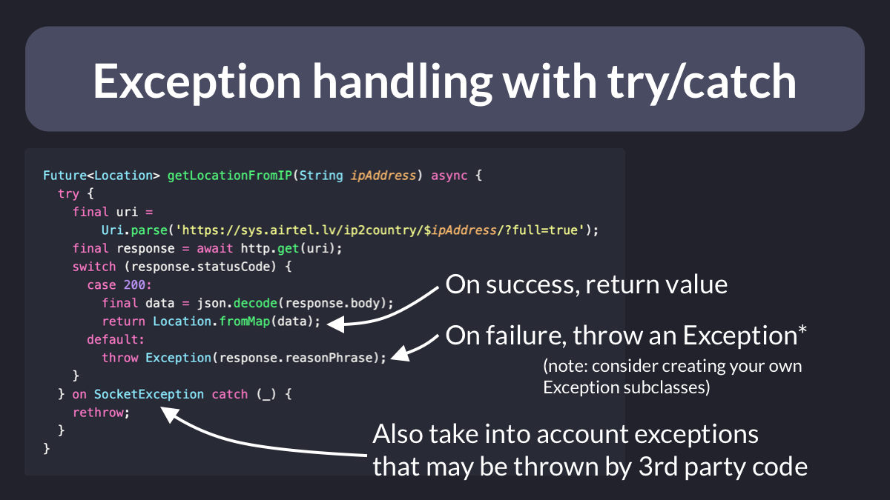
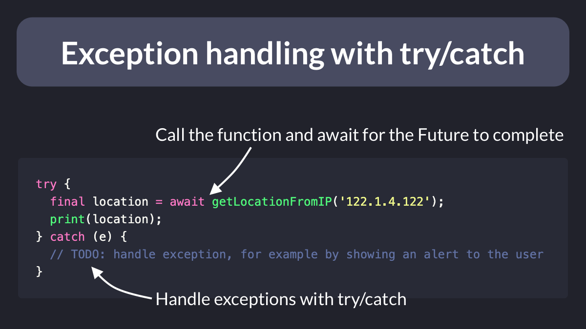
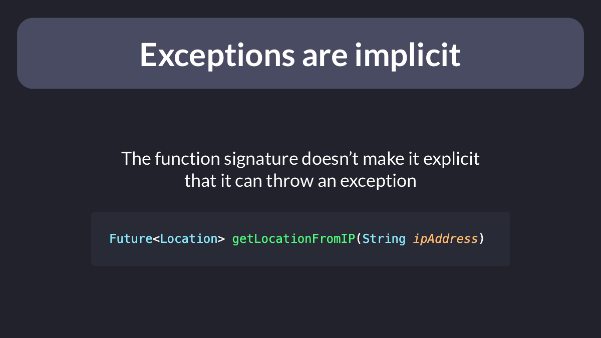
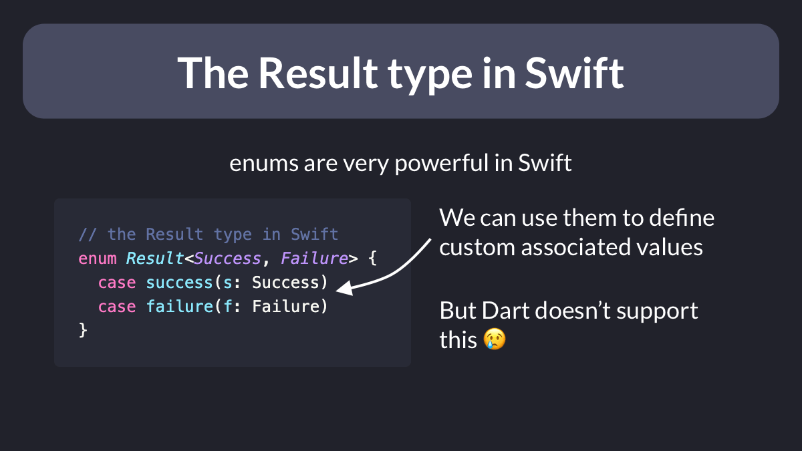
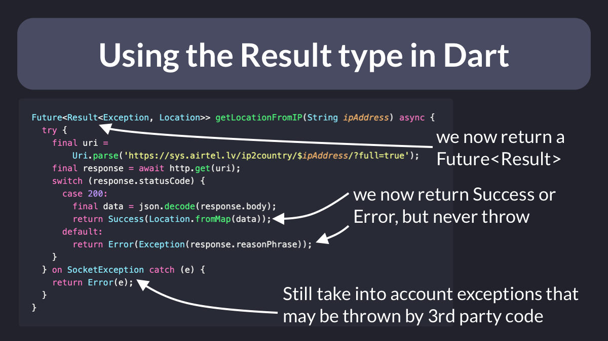
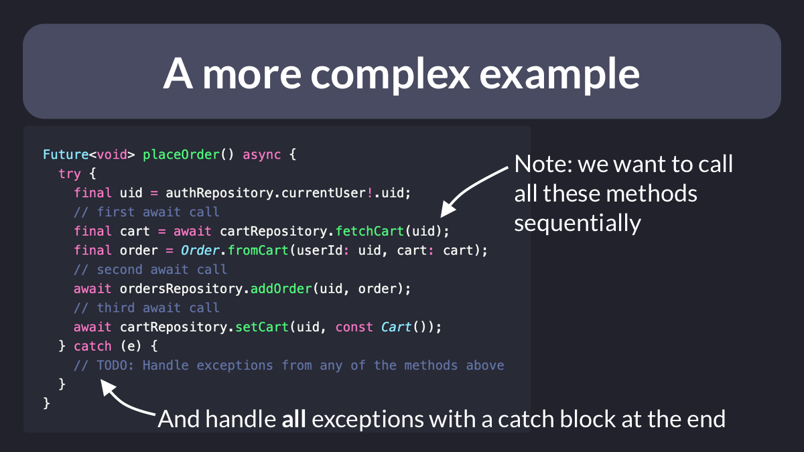
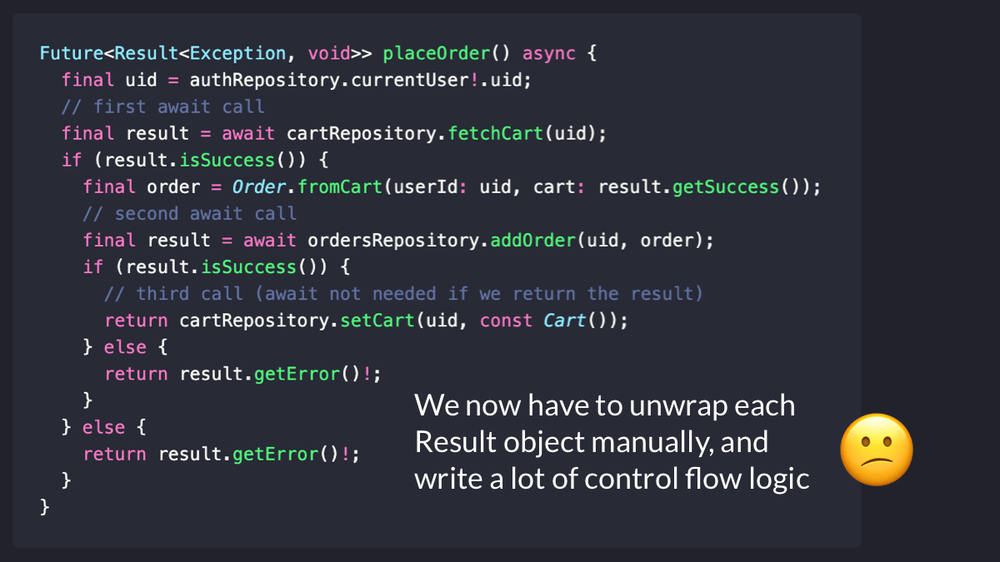

# Exception handling: try/catch vs Result

If we want to write robust apps, handling exceptions is important.

And in Flutter, this is normally done with `try`/`catch` blocks.

As an alternative, we can use the Result type to declare errors **explicitly** in the function **signature**.

So let's learn about the pros & cons. 🧵

---

As a starting point, let's consider a function that handles exceptions with `try` and `catch`:

- The return type is a `Future<Location>`
- If the request succeeds, we return a `Location` object
- If the request fails, we throw an exception

---

When we call our function, we can use await (since it returns a `Future`).

And we should also catch any exceptions it might throw.

But if we forget the `try`/`catch` block, the compiler won't warn us.

And this opens the door to unhandled exceptions in our code.

---

In addition to this, the function **signature** doesn't make it **explicit** that it can throw an exception.

And we can only find out if the function throws by reading its documentation and/or implementation.

---

So how can we make it explicit that the function can return an error?

What we need is a `Result` type that can represent **either** a success or an error.

The Swift language supports this using enums with **associated values**.

But this feature is not available in the Dart language.

---

If we want to implement a `Result` type in Dart, we have two options:

- Build our own using abstract classes and subclassing (the hard way)
- Use a package such as [multiple_result](https://pub.dev/packages/multiple_result), [dartz](https://pub.dev/packages/dartz), or [fpdart](https://pub.dev/packages/fpdart) (easier)

---

So let's convert our geolocation function to use `Result` from the [multiple_result](https://pub.dev/packages/multiple_result) package.

Here's what's changed: 

- The return type is a `Future<Result>`
- If the request succeeds, we return a `Success` object
- If the request fails, we return an `Error`

---

When we call our function, we can use `await` to get the result.

And then we can use **pattern matching** to handle both success and error cases with the `when()` method.

This way we can't make mistakes, since it's a compiler error to not handle the error case.

---

Here's what we've learned so far:

- The `Result` type lets us **explicitly** declare success and error types in the **signature** of a function
- We can use pattern matching in the calling code to ensure we handle both cases **explicitly**

But should we really use `Result` everywhere?

---

Not so fast.

Here's an example where we need to call multiple async methods **sequentially**.

If any of these methods throws an exception, we can catch it in **one** place and handle it as needed.

---

But if we attempt to implement the same method using `Result`, we're in trouble.

The code becomes much harder to read, because we have to **unwrap** each `Result` object manually.

And we have to write a lot of control flow logic to handle all the success/error cases.

---

So is the `Result` type pointless and should we use old good `try`/`catch` blocks everywhere?

Or is it worthwhile in some cases?

How can we decide when to use it, and when not to?

---

I'll be covering this in more detail in an upcoming thread.

And I'm also writing some articles that will cover this topic more in detail.

If you don't wanna miss them, follow me: [@biz84](https://twitter.com/biz84).

And to learn more about error handling, check out my course:

- [The Complete Flutter Course Bundle](https://codewithandrea.com/courses/complete-flutter-bundle/)

---

### Found this useful? Show some love and share the [original tweet](https://twitter.com/biz84/status/1552337771158818817) 🙏

### [Source code](main.dart)

### Also published on codewithandrea.com 👇

- [Flutter Exception Handling with try/catch and the Result type](https://codewithandrea.com/articles/flutter-exception-handling-try-catch-result-type/)

---

| Previous | Next |
| -------- | ---- |
| [Errors vs Exceptions in Flutter](../0061-flutter-errors-vs-exceptions/index.md) | [Explicit error types with Either](../0063-either-type-fpdart/index.md) |