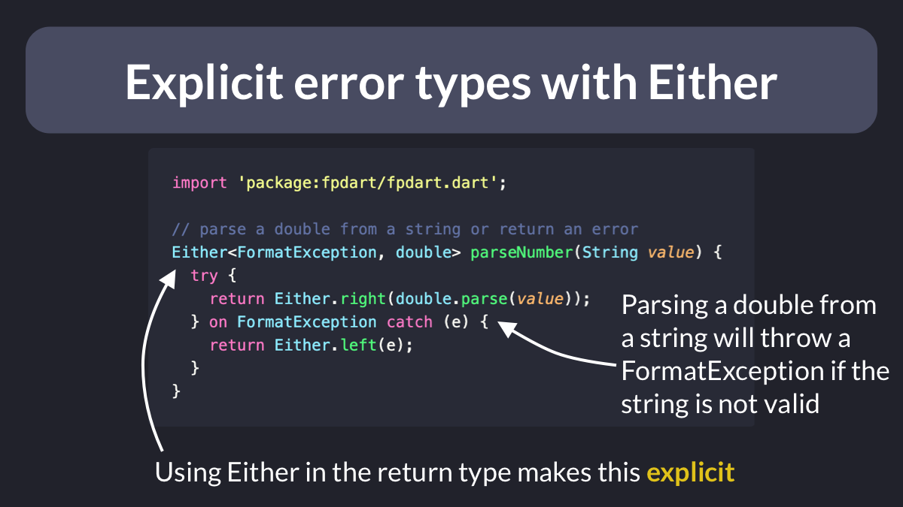
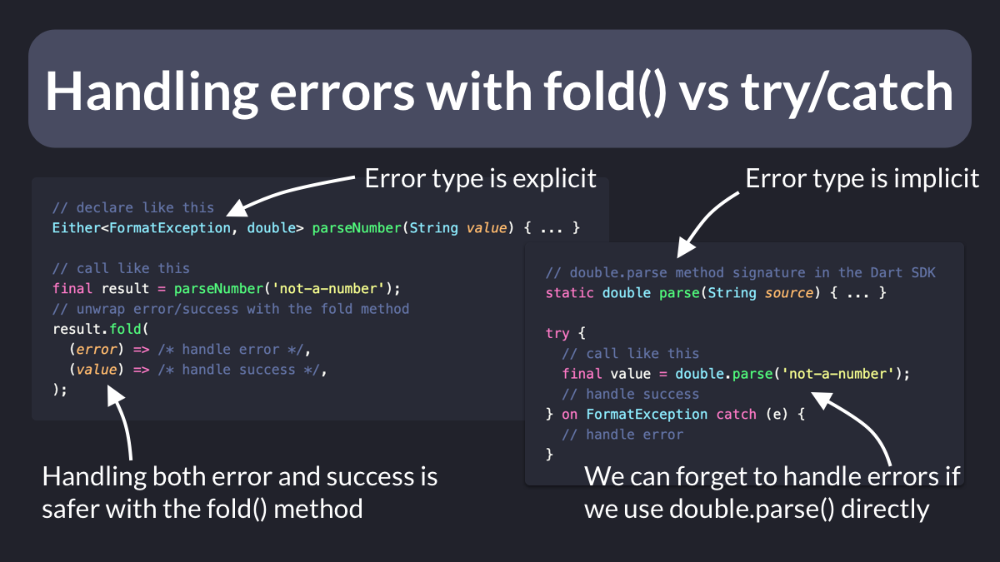

# Explicit error types with Either

In Dart/Flutter, you can make it **explicit** when a function can return an error with the `Either` type from the [fpdart](https://pub.dev/packages/fpdart) package.

For example, parsing a double can throw a `FormatException` if the input string is not a number, and we can make this part of the function **signature**. 👇

---

What's the benefit of this?

You can safely handle both error and success with the `fold` method, and the type checker will help you to do so.

On the other hand, if you call `double.parse` directly, you won't get a warning if you forget to handle errors.

---

Just to be clear: Dart already has a built-in exception handling system.

And throwing exceptions works great when you want them to propagate through the call stack.

Other times, **returning** an error is preferable to **throwing** an exception.

So choose accordingly.

---

Also note that `Either` is very similar to the `Result` type that I've covered in tip 62.

The advantage of `Either` (and fpdart in general) is that it has a more extensive (and well documented) API that works particularly well when dealing with async code.

---

### Found this useful? Show some love and share the [original tweet](https://twitter.com/biz84/status/1554518642343256067) 🙏

### Also published on codewithandrea.com 👇

- [Functional Error Handling with Either and fpdart in Flutter: An Introduction](https://codewithandrea.com/articles/functional-error-handling-either-fpdart/)

---

| Previous | Next |
| -------- | ---- |
| [Exception handling: try/catch vs Result](../0062-try-catch-result-type/index.md) | [When to use each Riverpod provider?](../0064-all-riverpod-providers/index.md) |