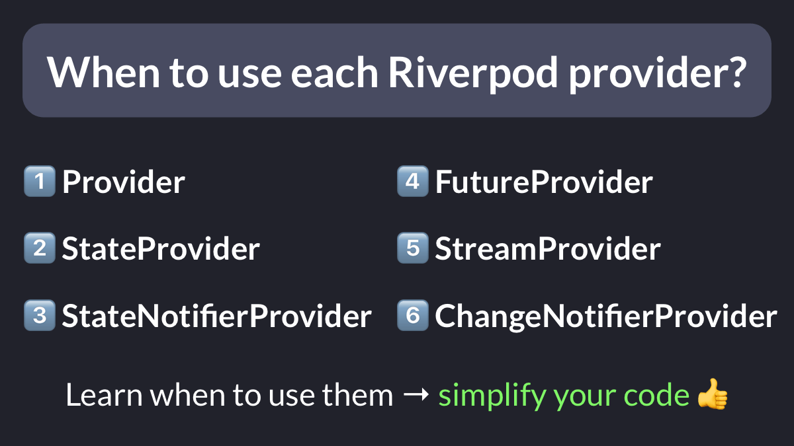
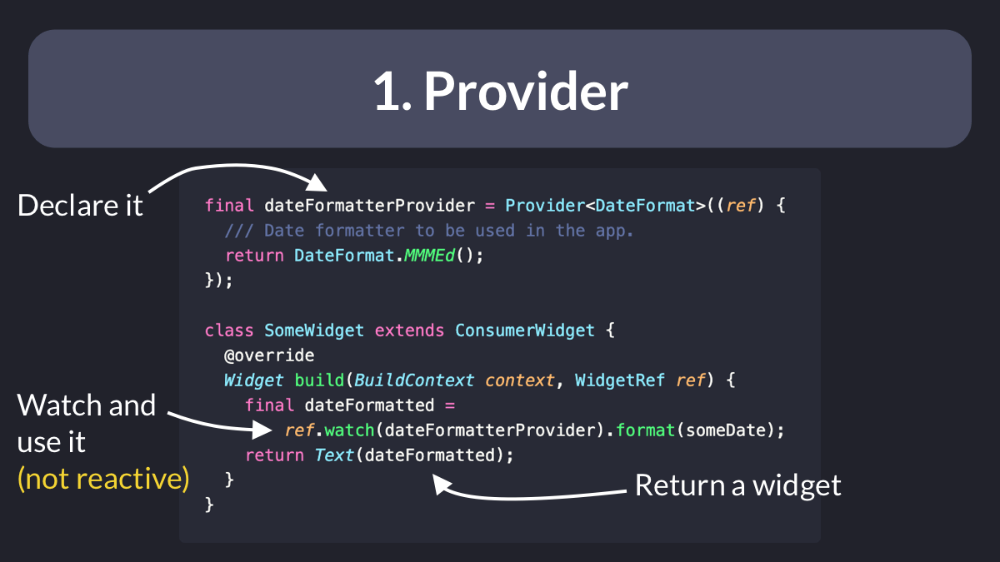
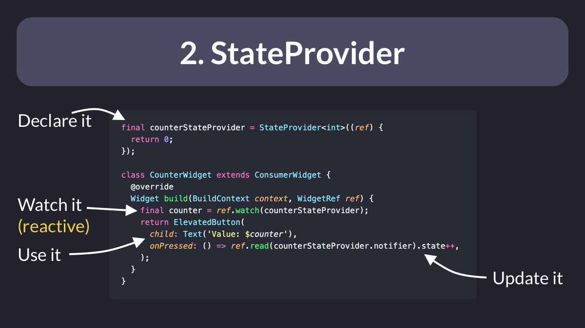
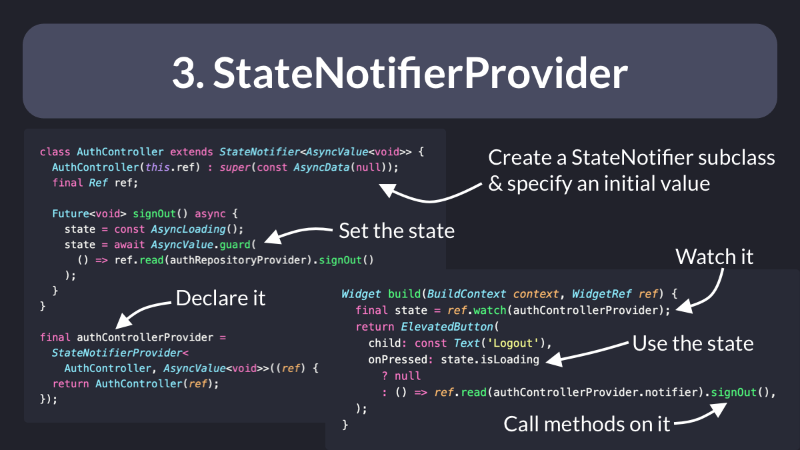
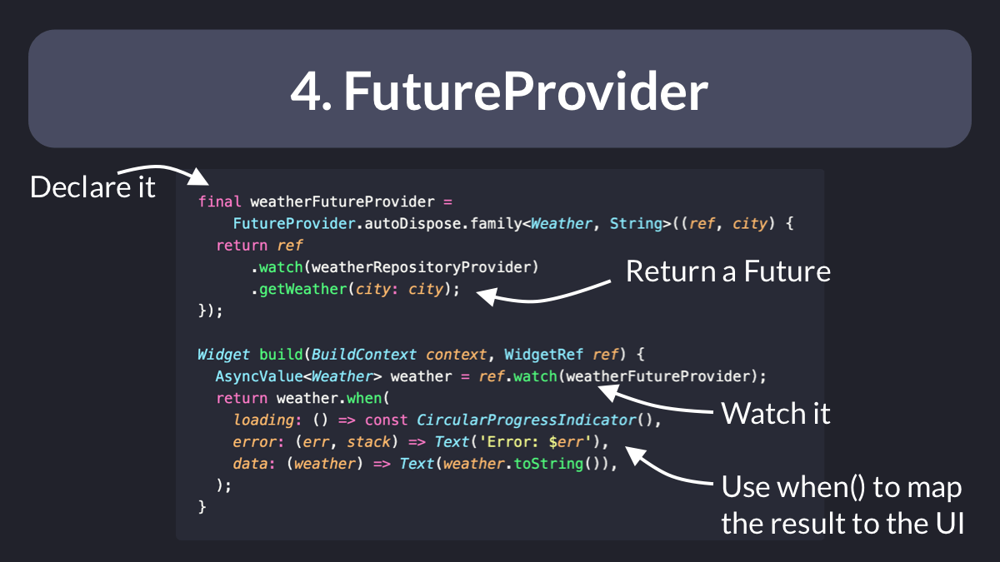
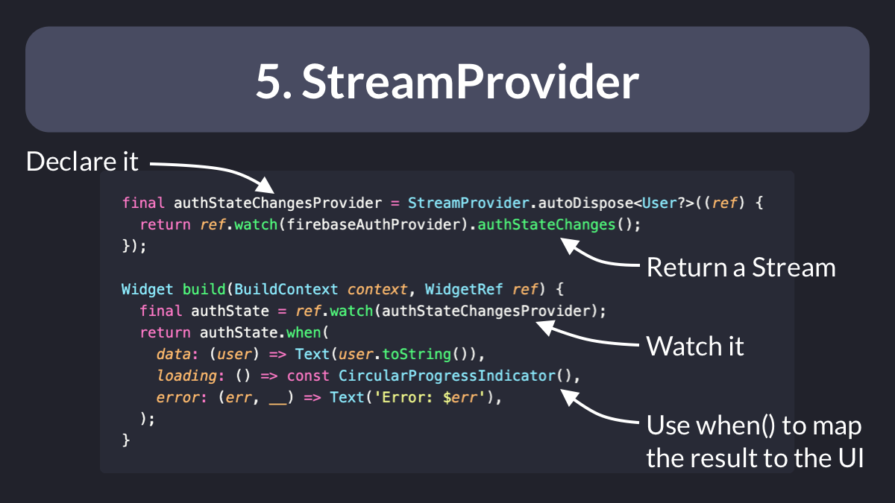
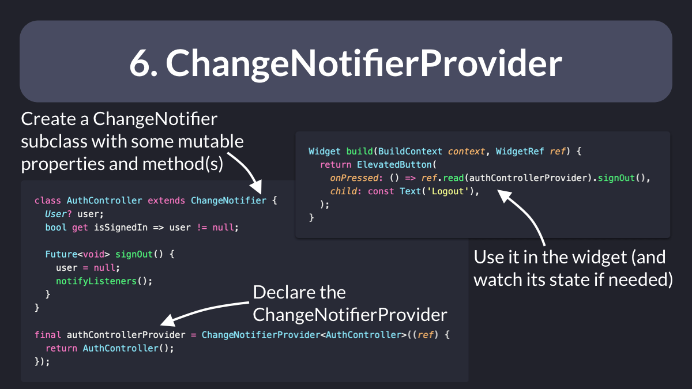

# When to use each Riverpod provider?

Riverpod offers 6 different kinds of providers, all suited for different use cases.

Knowing when to use each one of them can save you a lot of time and simplify your code. 👍

So let's take a look at them and learn when they are most useful.

Thread. 🧵

---

### 1. `Provider`

Great for accessing dependencies and objects that don’t change.

You may use this to access a repository, a logger, a date-time formatter, or a function that returns the current time.

Don't use this to hold data or state objects that should cause a widget rebuild.

---

### 2. `StateProvider`

Great for storing simple state objects that can change (such as a counter value).

You can read a `StateProvider` and update its state inside a button callback.

And you can watch it inside a widget so that it rebuilds when the state changes.

---

### 3. `StateNotifierProvider`

Use this to access a `StateNotifier` subclass that you have created.

Great for storing more complex widget state, along with the logic for updating it.

Don't use this if you only need to *read* some async data. That's what `FutureProvider` is for. 👇

---

### 4. `FutureProvider`

Want to get the result from an API call that returns a Future?

Then just create a `FutureProvider`, watch it in the build method, and map the resulting `AsyncValue` (data, loading, error) to your UI.

You can even refresh a `FutureProvider` to get updated data.

---

### 5. `StreamProvider`

Great for watching a `Stream` of results from an API and *reactively* rebuilding the UI.

Doesn't require an explicit refresh to get the updated data (it's realtime by design).

Use cases: auth state changes, realtime database updates, etc.

---

### 6. `ChangeNotifierProvider`

This is only useful for legacy applications and APIs that store mutable data inside `ChangeNotifier` subclasses.

Not recommended. For new projects, use `StateNotifierProvider` instead.

---

Six different kinds of providers, all suited for different use cases. 🚀

Wanna see more practical examples of when to use them?

Then check out my extensive (and free) guide about Riverpod:

- [Flutter State Management with Riverpod: The Essential Guide](https://codewithandrea.com/articles/flutter-state-management-riverpod/)

---

### Found this useful? Show some love and share the [original tweet](https://twitter.com/biz84/status/1554518642343256067) 🙏

---

| Previous | Next |
| -------- | ---- |
| [Explicit error types with Either](../0063-either-type-fpdart/index.md) | [How `kIsWeb` works in Flutter](../0065-kIsWeb/index.md) |