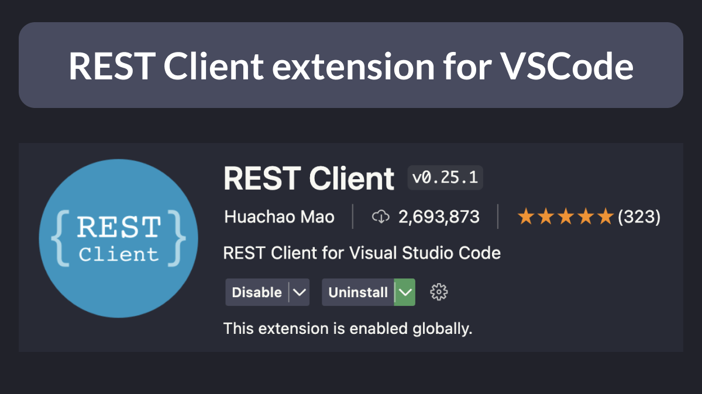
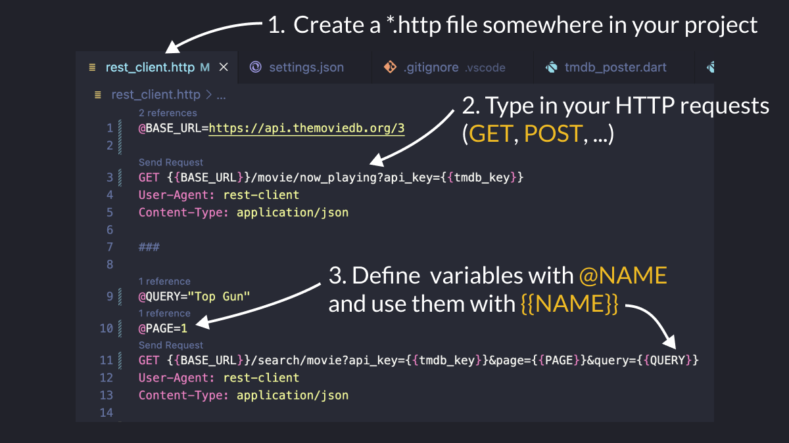
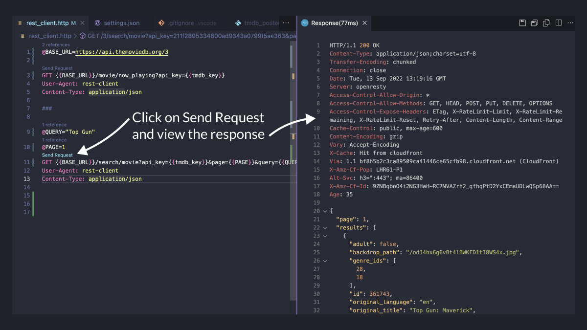
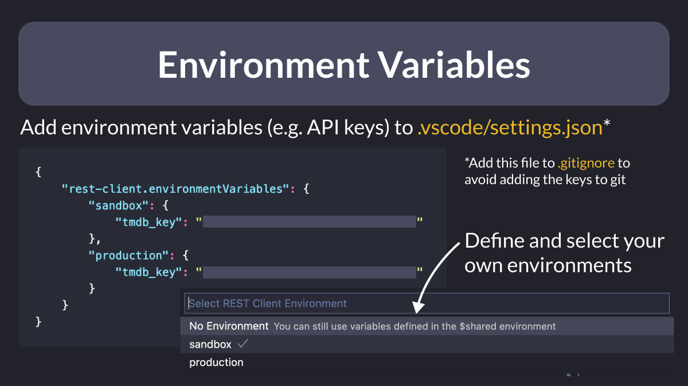

# REST Client extension for VSCode

REST Client is one of my favourite VSCode extensions.

It allows you to send HTTP requests and view the response directly in Visual Studio Code.

This is great if you want to have "runnable documentation" for any REST APIs you use in your project.

Let's take a look. 🧵

---

To get started, create a `rest_client.http` file in your project.

Then, you can type in HTTP requests for all the endpoints you want to use.

If needed, you can use variables too. 👇

---

When you're ready, click on "Send Request", and viola! 🎁

REST Client will open a side window with all the response data. 👇

---

You can define your own environments too.

This is quite handy for storing API keys that you don't want to commit to git. 👇

---

REST Client has a ton of useful features.

For all the details, check the official page:

- [REST Client | VSCode Marketplace](https://marketplace.visualstudio.com/items?itemName=humao.rest-client)

---

And if you want to learn about all the other VSCode extensions and shortcuts I use in my projects, check this article on my site:

- [VSCode Shortcuts, Extensions & Settings for Flutter Development](https://codewithandrea.com/articles/vscode-shortcuts-extensions-settings-flutter-development/)

---

### Found this useful? Show some love and share the [original tweet](https://twitter.com/biz84/status/1569690846051635205) 🙏

---

| Previous | Next |
| -------- | ---- |
| [The HtmlUnescape package](../0066-html-unescape/index.md) | [--enable-asserts flag in Dart / Flutter](../0068-enable-asserts-flag/index.md) |