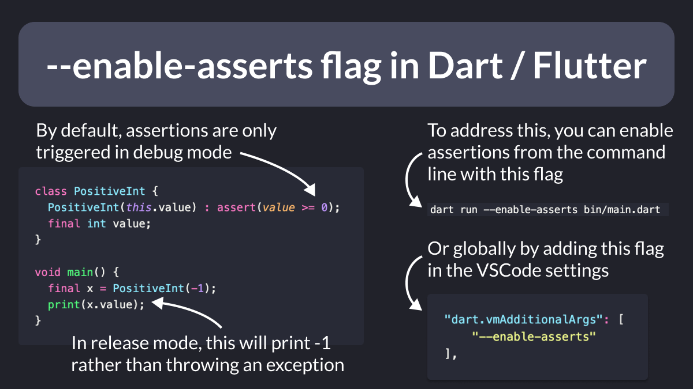

# --enable-asserts flag in Dart / Flutter

When running a Dart or Flutter app, assertions are only enabled in Debug mode.

But in Release mode, they are disabled by default.

If you want to change this behavior, add the `--enable-asserts` flag when running from the command line.

Or set it globally in your VSCode settings file.

> Note: while you **can** enable asserts in release mode, you probably **shoudn't**. Assets are used to warn you of programmer errors during development. As such, you should fix them before release.

---

### Found this useful? Show some love and share the [original tweet](https://twitter.com/biz84/status/1572227339060117505) 🙏

---

| Previous | Next |
| -------- | ---- |
| [REST Client extension for VSCode](../0067-rest-client-vscode/index.md) | [When to use `SizedBox.shrink()` to return an empty box](../0069-sizedbox-shrink/index.md) |