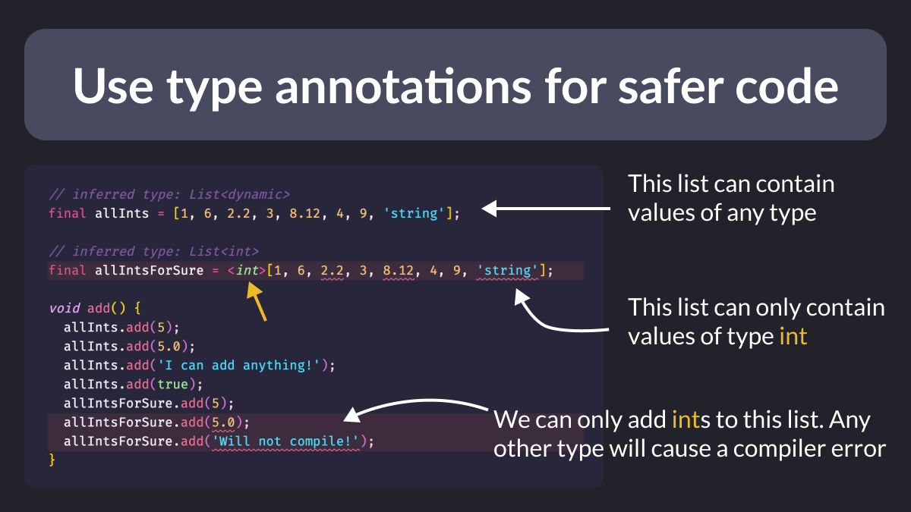

# Use type annotations for safer code

The Dart analyzer can infer types for fields, methods, variables, and more.

But sometimes it needs a little help and you can use type annotations to ensure variables are of the intended type.

This way, your code won't compile if you use types incorrectly.

---

### Found this useful? Show some love and share the [original tweet](https://twitter.com/biz84/status/1577928394762846208) 🙏

| Previous | Next |
| -------- | ---- |
| [Const vs final vs var](../0071-const-vs-final-vs-var/index.md) | [Enhance readability with Typedef](../0073-enhance-readability-with-typdef/index.md) |