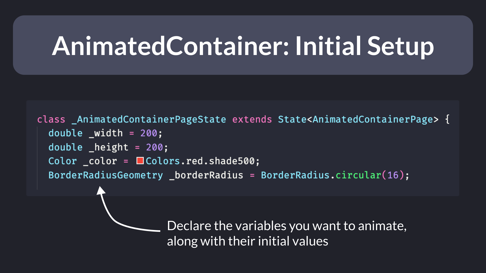
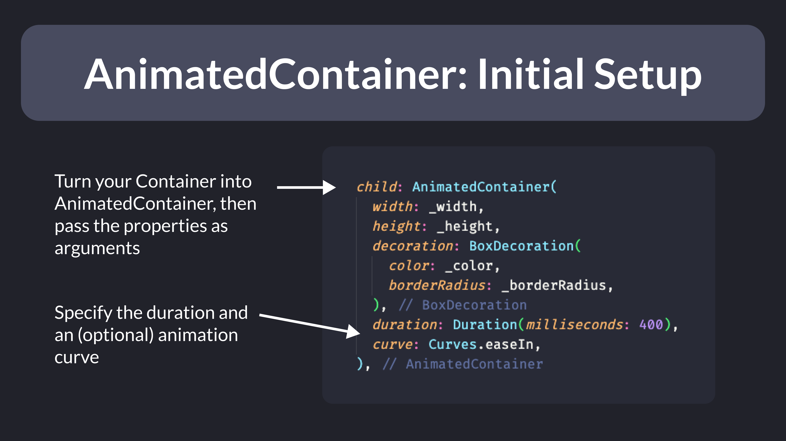

# Using AnimatedContainer to animate Container properties

How easy is it to create this animation? 🤔

All you need is a single widget in Flutter: AnimatedContainer 👌🏻

Let's see how it works.

For each property you want to animate, create a state variable with an initial value.

For example, you can animate the width, height, color, and border-radius.

The AnimatedContainer widget is much like Container, but every property will animate when the state changes, using the duration and animation curve provided.

In this example, we pass the state variables we have declared to the relevant Container properties.

To trigger the animation, we call setState and update the values as needed.

This will rebuild the widget and the AnimatedContainer will *implicitly* animate to the new values (over the given duration).

You can check the full example and play around with it on [Zapp](https://zapp.run/edit/animatedcontainer-zla06dalb06).

---

### Found this useful? Show some love and share the [original tweet](https://twitter.com/biz84/status/1584420460288126976) 🙏

---

| Previous | Next |
| -------- | ---- |
| [Enable sticky scroll in VSCode](../0076-sticky-scroll-vscode/index.md) | [How to nest generated files in VSCode](../0078-file-nesting-vscode/index.md) |