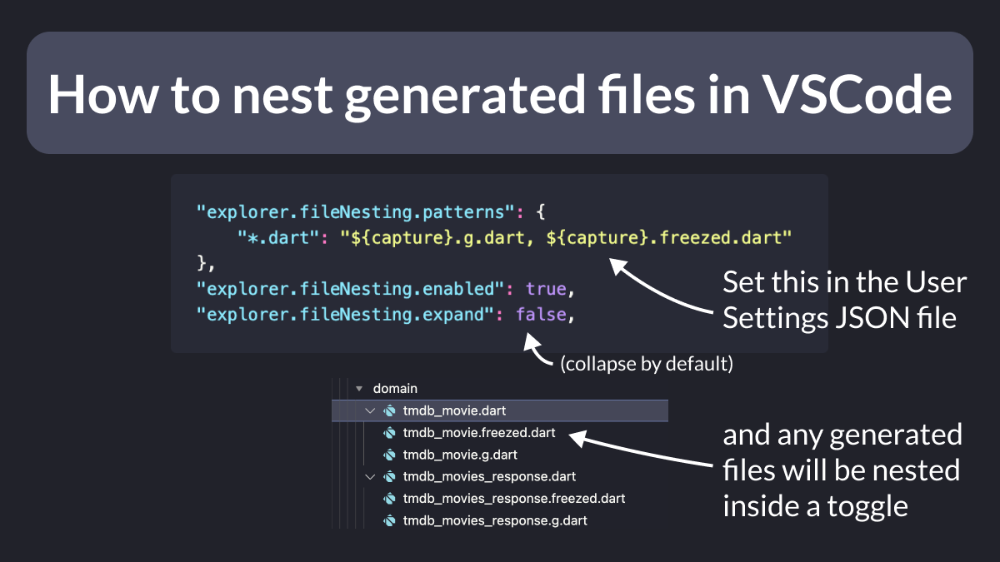

# How to nest generated files in VSCode

Do you have a lot of code-generated files and want to hide them by default the project explorer?

Just enable file nesting in the VSCode settings and you're good to go! 🚀

Very useful if you use build_runner, Freezed, or json_serializable in your Flutter apps. 👌

---

### Found this useful? Show some love and share the [original tweet](https://twitter.com/biz84/status/1584527886891245568) 🙏

---

| Previous | Next |
| -------- | ---- |
| [Using AnimatedContainer to animate Container properties](../0077-animatedcontainer/index.md) | [String multiplication in Dart](../0079-string-multiplication/index.md) |