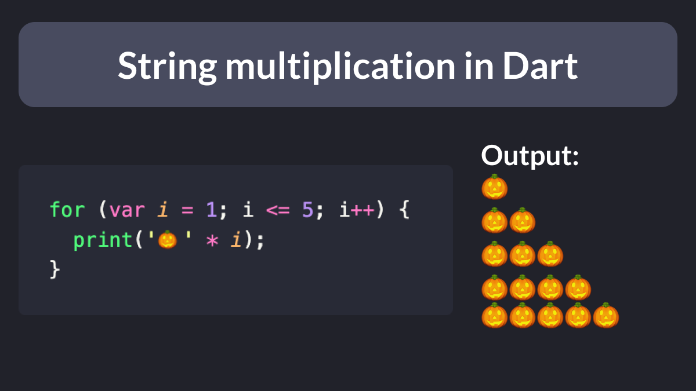

# String multiplication in Dart

Did you know?

Dart supports string multiplication.

Very useful when you want to check if long strings are rendered correctly in your Flutter layouts.

### Found this useful? Show some love and share the [original tweet](https://twitter.com/biz84/status/1587071641649020929) 🙏

---

| Previous | Next |
| -------- | ---- |
| [How to nest generated files in VSCode](../0078-file-nesting-vscode/index.md) |  |