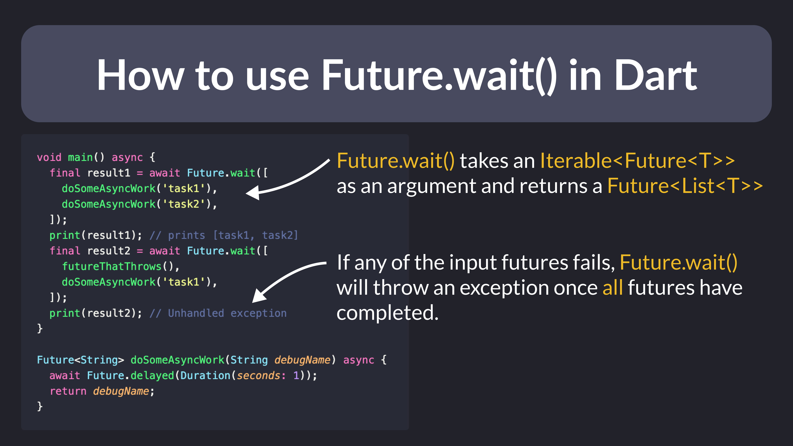

# How to use Future.wait() in Dart

Do you need to execute multiple futures *concurrently* in Dart, and get all the results at once?

Use `Future.wait()`. 👌🏻

This will wait for all the futures to complete and return the results as a list, or throw an error if any of them fails. ⚠️

Andrea Bizzotto 💙 @biz84

Future.wait enables concurrency, meaning that multiple futures can be run at once.

But this is *not* true parallelism, as they all run on the same *isolate*.

To run heavy computations in parallel, you need multiple isolates.

Learn more in [this YouTube video here](https://youtu.be/5AxWC49ZMzs).

### Found this useful? Show some love and share the [original tweet](https://twitter.com/biz84/status/1587071641649020929) 🙏

---

| Previous | Next |
| -------- | ---- |
| [String multiplication in Dart](../0079-string-multiplication/index.md) |  |