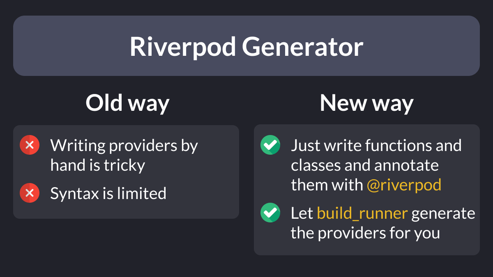
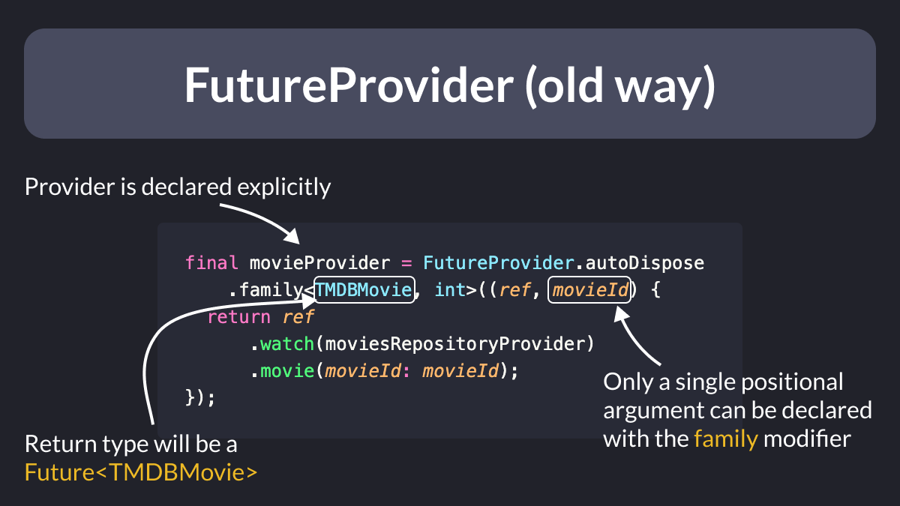
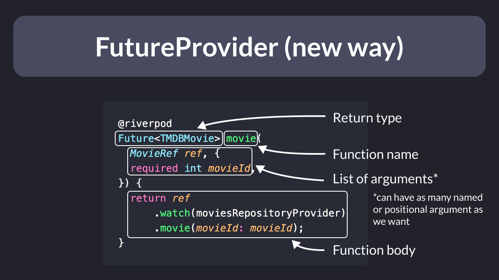
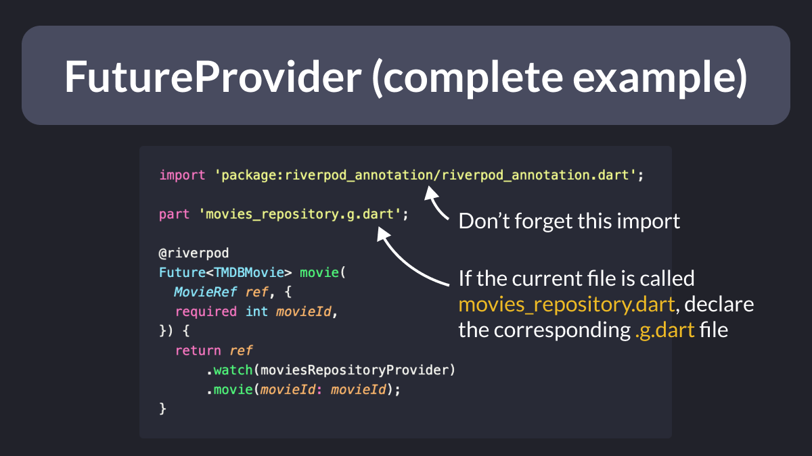
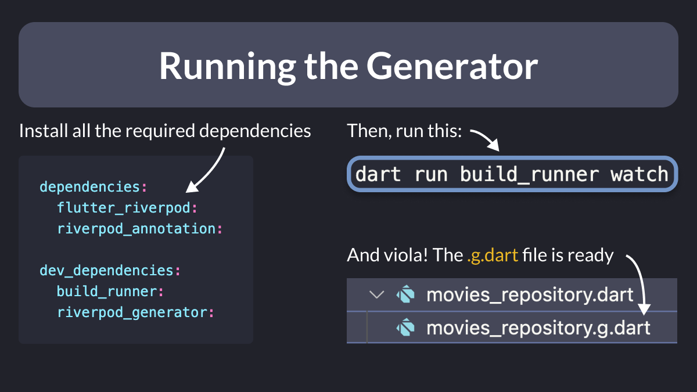

# How to use the new Riverpod Generator package

Declaring providers by hand using Riverpod can be tricky.

And the syntax for passing arguments to a provider is quite limited.

What if we could simply declare functions and classes, and let build_runner generate all the providers on the fly?

Enter Riverpod Generator. 👇



---

As an example, consider the syntax you'd use to create a `FutureProvider`.

If you need to pass an argument, you have to:

- use the family modifier
- add a second type annotation
- pass the extra argument

All the types must match, and your code won't compile if you get it wrong.



---

With the new Riverpod Generator, this is much easier:

- just declare a function with the desired return type and annotate it
- match the function name with the type of the ref argument (`movie` → `MovieRef`)
- pass one or more arguments and use them in the function body



---

Note that for everything to work, you also need to:

- import riverpod_annotation.dart
- declare a part file that will contain the generated code



---

And once everything is ready, run this command:

```
dart run build_runner watch
```

And the `.g.dart` file will be generated (and updated) any time you save your changes.



---

I've covered the new Riverpod Generator in great detail on this article.

This explains how to use it with different kinds of providers, and covers some limitations and tradeoffs. 👇

- [How to Auto-Generate your Providers with Flutter Riverpod Generator](https://codewithandrea.com/articles/flutter-riverpod-generator/)

---

I'll also cover Riverpod Generator and the new Riverpod 2.0 APIs in my Flutter Foundations course.

In fact, I'm planning a whole new module about it, that will be out next week.

- [The Complete Flutter Course Bundle](https://codewithandrea.com/courses/complete-flutter-bundle/)

---

### Found this useful? Show some love and share the [original tweet](https://twitter.com/biz84/status/1590344470087671809) 🙏

---

| Previous | Next |
| -------- | ---- |
| [How to use Future.wait() in Dart](../0080-future.wait/index.md) |  |
