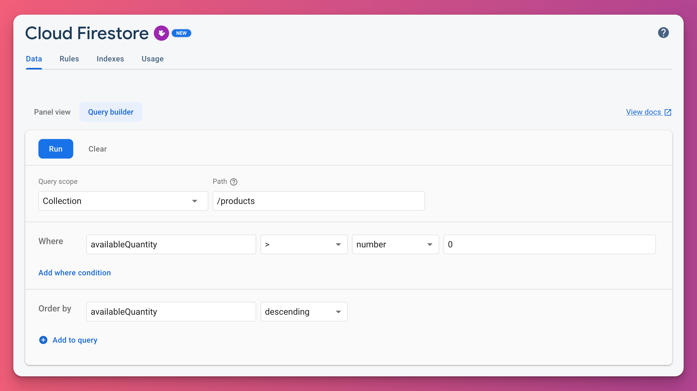

# Using the query builder UI in Cloud Firestore

Did you know that Cloud Firestore has a query builder UI? 🔥

You can apply this to a collection or collection group and:

- filter results (using where)
- order by one or more fields
- limit the number of results

It's a nice little addition. 👌

---

### Found this useful? Show some love and share the [original tweet](https://twitter.com/biz84/status/1598710090617561088) 🙏

---

| Previous | Next |
| -------- | ---- |
| [Update packages with the Version Lens VSCode extension](../0083-version-lens-vscode/index.md) |  |