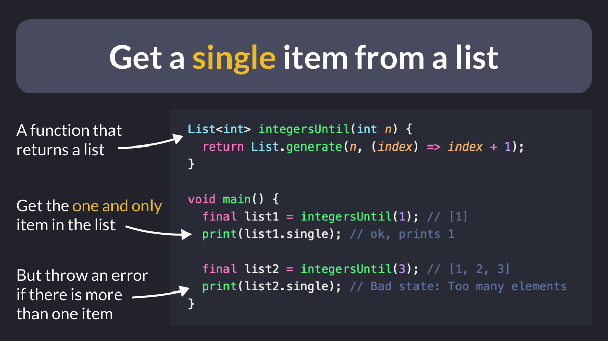

# Get a single item from a list

When working with lists in Dart, you can use `single` to:

- check if a list has only one element, and return that element
- throw an error if the list is empty or has more than one element

Useful when you run a function that returns a list with only one item. 👍

---

### Found this useful? Show some love and share the [original tweet](https://twitter.com/biz84/status/1611332511342231553) 🙏

---

| Previous | Next |
| -------- | ---- |
| [The Accessibility Tools package](../0087-accessibility-tools/index.md) |  |